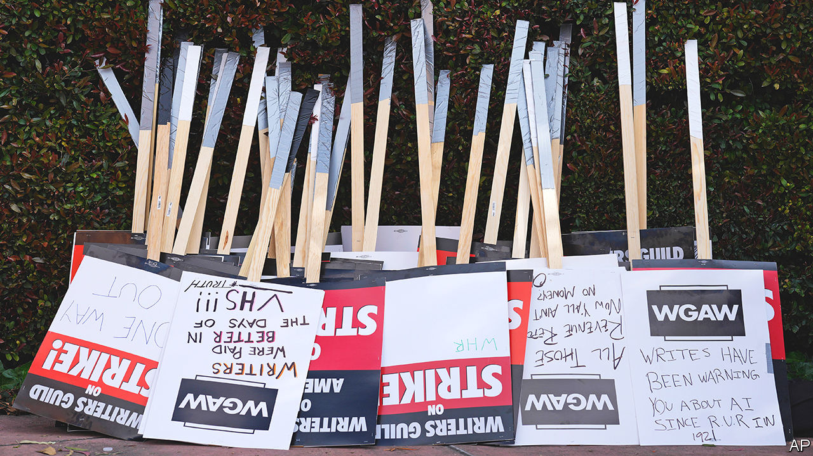

###### That’s a wrap

# Hollywood’s strike enters its final act, as writers reach a deal 

##### Next: the actors 

 

> Sep 25th 2023 

Dust-sheets cover the sets inside one soundproofed Hollywood studio, as placard-wielding writers and actors make as much noise as they can outside. The covers have been on since May, when America’s writers ; in July the country’s actors  on strike. But on September 24th the writers said they had reached a tentative deal with the studios. The stage is now set for the actors to do the same, after which the dust-sheets can be whisked back off.

The writers have won meaningful concessions: bonuses for shows that do well on streaming, a format whose success metrics have until now been opaque; higher foreign royalties; and minimum staffing levels for writers’ rooms. The three-year agreement also lays out loose terms governing the use of artificial intelligence, which writers fear could soon churn out blockbuster scripts. The Writers Guild of America (WGA) says the “exceptional” deal is worth $233m a year. The studios are more circumspect. Until the agreement is ratified by a vote among the WGA’s 11,500 members, which closes on October 9th, both sides have reason to say the deal is a good one for writers.

After nearly five months without work, the writers are likely to vote “yes”. “If I lose my rent-controlled apartment, I’ll have to leave Los Angeles,” said one Hollywood worker marching in the heat outside Disney last week. The WGA has authorised its members to start working again while the ratification process is going on. Production of some formats, like talk shows, has already resumed.

Elsewhere, the cameras are not quite ready to roll. With actors still on strike, there will be no filming of scripted content (and even the talk shows will feel thin, as striking stars are banned from appearing as guests). Their union, the Screen Actors Guild, is demanding a revenue-sharing deal with the streamers, plus an 11% rise in basic wages, which the studios have rejected. A few more weeks of negotiation look likely. Factoring in a similar ratification process, things are unlikely to get back to normal much before Thanksgiving, in late November. 

That will mean a production crunch at a time when Hollywood is normally winding down. With the industry on hold for nearly half the year, film and television schedules in 2024 are looking rather bare, so studios will rush to cram in as much production as they can. Time is running out to save next year’s summer blockbusters.■


