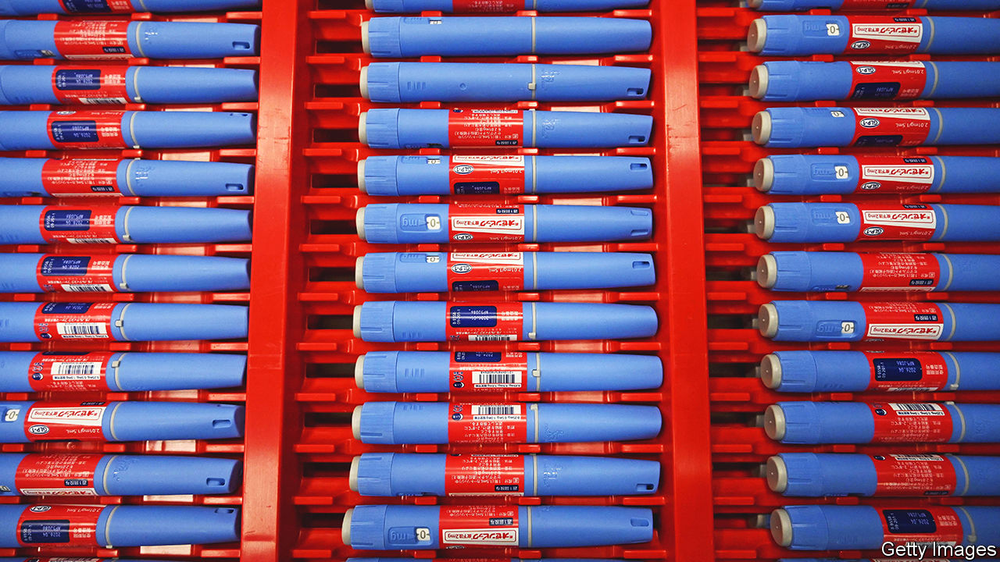
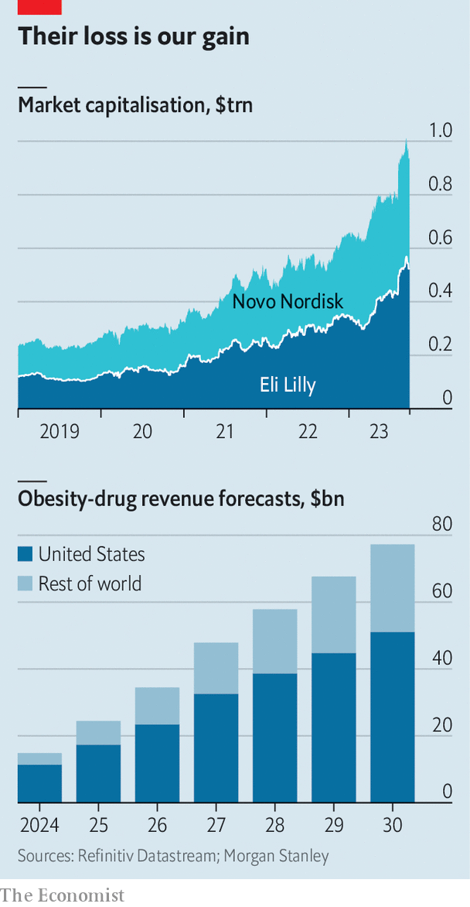

###### A medical gold rush

# Pharma’s big push for a new generation of obesity drugs 

##### Rivals to Novo Nordisk and Eli Lilly are piling in 

 

> Sep 28th 2023 

FIVE YEARS ago Novo Nordisk was a boring Danish drugmaker whose diabetes medications were reliably profitable. The only time the company made headlines was when it was caught up in complaints about the high cost of insulin. Then in 2021 a trial of its diabetes drug, Ozempic (semaglutide), showed that people taking it lost weight. A great deal of weight—up to 15% of their body mass. Excitement about the drug has kept Novo Nordisk in the headlines. Its market value has nearly quadrupled in the past five years. Earlier this month it reached $444bn, handbagging LVMH, a purveyor of luxury goods, off its perch as Europe’s most valuable company. Novo Nordisk’s main rival, Eli Lilly, which has a similar drug called Mounjaro (tirzepatide), is worth $522bn, more than four times what it was at the start of 2019.

It isn’t just investors who are jubilant. Not long ago Morgan Stanley, a bank, estimated that global sales of such weight-management drugs could reach $54bn annually by 2030. Now it puts the figure at $77bn. By comparison, last year they raked in just $2.4bn. The potential bonanza is attracting imitators. These include big pharma (for instance, Amgen, Boehringer Ingelheim and Pfizer), not-so-big pharma (Jiangsu Hengrui, Structure Therapeutics) and biotech startups (Carmot Therapeutics in California, Gmax Biopharm and Sciwind Biosciences in Hangzhou). 

 


It is not the first time in pharmaceutical history that a class of drugs has been ignored, only to spur a gold rush when a successful medicine emerges. The arrival of Prozac (fluoxetine) in 1987 spawned many competitors, leading to the broad range of similar antidepressants available today. The weight-management newcomers will be hoping their drugs can, like some of Prozac’s rivals, improve on the first-movers. 

One important improvement would be a drug that can be gulped down rather than injected, as Mounjaro and Ozempic’s weight-loss version, Wegovy, need to be. Pfizer’s needle-free option, danuglipron, is in the second phase of clinical trials (out of the necessary three). The company is expected to announce plans for further trials later this year. 

A lot of effort is also going into limiting the drugs’ side effects. The ones currently available make many people feel nauseous. That may lead some patients to stop taking them—a problem, given that their fat-suppressing effect wears off as soon as they are no longer administered. Novo Nordisk is experimenting with adding a hormone called amylin, which it hopes might make Wegovy more tolerable. 

Efforts are under way, too, to make the drugs more effective and longer-acting. Work is going into testing whether they can help patients counteract compulsive behaviour other than overeating, such as alcoholism. And trials are being conducted to see whether they bring broader health benefits. One recent trial showed that Wegovy was able to reduce the risk of death from heart attacks, strokes and other cardiovascular causes by 20%.

Just how useful the drugs will prove beyond helping people lose weight remains unclear. Despite Wegovy’s promising trial, Airfinity, a firm of analysts, recently calculated that 63 people would need to be treated with it over three years at a combined cost of $1.1m to prevent one cardiovascular death. However, more data on the medical benefits of these drugs could also add to their perceived value.

This in turn would make them more palatable to those who foot the bill, such as public health-care systems or private health insurers. Those payers are nervous about the high cost, particularly as the drugs must, in their current iteration, be taken indefinitely. In Europe prices range from €170 to €357 ($180 to $375) a month. In America the list price of Wegovy is about $1,350 a month. Health insurers are cautious: so far only 40m of the 110m Americans with obesity have access to the drugs through their health insurance. 

Raymond Stevens, boss of Structure Therapeutics, says that the long-run future of pricing remains hazy. Competition from firms like his could force prices down. On the other hand, innovations in delivery or tolerability could lift them back up. The short term is more predictable. Despite Eli Lilly’s and Novo Nordisk’s efforts to ramp up production, demand from an overweight world will continue to outstrip supply. That is a formula for healthy profits. ■


