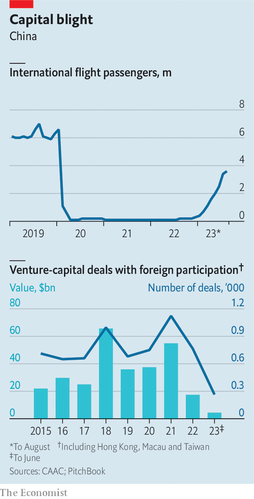

###### Exit the dragon

# Ties between foreign businesses and China go from bad to worse 

##### Travel and investment are shockingly depressed 

 

> Sep 26th 2023 

THE RANKS of foreign businesspeople in Shanghai are much depleted these days. Those who remain closely monitor the comings and goings of multinational executives. So all eyes were on the Bund Summit, a globally minded economic and financial forum held in the city from September 22nd to 24th. In previous years the forum brought in A-list chief executives from around the world. The latest gathering, the first since China lifted its draconian covid-19 restrictions and declared itself open for business, was expected to draw high-powered crowds once again. 

Not so. Nearly ten months in, President Xi Jinping’s grand reopening from his zero-covid fiasco has been a big disappointment. Foreign investors believed that 2022, when quarantines threw China into a deep freeze, would mark the bottom for gloomy sentiment. Instead the Chinese economy is creaking and cross-border investment flows have weakened. Several foreign businesses have been raided by the authorities. On September 25th the  reported that Charles Wang Zhonghe, the chairman of Chinese investment banking at Nomura International, a Japanese bank, had been banned from leaving China. Many foreign investors are skipping trips and, more damagingly, putting off investment plans.

Those who are showing up in Beijing and Shanghai this year say the damage wrought by zero-covid is palpable. Some of this, like the deteriorating English-language skills of hotel workers, is superficial. Other problems cut to the bone. Local staff have been deprived of foreign travel for years, and so from mingling with colleagues, engineers and scientists. China’s legions of well-trained white-collared workers appear less prepared to engage with the rest of the world than they did a few years ago, the visitors lament. 

 


Communication between the government and foreign investors is even more stilted. Chinese officials are less willing to have open discussions with visitors from abroad. Most queries from foreigners are met with boilerplate responses. A lack of specifics is particularly unhelpful at a time when dizzyingly complex new compliance rules for things like data transfers pose big legal risks for companies.

Perhaps as a consequence, few foreigners bother coming. Travel remains shockingly depressed. The number of passengers entering and leaving the country on international flights dropped by more than three-quarters in the first half of the year, compared with the same period in 2019. As late as July the figure was still languishing at just over 50% (see chart). Western tourists have been almost entirely missing from China in recent months, depriving the country of useful interpersonal connections. Group travel from America was down by about 99% in the second quarter of the year, compared with 2019.

Business travel, which ground to an almost complete halt in 2022 as China issued few visas and required up to three weeks of quarantine, is far below Chinese expectations and increasing only at a snail’s pace. Harrington Zhang and colleagues at Nomura warn in a recent report (published before their colleague’s predicament came to light) that the “lack of business contacts and civilian exchanges between China and the outside world may have more profound implications for China’s economic growth potential in the years ahead”. The flow of inbound foreign direct investment has already collapsed. In the second quarter it was just $4.9bn, down by 94% from the same period in 2021, according to Nomura. Just $4.4bn in foreign venture capital flowed into China in the first half of the year, down from about $55bn for all of 2021, reckons PitchBook, a data provider.

Those who stuck it out during the punitive zero-covid years are re-evaluating their commitment to China. According to a survey of American companies in the country by the American Chamber of Commerce in Shanghai, released on September 19th, just 68% were profitable last year. Only 52% think this year will be better. Roughly as many were optimistic about the next five years, a record low. Some 40% of companies say they are moving investments elsewhere or planning to do so.

The chamber noted that “2023 was supposed to be the year investor confidence and optimism bounced back.” But, it added grimly, that rebound has simply “not materialised”. Instead, business sentiment has “continued to deteriorate”. Merely flinging the door to the world open has not worked. Meanwhile, the window to meaningfully re-engage with the West is closing. ■


