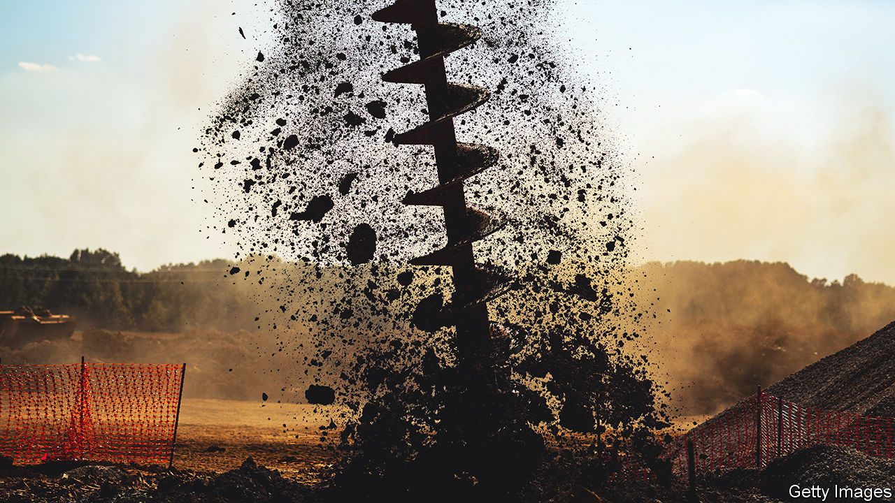
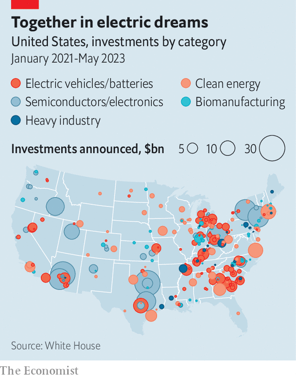

###### Cranes, drains and automobiles

# Will the auto workers’ strike jeopardise Joe Biden’s manufacturing boom? 

##### A report from the front line of America’s industrial revival 

 

> Sep 24th 2023 

STANTON, TENNESSEE, looks like a place from a bygone age. The town hall quaintly resembles a 1960s grocery store. Next door is a cannery, where townsfolk use communal stoves to make soups and peach preserve for winter. For much of its history, Stanton’s main source of income has been cotton farming, which was so depressed that many smallholders left. 

Yet amid the cotton fields something remarkable is taking shape. Ford, one of America’s three big carmakers, is setting up the biggest industrial complex in its history, including an electric-vehicle (EV) plant, a battery factory and a base for its suppliers, with an investment of $5.6bn. A year after it broke ground thousands of acres have been covered with concrete and steel. Construction workers in high-vis jackets stomp into Suga’s Diner, the only food joint in the 400-person town, for lunches of fried chicken and catfish. When Ford announced the project in 2021, the diner had a sign lamenting a shortage of chicken. Now a help-wanted sign points to a shortage of staff. “We are rushed off our feet,” says Lesa “Suga” Tard, the owner. 

It is a similar story in De Soto, Kansas. Its industrial activity was abruptly cut short decades ago when a munitions factory was mothballed. In April construction began on a $4bn Panasonic battery plant, the largest investment in the state’s history. Driving to the 9,000-acre (3,600-hectare) site in his pickup truck, Rick Walker, the mayor, points to diggers turning a country road into a four-lane highway, counts the cranes (nine of them) erecting the plant’s second floor, and gushes about a giant solar farm due to be built nearby. 

 


A drive over several days down parts of America’s “auto alley”, which stretches from the Great Lakes to the Gulf of Mexico, provides a glimpse of industrial history in the making. The country is in the grip of an investment boom in everything from semiconductor “fabs” to solar farms (see map). By late 2022 firms had announced a cumulative $210bn of investments in EV and battery factories in America, up from $51bn at the end of 2020, according to Atlas Public Policy, a data gatherer. This is already fuelling a boom in construction spending, which has doubled since the end of 2021. 

Several factors explain what some are calling America’s . President Joe Biden claims much of the bonanza is the result of financial incentives in the Chips and Science Act, and the  (IRA), two of his signature policies. State and local giveaways also help. So does the desire to outcompete China, as well as reshoring after the supply-chain chaos of the pandemic. In the case of car firms like Ford, which decided to build in Stanton before the IRA was passed, the fear is that unless they seize the initiative on electrification, they will lose their dominance of American carmaking to Tesla, the EV front-runner. 

Given how attached Americans outside a few coastal cities remain to their gas guzzlers, the surge in EV and battery factories may seem like white elephants in the making. Whatever their commercial logic, the factories are already playing a role in national debates. The EV and battery plants are important points of contention in a strike against Detroit’s big three carmakers, Chrysler (part of Stellantis, whose biggest shareholder part-owns ’s parent company), Ford and General Motors (GM). Ford has paused construction of a battery plant in Marshall, Michigan, until the labour dispute is resolved. Both Mr Biden and his predecessor and likely presidential rival, Donald Trump, visited Michigan this week to support the strikes. 

The United Auto Workers (UAW), the trade union behind the strike, worries that the new plants will be hard to unionise. In fact there is little evidence of a full-blown migration of carmaking from the unionised north to the less union-friendly south. James Rubenstein of Miami University, in Oxford, Ohio, who studies the industry’s geography, notes that non-American carmakers have been building factories in the south for decades. And now the old carmaking states are seeing as much activity as the new ones. GM’s first contiguous EV-and-battery plant is in Detroit, close to the dilapidated and graffitied factories left over from the city’s heyday. Ford’s project in Marshall is a two-hour drive away. “Everyone’s getting a pretty fair share of the largesse, both north of the Ohio River and south,” says Mr Rubenstein.

The megaprojects may not, then, be reconfiguring America’s large-scale industrial geography. But at the local level, their impact is extraordinary. They are sprouting up in left-behind places that for years waited in frustration for a manufacturing revival to arrive. These places have several things in common. 

First, they long ago earmarked huge spaces of unproductive land for industrial development. Allan Sterbinsky, mayor of Stanton, says the town set aside 4,000 acres for this purpose decades ago; the state government even set up an office in Japan to promote it. Toyota, a Japanese car giant, made a few exploratory approaches. But it took Ford to ensure that the town’s ambitions could at last be realised, he says. In Kansas, De Soto started drawing up plans to rezone 9,000 acres for development a decade ago. 

Anyone up for a car pool?

The second common feature is the availability of labour. Though many of the new factories are in rural backwaters, they have access to big pools of workers within commuting distance. Once up and running, Ford’s operations are expected to employ 6,000 workers, about 15 times more than Stanton’s meagre population. A technical college on site will in time train future workers. For now, it will be fairly easy to find them in Memphis, which is about a 40-minute drive away, and which the car industry has hitherto overlooked. De Soto has 1.5m potential workers within a 30-minute radius, including Kansas City, so Panasonic should have no problem hiring 4,000 people, says Mr Walker. 

The new factories will nevertheless contribute to further clustering in the American car industry—a third shared trait. This is helpful in order to minimise the cost of transporting heavy batteries. Ford will have SK On, its South Korean battery partner, on site in Stanton. It will also have car-parts suppliers, such as Magna, directly on its doorstep. Unlike the gigafactory in Nevada, where Panasonic has teamed up with Tesla, the Japanese firm’s De Soto plant will supply more than one customer, and make different types of lithium-ion batteries. 

The projects’ dependence on copious sources of clean energy, meanwhile, makes them symbiotic with the proliferation of wind and solar developments nearby. The skyline along the Kansas prairies is thick with wind turbines, which generate almost half of the state’s electricity. The Tennessee Valley Authority, a multi-state utility, is investing heavily in new solar and other forms of generation capacity to meet sharply rising electricity demand in the south because of projects like Ford’s. 

A few big bones of contention remain. One is the cost and efficacy of government incentives to promote the investment boom. Ford and SK, which are also building two battery factories in Kentucky, have conditionally been granted a $9.2bn loan from the Department of Energy. They also hope to qualify for a battery-production tax credit under the IRA. Panasonic will reportedly receive $830m in state-funded tax credits, as well as potential IRA support. 

A new report by Ahmed Medhi and Tom Moerenhout, of the Centre on Global Energy Policy at Columbia University, calculates that the IRA tax credits provide savings of more than 30% for battery manufacturers, helping bridge the gap between the cost of producing batteries in America and China. However, their success in stimulating investments may make their fiscal costs higher than projected. They are also triggering “subsidy wars” with the European Union. Although they might boost factory towns, the subsidies come at a cost to the taxpayer, and in the long term could blunt the industry’s incentives to innovate. De Soto had to offer tax breaks and the like to lure Panasonic, which for many months kept its identity secret even from town officials so as not to tip off competitors.

Another concern is the environmental and social impact of investments. Companies want to develop greenfield sites in places where demand for labour is not too fierce. But that can stir hostility from locals who resist turning fields into factories and worry about pollution and overuse of local resources, even in the service of a “green revolution”. Some also fear that industrial development will destroy the traditional character of their towns, or increase living costs. At a café in De Soto, Kira Horn, a waitress, describes how at night the lights on the cranes, which work around the clock, make the site look “like a city”. Although people like her boss, who is also an estate agent, are already relishing the business and property boom, some of her young friends worry that it will price them out of buying homes. 

Then there is the union challenge. Neither Kansas nor Tennessee is a union-friendly state. In contrast to GM, which has a unionised factory near Nashville, Tennessee, Ford’s workers at Stanton will not automatically be required to join the UAW. This has caused friction. In June the UAW’s president, Shawn Fain, blasted the Biden administration for lending money to the Stanton project without agreeing wage requirements up front. 

Ford caught a breather on September 22nd when the UAW decided to expand its strike only at factories run by GM and Stellantis, saying it had made progress in negotiations with Ford. But the carmaker will be loth to give much ground on Stanton. Erik Gordon of the University of Michigan’s Ross School of Business says that the revitalisation of American manufacturing will hinge on automation and labour. The Detroit carmakers’ EVs will be uncompetitive if labour costs are too high, he says. 

If America’s entrepreneurial muscle is to be rebuilt and left-behind places revived, as the champions of local projects hope, these hurdles will need to be overcome. And Mr Biden’s turn towards subsidies may bring with it economic costs for the country at large. But, though it is early days, the prospects for Stanton look encouraging. The presence of Ford’s supply chain close to the factory floor is likely to lure more small businesses. The mayor’s projections show that, as a result of Ford’s investment, the town’s population is likely to grow about 20-fold in just over a decade. Mr Sterbinsky is already securing investments in water, sewerage and other infrastructure to support the growth. He has toured southern states to learn how to turn sleepy places into creative hotspots that attract enterprising types. Stanton’s genuine southern treasures, such as the cannery and Suga’s Diner, are a good start. ■


