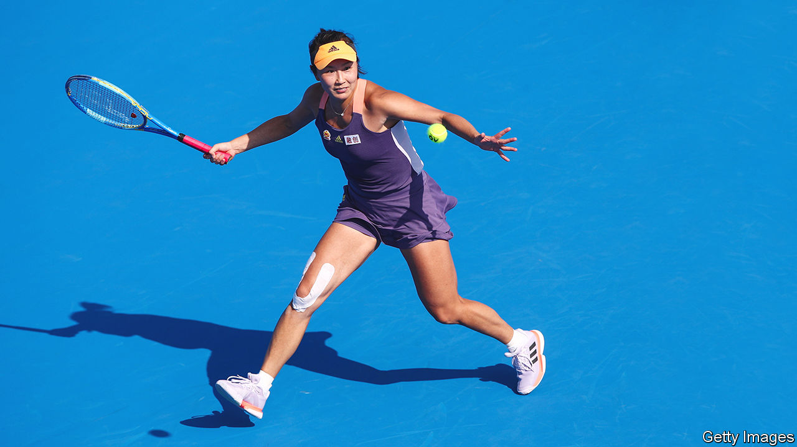

###### Return game

# After an unsuccessful boycott, women’s tennis is back in China 

##### The governing body admits defeat in its push for women’s rights 

 

> Sep 28th 2023 

Not long after Peng Shuai, a Chinese tennis star (pictured), accused a Communist Party grandee of sexual assault in 2021, her sport’s governing body, the Women’s Tennis Association (WTA), halted all tournaments in China. The WTA, based in America, called for Ms Peng’s allegation to be investigated “fully, fairly, transparently and without censorship”. That has not happened. Nevertheless, the WTA has returned. The China Open began in late September.

The WTA’s boycott is hardly the first of its kind to fail to produce a result from the Chinese government. Western leaders refused to attend the Winter Olympics in Beijing in 2022, citing concerns over human-rights abuses in China. But once the torch was lit, their message was largely forgotten by viewers. Many Chinese were unaware of the WTA’s boycott because Ms Peng’s allegations were censored. State media said tournaments were on hold because of the pandemic.

Nor is the WTA the first sports league to find out that taking a principled stand against China is costly. In 2019 the general manager of the Houston Rockets, a team in America’s National Basketball Association, expressed support for pro-democracy protests in Hong Kong. China responded by temporarily banning the broadcast of NBA games, costing the league hundreds of millions of dollars. 

The WTA left millions of dollars on the table with its cancellation of tournaments in mainland China and Hong Kong over the past two years. Commercial interests undoubtedly played a big role in its climbdown. Before the boycott, China had helped boost the WTA, hosting a large number of its events, including the WTA Finals.

The association admits that staying away from the country accomplished little. Since making her allegations, Ms Peng has walked them back. Observers believe she was under pressure from the authorities to do so. Chinese women who come forward with similar claims are often treated poorly. In 2018 a former intern at CCTV, the state broadcaster, went public with allegations that a prominent host had groped her, leading many women to speak up. Yet the former intern not only lost her legal case, but was sued for defamation. (The host withdrew the case on September 25th.)

Gender equality is, theoretically, a central tenet of the Communist Party. But the government has muffled the country’s #MeToo movement, lest it turn into political dissent. On September 22nd two well-known supporters of the cause went on trial in southern China for “inciting subversion of state power” (foreign diplomats and journalists were barred from the courthouse). The activists have already been held for two years.

The WTA has been assured that Ms Peng is living safely with her family. She is rarely seen in public. When it announced its boycott, the association said it did not want to let powerful people suppress the voices of women. Yet that is exactly what has happened.■


