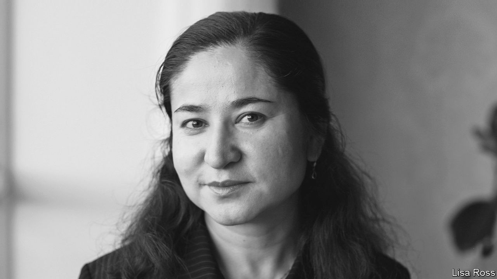

###### An absurd life sentence

# China’s persecution of Uyghurs extends to those it once favoured 

##### The punishment of Rahile Dawut speaks volumes 

 

> Sep 28th 2023 

Rahile Dawut was once something of an establishment figure in China. The 57-year-old anthropologist from the Uyghur ethnic group was a member of the Communist Party. The state funded some of her work at the University of Xinjiang, the premier college in the region, where she was a professor and founder of a research centre studying ethnic minorities. She was awarded prizes by the Ministry of Culture, had met President Jiang Zemin in 2000 and was featured on the cover of a state-supported magazine in Xinjiang, the Uyghur heartland. But in December 2017, after telling a relative that she had to travel to Beijing, Ms Dawut (pictured) disappeared.

There has been no official explanation of what happened to Ms Dawut. But the Dui Hua Foundation, a group that campaigns on behalf of political prisoners in China, says it has learned of her fate from a government source. According to the foundation, Ms Dawut was arrested for promoting separatism and “endangering national security”. At a secret court hearing in Xinjiang in 2018, she was convicted and sentenced to life in prison. She then appealed the sentence and lost.

Friends and former students of Ms Dawut say the charges against her are absurd. They describe her as a pragmatic scholar who rarely spoke about politics. For years she skilfully navigated the tight constraints on academic research in China. Ms Dawut is not a dissident, they say, but yet another victim of the state’s persecution of the Uyghur minority.

Since 2017 perhaps a million Uyghurs and other ethnic minorities have passed through “re-education camps” in Xinjiang, part of a government campaign of forced assimilation. The state has justified its actions by citing concerns about terrorism and separatism. Critics accuse it of cultural genocide. Ms Dawut is among “the long and growing list of Uyghur intellectuals—by one count more than 300—who have been detained, arrested, and imprisoned since 2016”, says the Dui Hua Foundation.

Still, the sudden fall of Ms Dawut was odd, causing observers to puzzle over it. Her high profile may have made her a target, says Abduweli Ayup, the founder of a Uyghur rights group in Norway. Perhaps officials wanted to make an example of her, to keep others in line, he suggests.

Ms Dawut’s international connections may have also raised concerns among the authorities. She was a visiting scholar at several universities in the West, including Cambridge University and the University of Pennsylvania. Chinese officials claim that foreign powers are trying to destabilise Xinjiang and are suspicious of any contact between Uyghurs and the outside world. Members of the group sometimes struggle to obtain passports. Some have been detained simply for travelling abroad.

Not forgotten

Ms Dawut attended Beijing Normal University, studying folklore, and was one of the first Uyghur women to earn a PhD. Her early work mapping Muslim shrines, called , which are scattered around Xinjiang, was lauded by academics. In the ensuing years she documented Uyghur folklore and religious traditions, often focusing on the role of women. She also mentored younger scholars. Her office at Xinjiang University and house in Urumqi, the region’s capital, were hubs for local and visiting researchers.

But in the years before she disappeared, Ms Dawut’s research was becoming increasingly sensitive. Her work recording local customs before they were wiped out clashed with official efforts to create a single Chinese identity, based around the majority Han ethnic group. Over the past decade, many  have been destroyed or desecrated by removing the offerings left by pilgrims. Others have been turned into attractions for mostly Han tourists.

At a recent foreign-ministry press briefing, a spokeswoman, Mao Ning, said she was unaware of Ms Dawut’s case. Officials are staying mum. Joshua Freeman, a historian based in Taiwan who has known Ms Dawut for two decades, thinks he knows why. “Their silence speaks volumes,” he says. “Her actual crime in the eyes of the state was being born Uyghur.” ■


