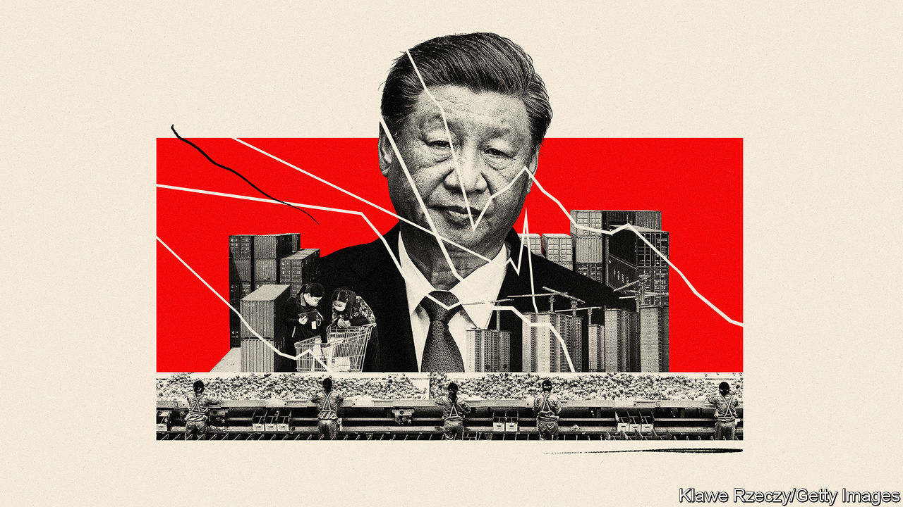
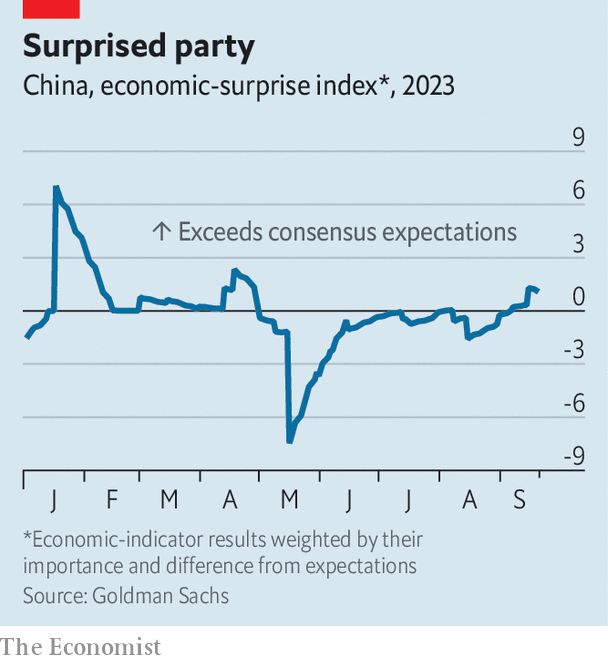

###### No time for stinginess

# Politics hamper China’s efforts to stimulate the economy 

##### The prime minister is weak and the president frugal 

 

> Sep 28th 2023 

A decade ago the 200-plus members of the Communist Party’s Central Committee gathered in Beijing for the “third plenum”, a five-yearly meeting traditionally devoted to the economy. The plenum promised to give markets, not the state, the “decisive role in allocating resources”. The failure of Xi Jinping, China’s leader since 2012, to embrace that commitment explains much of the disappointment about China’s economy in the past ten years. 

But the economy’s immediate predicament is different. The problem this year is not that the state has too decisive a role at the expense of the market. The most pressing difficulty is that in mobilising and allocating resources neither the market nor the state has been decisive enough. 

Consumers have lost confidence. They are reluctant to splash out or invest, preferring instead to accumulate money in bank deposits. They are wary in particular of buying property, once a mainstay of the economy. That has made it impossible for property developers like Evergrande to find their way back from insolvency.

Combined with a downturn in exports, this consumer hesitation has cut into the economy’s post-pandemic recovery. Data released from May to August covering industrial production, retail sales and exports, among other things, fell far short of expectations. Slowing growth has coincided with declining prices.

In the past, China’s government has responded forcefully to such downturns. When the global financial crisis struck the country in 2008, policymakers unleashed a lending and spending spree that quickly got growth back on track, even as the rest of the world faltered. But in the face of this year’s slowdown, the government has been as tentative and timid as its consumers. Its hesitancy exposes some of the political and ideological constraints that now hamper China’s efforts at stimulus.

In most economies, the “first responder” to a slowdown is the central bank. China’s monetary authority did cut interest rates in June, but not by much. It lowered its seven-day rate by 0.1 percentage points, followed by a second cut of the same size in August. (Many Western countries are raising rates because of concerns about inflation, a problem China does not have.)

Policymakers in China, like their counterparts in other emerging economies, worry that deep cuts in interest rates will undermine faith in the currency and erode the profitability of banks. But there is another element to this restraint. China’s political system has no room for activist, heroic central bankers. There is only one “maestro” in the country (to use a term once bestowed on the chairman of America’s Federal Reserve). That is Mr Xi. To retain any autonomy, China’s central bankers have to tread cautiously.

Responsibility for the economy traditionally falls to China’s number-two official, the prime minister. Past holders of this position have had the clout and gumption to fend off disaster and revive growth. When the Asian financial crisis rocked China in 1998, Zhu Rongji raised morale by vowing to keep growth at 8%. The current prime minister, Li Qiang, is weak by comparison. Installed in March, he owes his position entirely to Mr Xi. His brief—safeguarding prosperity—remains important. But it often plays second fiddle to safeguarding security, broadly defined. Mr Li is energetic and informed. Still, he sees the State Council (China’s cabinet) as a mere implementer of the party’s ideas, rather than a source of them, according to Wu Guoguang of Stanford University.

The once-bubbly property market is perhaps the biggest concern. It has been in a slump since mid-2021, when regulatory limits on excessive borrowing by developers began to bite, pushing Evergrande and others into default. Those limits were not merely a technocratic measure. They were part of a fierce, quasi-ideological campaign summed up by Mr Xi’s slogan: “Housing is for living in, not for speculation”.

That campaign has succeeded only too well. Sales of flats in August were 47% below their level in August 2019. Until the market stabilises, the economy will remain vulnerable. But recalibrating an ideological campaign is difficult. Regulators have loosened the definition of a first-time homebuyer, allowing more people to benefit from easier mortgage terms. They have lowered the cash down-payment people must provide. Some cities have removed price controls on flats. The 24-person Politburo, which helps set policy, dropped Mr Xi’s slogan from its communiqué in July.

But neither Mr Xi nor his underlings can easily admit that his campaign went too far. Nor can they loudly champion an alternative slogan that might rally the market without raising eyebrows. The impact on sentiment therefore lingers. On September 22nd Evergrande said that disappointing sales had forced it to delay a debt-restructuring plan. Trading in Evergrande’s shares was suspended on September 28th after Bloomberg revealed that the group’s chairman, Hui Ka Yan, is under police surveillance. The well-connected Mr Hui is both an author of the group’s misfortune and key to its recovery. None of this will inspire confidence in the viability of other distressed developers. 

China’s successful stimulus effort in 2008 was spearheaded not by officials in Beijing but by local governments. By the time Mr Xi came to power, the successes of this model had been overshadowed by excesses. Local governments had previously competed with each other to promote growth within tight fiscal constraints imposed by the central government. The stimulus upset this delicate political balance. Local governments borrowed heavily through off-balance-sheet “financing vehicles”, freeing them from their fiscal straitjacket and allowing them to make more expensive mistakes. Their appetite for debt has proved tenacious. These vehicles now owe about 60trn yuan (over $8trn), says Goldman Sachs, a bank.

Mr Xi has been determined to keep local governments on a tighter financial leash. That means they are in no position to lead another round of stimulus. The central government could instead do more itself. Some economists have urged it to provide consumption vouchers or handouts to the poor. But the state seems reluctant to help households directly. 

This may reflect the view that alternative methods of boosting the economy, such as public investment or tax cuts, pack a double punch: they help stimulate demand and also improve the supply side of the economy, by building infrastructure or spurring entrepreneurial vigour. The lack of enthusiasm for handouts may also reflect Mr Xi’s personal distaste for “welfarism”, which, he warns, leads to laziness. 

In recent weeks China’s government has begun to respond more forcefully to the slowdown. It has extended a tax break for people trading in their old homes for better ones. It has talked about renovating so-called “urban villages”, once-rural plots swallowed up by China’s big cities as they expanded outward. In August alone, local and central governments between them issued bonds worth about 1.2trn yuan ($165bn), more than twice the average for the first seven months of the year.

 


The economy also seems to be bottoming out. Exports in August were higher than a month before. Growth of retail sales and industrial production improved. Consumer prices have stopped falling. China’s economic data have lately begun to exceed diminished expectations (see chart).

To lift those expectations, Mr Xi could devote the next plenum to revising and elucidating his economic philosophy. He could promise to give greater priority to the market versus the state, prosperity versus security, opening up versus toughening up. In the meantime, his underlings will have to go on muddling through. ■


