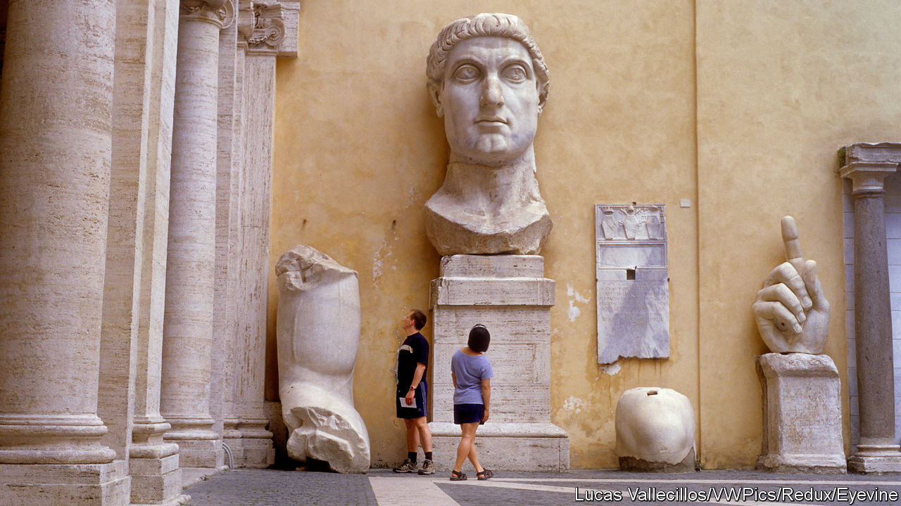

###### The emperor strikes back

# A new book by Mary Beard looks at the glitz and gore of Rome 

##### “Emperor of Rome” is a colourful tour of 30 emperors spanning over 250 years 

 

> Sep 28th 2023 

By Mary Beard. 

The lives of the rulers of ancient Rome are still vivid in modern heads. According to a conversation that has gone viral on TikTok, some men say they think about the  “every day”. The strongly masculine vibe appeals, of course. From “Ben-Hur” to “Carry on Cleo” to , the gaudy and rough images roll past: the tables groaning with grapes and roast flamingos; the marble halls; colossal self-portraits, plundered treasure and fawning senators; while, behind a curtain, wives and mothers scheme, and servants marinate the poisoned mushrooms.

People do not know the half of it, according to Mary Beard. Elagabalus, a teenage cross-dresser, not only gave banquets but allegedly showered his guests so liberally with petals that they were smothered to death.  not only fiddled (or, rather, played his lyre) as Rome burned, but also had the Olympic games rigged so that he won every event he entered. He acted, too, including in a play called “Orestes the Mother-Killer”—appropriately, since he had tried to kill his own. Caligula, perhaps the nastiest of the crew (though Tiberius came close), did not only propose that his racehorse should be a consul but gave him a marble stall, an ivory manger and imperial-purple blankets.

The stories are both shocking and entertaining. who writes and teaches at Cambridge when not starring in TV documentaries, has become a British national treasure partly for her defiant donnishness, including grey locks and an ancient bicycle, but mostly for her unabashed delight in unearthing the “real” Rome from the pieces left behind: tombstones, scraps of papyrus and the odd arresting sentence buried deep in administrative reports. 

Her ear and eye are alert to the unexpected, the funny and the salacious; her sympathies are tuned to the lives of the overlooked, who included, in those times, almost all women. In  published in 2015, she explained the surprising success of the Roman republic. In “Emperor of Rome” she applies the same method to a chariot-load of extraordinary characters, examining around 30 emperors over 250 years, ending in 235AD. She burrows busily and most enjoyably to show what the lives of these blood-splashed, technicolour rulers were like.

Professor Beard’s first source is a familiar and obvious one: Roman writers, and especially Gaius Suetonius Tranquillus, who worked in the secretariats of both Hadrian and Trajan. She cautions rightly that the chronicler of one emperor was likely to trash the reputation of the one who had gone before, and the titillating or horrifying tales should be taken with a large pinch of salt. But they are much too good to overlook. Suetonius was an overflowing fountain of political and sexual gossip, revealing the tiniest details. 

Emperors, too, should be pictured with a stylus in their hand. Few were writers in the usual sense, save Marcus Aurelius with his “Meditations”. Instead, they had to read and reply to mountains of paperwork from every corner of the empire: daily reports from governors and generals, petitions from towns, controversies over estates. More than 12 letters a day probably landed on the gold-and-marble imperial desk. No local problem was too small to send to the top man. 

His senior staff on the ground were stretched perilously thin. There was roughly one administrator for every 330,000 people, in an empire which, at its farthest extent from Scotland to the Sahara, and from Portugal to Iraq, contained more than 50m people. One man, competent or incompetent, lazy or dedicated, held all this together. 

Equally, no part of Roman life was too trifling to escape an imperial decree. (Tiberius banned pastries from fast-food stalls.) If emperors appeared at a morning  or at the races, dozens of parchment requests would be stuffed into their hands. Small wonder that  (who was not an emperor) took his paperwork to gladiator shows, though this was thought bad form. They had secretaries, of course, but most of them worked fairly hard themselves. And, being Roman emperors, they could not resist weaponising their pens. Hadrian stabbed a slave with his. Domitian used his to skewer flies.

The emperor’s gracious replies and concessions were often engraved in stone and erected all over the known world. Augustus’s “Res Gestae” (“What I Did”) was a fulsome autobiography written for just such public display, but the smallest town might put up a plaque, too. These, combined with mass-produced statues of the emperor and coins embossed with his idealised face, carried his authority far and wide. Caesar flooded the world with images of himself, and there may have been as many as 50,000 statues of Augustus, some colossal. These imperial images were also stamped on mirrors and vases: as Professor Beard remarks, the ancient equivalent of fridge magnets, populism personified.

The awe inspired by the emperor went with the job. He was the richest man in the world, with 30 palaces in Rome and country estates outside it. In the provinces he owned marble quarries, mines, papyrus marshes, claypits and vast tracts of crop-bearing land. All this directly served to feed, administer and decorate the empire. It also provided the cash that emperors fairly often showered on people. 

Dazzle came from sheer display: visitors to Nero’s Golden House found so many sumptuous rooms stuffed with treasure that they were disoriented even before dinner. Dread came from imperial caprice in matters of life and death: Caligula’s dinner-table quip, for example, that he could cut the consuls’ necks any time he chose. Emperors were seldom physically handsome (Caligula was spindly-legged, Galba had a hooked nose and a large hernia, several worried about baldness), but they carried the allure of being “Caesar”, the exhaustion of solo triumph-parades and the potential glory of being gods.

This did not sit well with all of them. The main aim of most emperors, Professor Beard writes, was almost to be “one of the lads”. Augustus, visiting the Senate, would greet every senator by name and shake their hands. With some he was on kissing terms. (He also liked to haunt the palace kitchens, kept a pet goat, and spent quiet afternoons fishing.) Commodus sometimes went down from the imperial box to fight among the gladiators, though only if they were already safely netted. 

Emperors did not fight in wars, but several visited the troops, chewed their hard rations and slept rough; Trajan even tore up his robes to make bandages. When bold comedians satirised them, they sometimes even let the joke pass.

At the beginning of her book, Professor Beard promises also to illuminate the lives of the people who served the emperor: the enormous staff of slaves, cooks, hairdressers, tutors, grooms and accountants. Very few emerge from the crowd. Instead she does something much more fascinating, uncovering the emperors themselves. 

It was not only Nero who put on a mask and strutted on the stage. In their different and sometimes hapless ways, they were all doing it, well aware of the elaborate fakery that sustained their power. Augustus, by a long way the most impressive emperor here, summed it all up on his deathbed: “Since the play has gone down well, give us a clap, and send us away with applause.” ■


