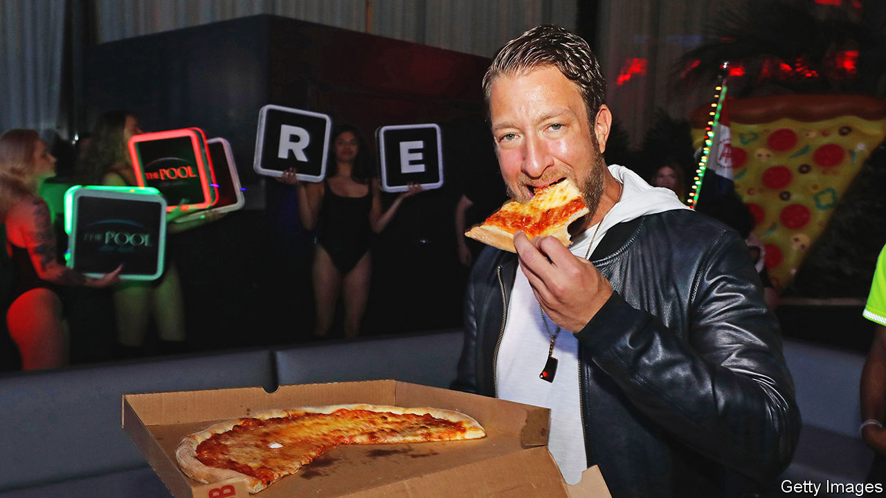

###### World in a dish

# Dave Portnoy, an internet personality, has become pizza’s kingmaker 

##### His controversial ratings have brought attention to what makes a good slice 

 

> Sep 28th 2023 

He has a mansion in Florida and millions of Twitter followers. He rails against , the White House’s former chief medical adviser, on Fox News and has been accused of misogyny and sexual misconduct, which he denies. Dave Portnoy (pictured) has crafted his persona in the image of the former president. He even calls himself “”. 

Barstool Sports, the media company Mr Portnoy founded 20 years ago, made him rich, but his “One Bite” pizza reviews, viewed nearly 700m times on YouTube, have made him the unlikely kingmaker of American pizza. On September 23rd, in drenching rains at a minor-league baseball stadium on Coney Island, he held his One Bite Pizza Festival. Around 6,000 fans attended; tickets started at $150.

Mr Portnoy does not pretend to be “some elite, like, food guy”, he told journalists. In more than 1,000 videos, he does not review so much as react. “One bite, everyone knows the rules,” he tells the camera before gobbling down a plain-cheese slice, which he rates from one to ten. Mr Portnoy is not afraid to be feisty, as shown by a recent spat with a pizzeria owner in Massachusetts that went viral. (The offending pizzeria was then flooded with negative reviews by “stoolies”, Mr Portnoy’s fans.) 

Despite the laddishness, this is . A rare high score—only 21 pizzerias in the country have scored a nine or above—can guarantee a steady, if rowdy and mostly male, clientele. Even for a popular establishment like John’s of Bleecker Street in Manhattan (one of Mr Portnoy’s avowed favourites, rated 9.3), a good review from him “puts you on the next level”, says Kevin Jackson, the manager. A small pizzeria in New Jersey lucky enough to receive a 9.4 quickly sold out its entire menu.

With cartoon renderings of Mr Portnoy’s bearded face smiling from every surface and an inflatable Statue of Liberty (brandishing a slice instead of a torch) presiding, the festival was a cheesy cross between a music festival, a drunken tailgate and a Trump rally. Despite the whiff of culture war—with several rants about the media—the event offered a helpful education in New York pizza. Mr Portnoy’s highest-rated pizzas tend to be thin, crispy, slightly charred and heavy on cheese. This is in keeping with classic ideals of pizza by the slice, says Scott Wiener, a pizza “tour guide” and critic of Mr Portnoy’s showmanship. The best slices have a thin crust with a “slightly puffy rim” and tomato sauce with light seasoning, if any. 

Patsy’s, a pizzeria in Harlem founded in 1933, claims to have been the first to sell pizza by the slice in New York. Mr Portnoy awarded the storied restaurant, which was present at the festival, an 8.6. But over the years New York pizza has become as diverse as the city, and your correspondent, who intrepidly sampled 15 of the 35 pizzerias, enjoyed less predictable fare. This included samples by two based in Brooklyn: Di Fara’s almost cracker-like crust and an exquisite offering by Lucali, whose crust straddled the crispier New York and chewier . (Lucali mixed  and parmesan and added a piquant garnish of basil.)

“The beauty of pizza is that everybody has access to it,” says Mr Wiener. Perhaps, then, the advent of a pizza populist—a bite-sized Trump, whose coarse charisma is impossible for restaurants to ignore—should not be surprising. Even if Mr Portnoy, like American culture writ large, is short on decency, he is a good guide to a great pie. ■


