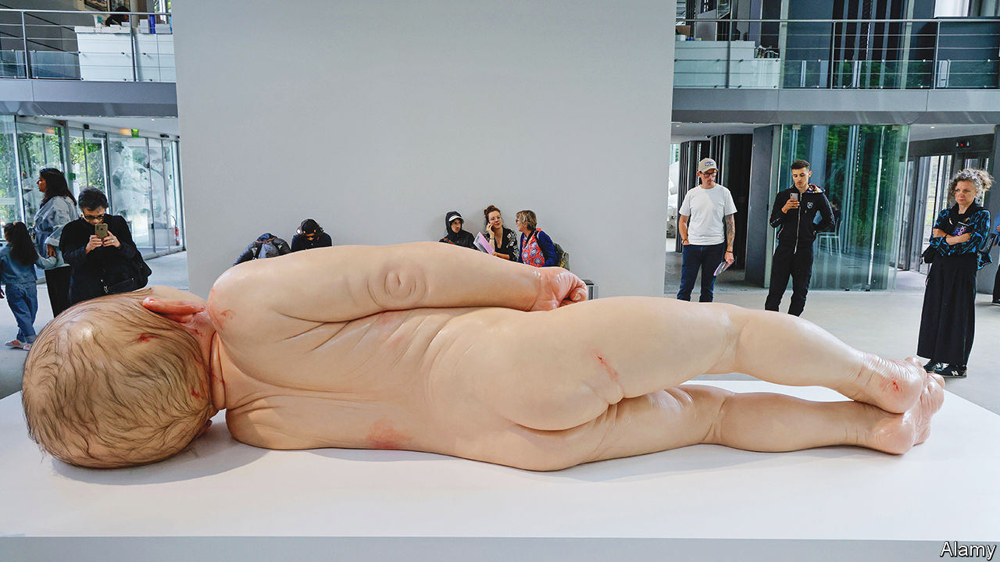

###### The unreal deal

# Hyperreal art is Instagram-worthy and booming 

##### But is it any good? People cannot decide 

 

> Sep 28th 2023 

A woman raises her hands like claws, laughs a little, bares her teeth and pretends to growl. She is having her photo taken in front of a pack of three-metre-tall black dogs made by Ron Mueck, an Australian artist whose sculptures are on display in Paris at the Fondation Cartier until November 5th. Awestruck whispers echo through another gallery as visitors snap photographs of a five-metre-long baby smeared with blood. It lies on the ground, face contorted in a newborn’s grimace.

For more than 25 years Mr Mueck, who once worked as a puppet-maker for , has built unsettlingly detailed figures out of silicon, fibreglass and resin. They are both lifelike and lifeless. Toying with notions of the grotesque and uncanny, Mr Mueck’s works balance tenderness with horror, often distorting the size of things to unsettle viewers and hold their focus. Audiences do not shy away. When the Fondation Cartier last showed Mr Mueck’s work in 2013, it was the most popular exhibition in its history, attracting 300,000 visitors. 

“Hyperreal” artworks are so technically precise they resemble photographs: no brush-strokes, lumps of paint or seams are discernible to the eye. The style is going global, jolting many galleries out of pandemic-induced attendance slumps. “Sembra Vivo!” (“It Looks Alive”), featuring 43 installations, is on view until October 8th at the Palazzo Bonaparte in Rome, after touring 13 cities from Bilbao to Taipei. In New York, Carole Feuerman’s swimsuit-clad sculptures loom over Park Avenue.

Earlier this year, high fashion even pounced on the trend, when Louis Vuitton collaborated with , the most expensive living female artist. Store windows in London, New York, Paris and Tokyo featured clones of the 94-year-old Ms Kusama and her multicoloured dots, arresting passersby as they tried to decide whether the robots were real people.

Hyperrealism has roots in the rich detail of Dutch still-life paintings of the 1600s but began to emerge in the 1960s in the work of artists such as Chuck Close, Duane Hanson and, later, Ms Feuerman. Political upheaval and technological change in America inspired hyperrealists (alongside pop artists) to turn their focus to the quotidian. “I couldn’t get a gallery,” says Ms Feuerman of her early days in New York, when abstraction and minimalism dominated art. But now the uptick in interest is so striking, she says, it sometimes makes her nervous that demand will outstrip supply: it takes her up to two years to make a single sculpture.

Popularity has its pitfalls. Whenever the San Francisco Museum of Modern Art (SFMOMA) displays its two sculptures by Mr Hanson—“Man with Ladder” and “Policeman”—curators have to worry about security, says Sarah Roberts, the museum’s head of painting and sculpture. Visitors often get too close to them. The photos that enthusiastic viewers snap are among the most popular posts on social media from the museum. On TikTok, a social video-sharing app, where artists including Marco Grassi, CJ Hendry and Emma Towers-Evans post films of themselves working on their time-consuming creations, #hyperrealism has 1bn views (compared with #abstraction’s mere 30.5m).

On one level, these works are purely fun . But something deeper is at stake, too. To look at a sculpture by Mr Mueck plays with notions of physicality, says Anne Cranny-Francis, a professor at the University of Technology Sydney. Viewers have to keep a safe distance, resist the urge to touch and avoid becoming disoriented by the surprising scale. In an era of screens, the body still matters.

Much of hyperrealism’s appeal also lies in an enthusiasm for the craftsmanship involved in the works, which can take painters or sculptors weeks and sometimes years to complete. Nobody looks at a hyperreal piece and announces “I can do that,” says Maximilian Letze, one of the organisers of “Sembra Vivo!”. Ms Hendry, for example, spends up to 80 hours working on each hand-pencilled drawing. Mr Mueck has made 48 works in his almost three-decade career. (“That is production at  pace,” marvelled one adoring critic in 2013.) At a time when , such as Dall-E, can create images in an instant based on simple, written prompts, such care and labour resonates. 

Hyperreal sculpture can be a tricky sale to private buyers, unless they are quirky types looking for something shocking to put in their living rooms, says David Knowles of Artelier, a British art consultancy. Hyperreal paintings are more likely to be sought out by his clients. 

Seeing is not believing

But the truth is that most art-world insiders loathe the genre, viewing it as crude, commercial and unimaginative, more spectacle than sublime. One critic dismissed Ms Feuerman’s work as an “eye-catching bauble”; others say Mr Mueck’s work is akin to a wax figure in Madame Tussauds’ collection. The works are, in the eyes of true collectors, the equivalent of elaborate, Instagrammable cakes: fun to photograph and post online but unlikely to be timeless.

Hyperrealism, however, can also bring people into museums and galleries they might otherwise find intimidating, says Ms Roberts of SFMOMA. And in an age of AI, some feel the work has fresh relevance. Humans are terrible at discriminating between people and deep-fakes. In June, academics from University College London found that when participants were asked to identify whether images of human faces were real or computer-generated, they were confident they could. Any success, however, was mostly due to chance. At least with art, after an initial double-take, they can leave the gallery knowing what was real. ■


