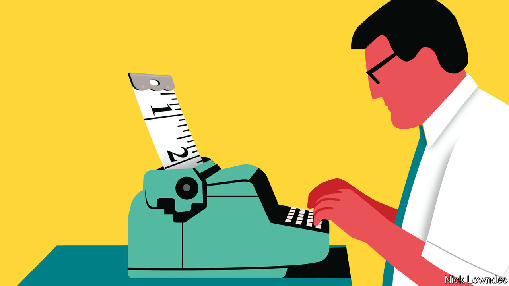

###### Johnson

# In favour of simple writing 

##### There is mounting evidence on why short and sharp is best 

 

> Sep 28th 2023 

DO YOU EDIT text messages carefully before sending them? If so, you may be the kind of person who takes pride in crafting even the simplest message. If you do not, you may see yourself as a go-getter for whom verve and speed outrank care: get it done decently now rather than perfectly later.

A new book makes the argument for being the , even in informal, throwaway messages. Todd Rogers and Jessica Lasky-Fink are behavioural scientists, both at Harvard. Their “Writing For Busy Readers” is cleverly titled: all readers are busy nowadays. People are bombarded constantly with messages, from the mailbox to the inbox to the text-message alert. (They can also be distracted by TikTok or “Candy Crush” at any moment.) What to read, what to skim and what to ignore are decisions that nearly everyone has to make dozens, or even hundreds, of times a day. 

The authors present well-established principles that have long been prized in  including’s style book (which Johnson helped update): cut unnecessary words, choose those that remain from the bedrock vocabulary everyone knows and keep syntax simple. But “Writing for Busy People” brings evidence. 

Take “less is more”. Most books on writing well preach the advice to omit needless words. The authors, however, have tested the notion. For example, in an email to thousands of school-board members asking them to take a survey, cutting the length from 127 to 49 words almost doubled the response rate (from a paltry 2.7% to 4.8%). The researchers found that a longer message makes recipients think the task (such as filling out a survey) will take longer, too.

The same applies to text messages. In another experiment, a pandemic-era message to parents first included a few sentences acknowledging the difficulties of home-schooling, then asked them to take a survey. A shorter message inviting them to take the survey got more responses. Writers must sometimes opt for being brusque but effective instead of sympathetic but ignored.

Often it is not just what you say but how briskly you say it. The  applies even when asking people to donate money, such as to political candidates. It is plausible that potential donors would be more likely to open their wallets if they could understand as many reasons as possible to do so. But in an experiment for an American candidate, simply deleting every other paragraph in a fundraising email increased donations by 16% (though it resulted in a disjointed message). Even political obsessives do not want to read endless self-justification.

Word-count is not the only thing to cut. Keeping messages to a single idea—or as few as absolutely needed—helps ensure that they will be read, remembered and acted on. Reducing the number of possible actions has the same effect, too: a link in an email (from, appropriately enough, magazine) attracted 50% more clicks when it was solo than when it was sent alongside a second, “bonus” link.

Syntax and , too. Short and active sentences, with common words that everyone uses, are best. From Facebook posts to online-travel reviews, even brief, informal pieces of writing that follow these rules get more likes, shares and so on. Serious writers should also take note. A study of the ethics codes of 188 public companies found that those using long sentences and complicated words were seen as less moral and trustworthy. 

The authors’ other points are less about writing than about design and informational packaging. Organisation matters: a redesigned summons issued by New York City police (for small offences on the street) reduced court no-shows by 13%. Bullet points, headings and formatting for emphasis are good—when used judiciously. But mixing up different forms of emphasis like highlighting, bolding and italics are the “equivalent of a peanut butter, ham and Gorgonzola sandwich on banana bread: a combination of ingredients that add up to an unpleasant, off-putting whole”.

If everyone is a busy reader, everyone is a busy writer, too. That may make it tempting to fire off as many messages as quickly as possible and hope for the best. But from essays to text messages organising dinner plans, devoting time to the needs of readers has provable benefits. If you are so busy that you write an undisciplined message that readers scan, ignore and delete, then you might as well have not written it at all.■


