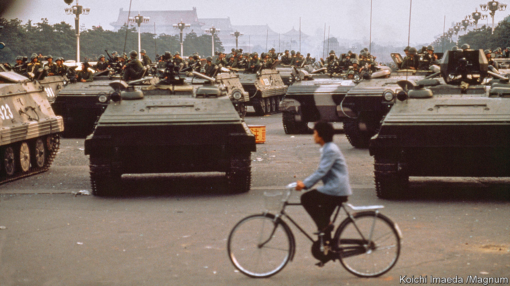

###### Writing the wrongs of history

# Some people in China are bravely trying to document the past 

##### “Sparks”, a new book by Ian Johnson, looks at China’s censored history 

 

> Sep 27th 2023 

By Ian Johnson. 

Amid the global calamity of covid-19 in 2021, the Chinese Communist Party’s elite had much to discuss at their secretive, annual conclave. But in the communique issued at the end, there were eight times as many mentions of the word “history” as of the word “pandemic”. To China’s leader, Xi Jinping, getting the party to agree to his version of the party’s century-long past was a no less pressing matter. 

Mr Xi’s interpretation of history was contained in a 36,000-character document. It presented what officials called a “magnificent epic”, with Mr Xi’s “new era” as its glorious culmination. Only one paragraph dealt with the horrors (“mistakes”, it called them) of the period under , when millions died in a man-made famine and political violence. It made no mention of the deaths he caused and blamed others in the leadership for the ’s “many crimes”. 

Deng Xiaoping’s crushing of the Tiananmen Square protests in 1989, at the cost of hundreds if not thousands of lives, was dealt with in just two sentences. Tiananmen was described as “a severe political disturbance” against which the party “took a clear stand”. The new history did not even hint at the army’s intervention, let alone its machine-gunning of protesters.

To Mr Xi, getting the party to agree on this narrative was not a mere ivory-tower exercise. It was aimed at demonstrating his power and silencing anyone who might attempt to undermine his or the party’s authority by dwelling on past failings and brutality. In his new book, “Sparks”,, a former Pulitzer-prizewinning journalist who is now a fellow at the Council on Foreign Relations, says Mr Xi regards “counter-history”—the attempt by some people in China to correct the sanitised official record and provide truthful accounts—as an “existential threat”.

The “underground historians”, as Mr Johnson calls them, are a motley group of academics, artists, film-makers and journalists, often motivated by personal experiences. Most have families and take enormous risks to visit scenes of past horror and to interview survivors. They share their discoveries in  form and publish or air them abroad, sometimes online using software to tunnel through . One underground journal, called , is circulated as a PDF every two weeks. It carefully avoids the most sensitive topics, such as Tiananmen, but pulls no punches on the Mao era.

Mr Johnson’s description of the historians’ efforts exposes an important facet of Chinese life that is often ignored because it is so hard to access. Police keep close watch on meetings and communications with the party’s critics. Mr Johnson’s ability to evade controls and gain the trust of his subjects is evident in his compellingly written work. The result is a rare insight into the extraordinary risks that some Chinese take to illuminate the darkest corners of communism. These historians are united, he says, by “common ideas and beliefs that remain widespread across China, so much so that it is not an exaggeration to call this a movement”.

The chroniclers of suppressed memories, interviewed by Mr Johnson over the course of many years working in China, are commendable for their courage. The history they tell is bleak. One is Tan Hecheng, a “garrulous, stubborn and emotional editor”. Mr Tan has spent more than four decades researching a massacre in 1967 of around 9,000 people in Hunan province by officials who falsely accused the victims of engaging in a counter-revolutionary plot. “Many were tied together in bundles around a charge of quarry explosives,” writes Mr Johnson. “These victims were called ‘homemade aeroplanes’ because their body parts flew over the fields.” Without Mr Tan the truth of what happened may not have been uncovered. 

The book also describes those who record contemporary events. When the  in the city of Wuhan, several Chinese filmed and described online the ensuing chaos of those early days, before the grim order of Mr Xi’s “zero-covid” policy was imposed. This was dangerous work in the face of official efforts to play down the suffering of ordinary people and highlight the deftness of the party’s response. The government harnessed nationalists to attack those who dared to criticise its efforts. Online diaries were gradually erased by censors. Some Chinese wrongly came to view the authors as “harmless cranks or Western stooges”, Mr Johnson writes.

But the historians have not given up. What is striking, Mr Johnson writes, is their persistence. The outbreak in Wuhan can be seen as an example of the party’s ability to project and wield enormous power. But Mr Johnson argues that it is better viewed as “a classic example” of repeated eruptions in China against “unchecked government authority”.

Such a claim may sound like wishful thinking. Many observers believe that China’s citizens are supportive of the party and its nationalist cause and that truth-seeking contrarians are a marginal force. But as Mr Johnson writes, “Saying that ‘most people’ don’t know or care is a truism applicable to almost every society in every era: what matters is that many Chinese do know and continue to battle, today, to change their society.” Mr Xi appears acutely aware of this—and fearful the efforts of unofficial historians will spread. ■


