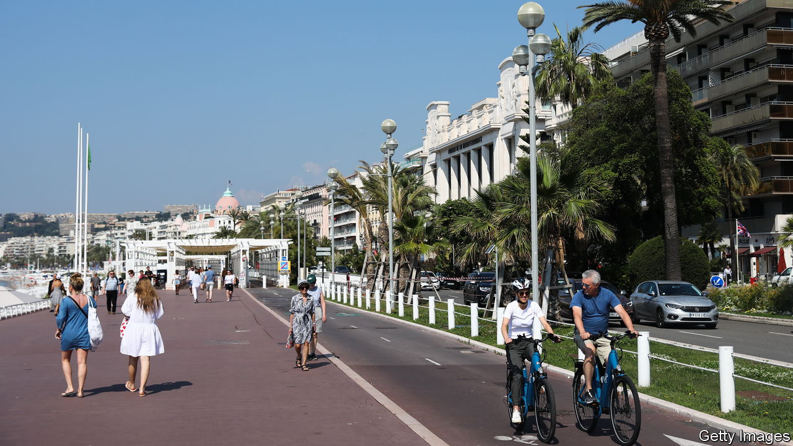

###### Good from evil

# Seven years after a terrorist attack, Nice has rebuilt itself 

##### “You have made us stronger,” says the mayor 

 

> Sep 24th 2023 

When the Tour de France, a gruelling multi-stage cycling race, takes place in July 2024, it will for the first time in its 120-year history end not in Paris, but in Nice. Instead of finishing on the Champs-Elysées, cyclists will complete the final stage along the palm-fringed Promenade des Anglais, on the Riviera. For the city of Nice, the event will be moving as well as being a source of pride. July will also mark eight years since a lorry ploughed into a festive crowd in a  that killed 86 people, and left the city in shock. Today Nice is trying to turn its response to that horror into a way to reinvent the city.

The attack of 2016 took place on France’s national holiday, Bastille Day, when locals and holidaymakers were out celebrating on the promenade. Mohamed Lahouaiej-Bouhlel, a Tunisian citizen resident in France, drove a 19-tonne lorry for 2km into crowds of families, before being shot dead by the police. Islamic State claimed the attack as an act of jihad, although investigators never found a direct link to the perpetrator. In the following days, the beachfront was turned into a shrine to the dead. Pebbles, teddy bears, dolls, drawings, candles and flowers were laid all along the promenade where victims fell. A place of revelry was turned into one of grief.

Nice has not forgotten that dark day. Last year the city unveiled a statue in memory of the dead, depicting an angel perched atop a breaking wave, its head inclined towards the sea. Yet in the aftermath of the attack, when the local authorities were working out how to reinforce security along the promenade, they decided to incorporate in their plans a broader effort: to make the city safer, greener, younger and more dynamic. The idea, says Christian Estrosi, the centrist mayor of Nice, who is close to Edouard Philippe, a former prime minister and a  in 2027, was “for people to forget the place as it was and discover a new one.”

The focus was initially on the seafront. Joggers and walkers, as well as cyclists, now enjoy dedicated lanes protected by white bollards of reinforced concrete, linked by steel cabling. Since 2018 Nice has opened two new tram lines, one of which links the airport with the city and has reduced by 20,000 cars a day the traffic along the promenade. The extra tram lines have also helped to breathe new life into neglected areas, including the once-shabby port. Two more tram lines are planned. A “green corridor” of trees and parks, still partly under construction, now stretches from the beachfront into the city’s interior. 

Heavily dependent on tourism, with its image as a favoured spot for such luminaries as Ernest Hemingway or Louis Armstrong, Nice also earned a reputation as a sun-drenched place for retirees. Now the city is trying to show that it can lure youth and innovation too. An “Eco-valley” is under construction along the Var river, from the airport and past the Allianz Riviera football stadium. ISART Digital, a school for video-game developers, is opening a new campus there. Start-ups specialising in “clean tech” have moved in. In 2025 Nice will host the United Nations oceans summit, a big jamboree. The city’s student population has doubled since 2008. In the evening, bars and restaurants are packed. “The city has said to its enemies: ‘you thought that you could floor us? In fact you have made us stronger,’” says Mr Estrosi.

Just along the road from the site of the attack, however, stands the Lenval Foundation children’s hospital. Years later, it continues to monitor 692 adults and children. On the night the attack happened, seven mobile psychological stations were opened on or near the promenade. These kept operating for over three weeks, and carried out over 4,000 consultations. Everyone in the city, says a psychiatrist, knew someone who was on the promenade that evening. In the run-up to a trial last autumn, in which eight people were found guilty of links to the attack, the hospital noted an increase in post-traumatic symptoms. Of the patients monitored by the Lenval hospital today, a third still have debilitating symptoms such as anxiety.

City leaders are well aware that Nice will continue to bear the scars. It also faces plenty of other issues unrelated to the attack. The jobless rate in Nice is higher than the national average. Poverty crowds into the tower blocks that stretch inland, far from the chic Riviera and its private yachts. The south of France more broadly has become a stronghold for Marine Le Pen’s hard right, and the Côte d’Azur is no exception. At the second round run-off of the presidential election in 2022, won by Emmanuel Macron, she scored three points more in Nice than she did on average across the country, and did even better in nearby cities such as Cannes.

Nor is the city’s redesign to everybody’s taste. Some opposition leaders are up in arms at the decision to tear down the city’s theatre and exhibition centre to make way for the extended urban forest. Motorists grumble about the new one-way system around the headland, designed to leave more space for cycling. Bold urban planning usually has its discontents. Yet on balance Nice is doing a pretty good job of picking itself up and shaping a different sort of future. “Historically we were a bit conservative,” acknowledges Mr Estrosi of his city. “Paradoxically, since the attack, we have become a much more open city.”■

