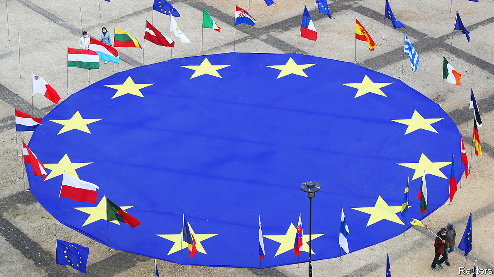
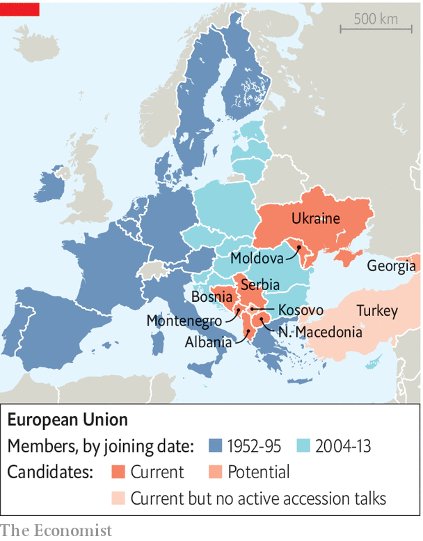

###### One last push

# The EU is finally rebooting the enlargement machine 

##### Going from 27 to 36 members will require reform of the bloc 

 

> Sep 28th 2023 

Russia’s invasion of Ukraine has prompted a slew of geopolitical realignments, from China to India by way of Turkey. Many are likely to prove fleeting. But one that may prove durable is a new European order now being actively considered. Some 2,000km from the front lines, in Brussels, the war on its continent has prompted the European Union to give serious consideration to bringing new countries into the club for the first time in over a decade—and to adapt the union for what is likely to be its last big enlargement. 

On October 6th the EU’s 27 national leaders will meet in the Spanish city of Granada to lay out a path to this enlargement, and ponder how a reshaped union would work. The road to EU membership for up to nine new countries—including Serbia, Albania and four others in the Western Balkans, as well as Ukraine, Moldova and possibly Georgia—will be tortuous. Joining what would become the world’s largest economic bloc, on a par with America, will require deep reforms of the sort current aspirants have so far shunned, or those that Russian invaders make hard to pull off.

From the EU’s perspective, morphing from a club of 27 today to perhaps 36 tomorrow will be possible only if its inner workings are revisited. That will include changing the balance of power between the bloc’s central institutions and its national capitals, for example making the club less hostage to a single country’s whims. Such internal reorganisations can easily prompt squabbling at the all-night summits the union is known for.

 


Nobody expects the process to be quick: a target date of 2030 that is being considered for both applicants and the EU to be ready is ambitious. But the fact that bringing more countries into the bloc is on the agenda at all is remarkable, seeing how enthusiasm for any newcomers has waned in recent years. Enlargement had once been a red thread running through the history of the club, which started off with just six members and ended up with 28 (before Britain left). But by 2013, when Croatia was let in, the process seemed to have run its course; no one has joined since then, and the previous entrants, Bulgaria and Romania, arrived as far back as 2007. 

Some of this reflected “enlargement fatigue” among Europe’s old guard, for example France, which feared that widening the EU had come at the expense of deepening its integration. Others came to agree, especially after the behaviour of some of the new member states, former Soviet-bloc countries granted entry mainly in 2004. Hungary and Poland have at times been run by governments accused of flouting core EU values concerning the rule of law. For much of the 2010s the EU was embroiled in the euro-zone crisis and was not much in the mood to take on new challenges. Ukraine for its part was too big, too poor, too corrupt and too agrarian to enter a club that mollycoddles its farmers.

The war in Ukraine has changed the calculus. “Enlargement used to be driven by hope; now it is driven by fear,” as a diplomat from an aspiring country puts it. Strung along for years with promises of accession, some countries have turned to new patrons, including Russia, Turkey and China, which have showered the region with aid and investment. That used to be merely annoying for the EU. Now it is an intolerable incursion into its back yard. 

 


When thinking of Ukraine, by far the biggest aspiring entrant (see chart), officials from EU countries wonder if having a neighbour with lots of battle-hardened men left outside the bloc looking in may be a recipe for future strife. The EU is on the hook for reconstructing the country anyway. The costs of bringing Ukraine and others into the club will be heavy, for they are still poor, corrupt and agrarian in varying degrees. Yet there is a good case to be made that it would prove even costlier to keep them out.

Nowhere has this new reality dawned so clearly as in France. As recently as May 2022 Emmanuel Macron seemed to write off the prospect of Ukraine becoming a member, saying it would take “several decades”; he had previously thrown sand in the gears of Balkan accession. Now France has become an unexpected champion of enlargement. Other existing EU members were always keener on the idea: Germany’s governing coalition agreement, signed in 2021, commits it to letting in the West Balkans. Central Europe also wants Ukraine and others to join—on security grounds. That is as much of a consensus as is likely to be reached on any EU issue.

Two hefty obstacles lie in the way of Europe formally welcoming nine new members. The first concerns the applicants. The second is the readiness of the club they want to join.

Start with the applicants. In short: there is a good reason why Bosnia-Herzegovina, Montenegro and the others are not already in the EU. None of them is particularly well run. All suffer from a mix of autocracy, corruption and weak rule of law. Moldova, Georgia and Ukraine have Russian troops on their territory. The EU prides itself as a “peace project”, yet simmering tensions endure between two putative members, Serbia and Kosovo, including periodic armed scuffles. Serbia has refused to apply sanctions against Russia; its president, Aleksandar Vucic, used his recent address to the UN General Assembly to blast the West over old grievances. Kosovo for its part is not even recognised as a state by five current EU members.

Bosnia is still riven by the ethnic tensions that broke up Yugoslavia in the 1990s. Montenegro, once a front-runner for EU membership, has had a caretaker government for over a year. Even when pro-EU leaders seem to be undertaking useful reforms, for example Maia Sandu in Moldova or Edi Rama in Albania, fears abound over whether the next election’s winner will be suitable to sit at the top table of the European Council. The same is true of Ukraine and whoever might succeed Volodymyr Zelensky. Teams of EU officials visiting Kyiv have been impressed by how much effort the country is putting into ticking all the boxes required to keep the accession process jogging along. But who will be Ukraine’s president in 2030, or 2035?

Balking at the Balkans

The obstacles may seem insurmountable, particularly in the Western Balkans, which have been promised EU membership as a reward for reforms since 2003. But enlargement optimists—now in the ascendant across the EU—think all that is needed is a new dynamic. Up till now, applicant countries sensed that even if they reformed, the doors to the club would remain shut. This bred a vicious cycle of cynicism: they pretended to reform, and the EU pretended to want them in.

The latest signals from Brussels are different. “The EU is ready. The EU is serious this time,” says Miroslav Lajcak, the club’s point man for the Western Balkans. He adds a caveat: “But I feel that the region is still not convinced about that.” For now, there are few signs that the distrust and despondency that have characterised the Balkans’ relations with the EU—and its messy internal politics—are being overcome. 

Two things are being done to break this cycle. The first is a new consensus in Brussels that applicant countries should feel the benefits of the EU before getting full membership. The aim is to provide immediate returns for reforms, and not promise a large but distant carrot only once membership is secured. Beyond participating in EU policies, such as energy interconnections or student exchanges, the applicant countries would get cash—a time-honoured way to spur reforms.

More chunky are the EU’s efforts to show that the club is undertaking its own reorganisation, necessary for enlargement to happen. The buzzword in Brussels is “absorption capacity”, so that a union of 27 does not collapse under its own weight when it swells to 36. Not only would enlargement alter the shape of the EU, but it will have to modify its inner workings, too.

Discussions are at an early stage and will take years. But two big changes will have to take place. The first concerns the EU budget. The bloc normally spends only about 1.2% of its combined members’ GDP, €1.8trn ($1.9trn) over its seven-year budget cycle. That is both not very much and yet enough to create winners and losers—and more all-night wrangling at summits. 

The common agricultural policy hoovers up around a third of the bloc’s budget, as do “cohesion” and regional-aid funds flowing to poorer countries and regions. Under current rules, such funds would be soaked up by the newcomers, in particular by Ukraine and its vast farms. The upshot would be stark: 18 current EU members now receive more money than they put in, including all of central Europe. Unless existing policies are overhauled, quite possibly all today’s members would become net contributors. Mere tweaks to farming subsidies are usually enough to send protesting farmers on their tractors into the streets of Brussels spreading manure. A more radical overhaul might be politically unpalatable in several countries. Poland, once Ukraine’s most steadfast ally within the EU, recently blockaded grain imports from its embattled neighbour, straining its relationship with the government in Kyiv.

The other huge challenge is to adjust the EU’s basic rules over how decisions are made. This is where the wrangling will prove most divisive. Some issues are easy to handle: at the moment, the European Commission, the bloc’s executive arm in Brussels, is composed of one appointee from each country. In a union of 36, some (smaller) countries might have to give up the right to a commissioner. 

A more contentious but necessary change would be for more decisions to be made by qualified-majority voting, whereby big countries carry more weight than small ones. At present important swathes of policymaking—including foreign policy, economic sanctions, policing matters and taxation—must be agreed unanimously by all 27 member states. France and Germany are keen for more areas to be impervious to veto by just one or two recalcitrant countries. But many small countries feel that such vetoes preserve their sovereignty. And much of central Europe already distrusts decisions crafted in Paris and Berlin that would be foisted on them.

Hence a lot of cogitation. A group of think-tankers commissioned by the governments of France and Germany has suggested a “multi-tier” structure for Europe, with more projects (like the euro) adopted by only some member states. Others want to make it easier to punish governments that flout democratic norms, like Hungary today, for example by suspending their voting rights on EU matters.

Few of the suggestions put forward today are likely to survive intact. Many member states, including Poland, suspect the entire debate around EU reforms is being cooked up to make it harder, not easier, to bring in new members. These fears are accentuated when those who want lots of changes say the process must involve a reform of the EU’s treaties—a cumbersome exercise last attempted in the 2000s.

The topic of when and how enlargement will happen will dominate the European political discourse for years. The final destination remains unclear. But the fact that the prospect of a bigger EU is at last being taken seriously is a mark of how much the war in Ukraine has reverberated far beyond the front lines. ■

