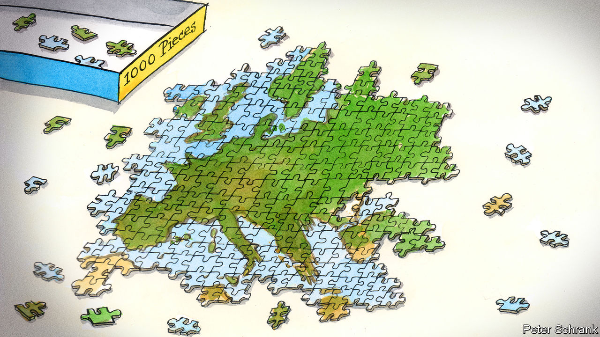

###### Charlemagne

# The definition of Europe has always been both inspiring and incoherent 

##### But that has not stopped it growing 

 

> Sep 27th 2023 

CURIOUSLY, THE only continent to have united under a moderately effective form of multinational government is not actually a continent. English-speakers may call Europe “the continent”, but that is because their language evolved on an island off its coast. In fact it is simply a convoluted promontory of Eurasia. This sets geographers a puzzle: where does Europe end? The eastern border especially is fuzzy. The current consensus holds that it runs through Russia along the Urals, gets vague for a while and then follows the Caucasus mountains’ watershed to the Black Sea. That makes demi-Europeans of not just Russia, Turkey and Georgia but also Kazakhstan and perhaps Azerbaijan. It puts Armenia outside Europe, though many Armenians would disagree.

Clearly, Europe is more than just a geographical concept. But other definitions also lead to confusion. If Europe is wherever European powers hold sway, colonialism has ensured it spans the globe. Cross the westernmost land border of the Netherlands and you step directly into France, because you are on the Caribbean island of Saint Martin, which they split. Define Europe culturally, meanwhile, and you will notice that polka music sounds more like Mexican than like Spanish flamenco, and that Greek ouzo and Lebanese arak are the same drink. Go with political values and you find many democracies outside Europe qualify, while some quasi-dictatorships inside might not. Use religion or race, and you are engaging in bigotry—nowadays seen as un-European.

All this might seem academic, were it not that the question of what defines Europe is vital for countries who want to join the European Union. Of the current serious applicants—six countries in the , plus ,  and —most sit well inside the physical continent. They have not yet got into the EU because they have not met its accession criteria. But those criteria themselves are in part a product of centuries of debate over what it means to be European. And EU voters’ gut sense of who belongs in the club is shaped by history.

The idea of Europe started with the ancient Greeks, who contrasted it with despotic, barbarian Asia. After the Roman Empire fell, the dream of reunifying Europe recurred periodically. In the Middle Ages that meant uniting Christendom against Islam. In the 17th and 18th centuries, as religious and imperial wars raged, secular ideas were floated. In 1712 the Abbé de Saint-Pierre called for a “European Union”, and in 1795 Immanuel Kant proposed something similar in his “Perpetual Peace”. Unfortunately the fellow who was busy trying to unite the continent at the time used bloodier means, until he was stopped at Waterloo. 

The Enlightenment sense of who belonged in Europe rested on Europeans’ alleged rationality and cosmopolitanism. The 19th century added the idea of intrinsically European cultures and peoples—or, most dangerously, races. Such nationalism meant more wars and, in their guilty aftermath, calls for European unity. The modern European movement started after the first world war. Some of its founders saw it as a way for Europe to compete with America and the Soviet Union. That implied that Russia could never join. Nor, some thought, could Britain, which identified more with its empire than with Europe. (They were right that this was an issue.)

When a federal European proto-government finally arrived after the second world war, its mission was political and economic: to make western Europe too integrated for its states to fight each other again, and rich enough to fend off communism. Membership was dictated by cold-war circumstances, not fluffy philosophical concerns. The community’s leaders did not get round to defining the “European identity” until 1973. They invoked “the cherished values of their legal, political and moral order” and vowed to preserve “the rich variety of their national cultures”. Since the values were universal (democracy, rule of law and so forth) and the cultures varied, there was no principled reason to keep eastern Europe out after communism collapsed. Accession to the EU became, in theory, a matter of technical criteria.

But the very unifying institutions that went along with the EU began to revive divisions. Free movement required the French (and the British, for a time) to accept unlimited numbers of Poles and Bulgarians. Monetary union forced the Germans and Dutch to budget together with the Italians and Greeks. European law meant that when Hungary packed its courts, it was a problem for everyone. Centuries-old faultlines cracked open: Protestant, Catholic and Orthodox; Gallic, Germanic and Slavic. After the euro crisis in 2010-12 and the migration crisis in 2015-16, few European peoples had an appetite for new members.

Finishing the job

Lately Europe’s leaders are again enthusing about enlargement. To understand why, it helps to consult arguably the greatest 20th-century European philosopher: Ludwig Wittgenstein. The Austrian once thought that language must refer to distinct things in the real world, and that philosophy should aim to make it exact, like science. Later he came to the view that this was nonsense. Words cannot be defined precisely; they have fuzzy edges. Their meaning lies in the way people use them to get things done.

So too with the word Europe. Europeans’ feelings about who belongs in the EU depend on what problems they are discussing. Monetary union and disputes over the rule of law are issues of institutions and culture, and they focus attention on Europeans’ different identities and histories. But today’s biggest challenges—the war in Ukraine, competition with China, rising migration across the Mediterranean, dealing with climate change—are geopolitical. This has turned Europe’s attention back to geography. French and Albanians may not entirely agree on what civilising traits they share, but they know they are stuck together on the same bit of Eurasian rock. At the moment, that seems more important. ■


