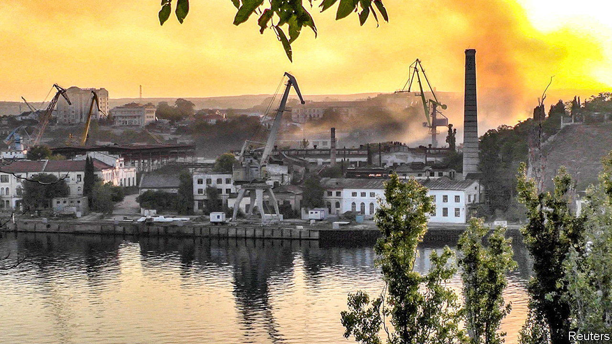

###### Black and Blue Sea

# War has arrived in Crimea 

##### Slowly but methodically, Ukraine is chipping away at Russia’s firepower in the peninsula 

 

> Sep 25th 2023 

 

TWO UKRAINIAN missiles smashed into the headquarters of  before noon on September 22nd. This time, there could be no cover-up. After a Ukrainian attack on a nearby command post two days earlier, censors had scrubbed most social-media posts written by locals. But the daytime strike in central Sevastopol, timed to coincide with a meeting of senior generals, was impossible to hush up. Local chatrooms buzzed with gossip. “Day 576 of a three-day war to take Kyiv,” read one. “What about our red lines? Time to wipe these bloody Ukries from the face of the earth,” another. Amid Ukrainian claims that dozens of officers had been killed, Russian authorities even started turning on early-warning air-raid sirens—something they had previously tried to avoid.

 


One and a half years in, Vladimir Putin’s war has come to Crimea in earnest. Since the beginning of summer, Ukraine has massively stepped up strikes on the peninsula annexed by the Kremlin in a largely bloodless coup in 2014. Using a mix of new  and foreign-supplied , it has hit military bases, air bases, and command-and-control centres. 

On September 13th a strike on the Sevmorzavod dry dock in Sevastopol took out an amphibious landing ship and one of just six kilo-class submarines capable of launching cruise missiles near the Ukrainian shore. A day later drones and Ukrainian cruise missiles destroyed a cutting-edge S-400 air-defence system that had an export price tag of over $1bn. On September 23rd, a day after the strike on the headquarters, another salvo of cruise missiles hit a pier in Sevastopol. Slowly, and methodically, Ukraine is chipping away at Russia’s Crimean firepower. 

Ukrainian military sources say the operations are not necessarily ends in themselves. They should rather be seen as auxiliaries to two more important efforts. The first is Ukraine’s ongoing land counter-offensive, focused on the  to the north-east of Crimea. Any Ukrainian success in degrading air power, railways and logistics, they say, undermines the Russian troops there who are directly supplied from the peninsula. 

The second focus is a naval contest in the Black Sea. Here, Ukraine is trying to deny Russia a monopoly of the sea and to regain control of vital shipping routes. It is destroying Russian warships wherever it can, and pushing the rest out to a distance that makes striking ports, cities and a new sea corridor as difficult as possible. The process began in April 2022 with the sinking of Russia’s flagship , hit with a home-produced Neptune cruise missile that the navy wasn’t sure even worked. Since then Ukraine has sunk or damaged at least 19 Russian ships.

Ukraine’s economy rests on the success of a new sea corridor in and out of Odessa, announced in August in the wake of Russia’s refusal to extend a . The safety of the route, which hugs the shoreline inside Ukrainian territorial waters, depends on two things: a bet that Russia will not target civilian ships sailing under neutral flags; and a viable threat of retaliation should that not prove enough. 

The latter is already real. At the start of the war Russian warships were positioned menacingly close to Odessa. Today, they rarely enter the north-western Black Sea—a remarkable achievement for a Ukrainian navy without a single operational warship. “The Ukrainians have adapted to become a mosquito fleet [using naval drones, missiles and artillery],” says John Foreman, a former British defence attaché in Moscow and Kyiv. “It’s a classic sea-denial strategy that others used against the [British] Royal Navy in the past.” 

Ukraine’s strategists have consistently identified Crimea as Russia’s Achilles heel: crucial to its ability to project power and hold on to occupied territories, but vulnerable to being cut off. An article co-written in September 2022 by Ukraine’s commander-in-chief, Valery Zaluzhny, highlighted the need to make “feelings [of discomfort in Crimea] more acute, natural and tangible.” New circumstances have added urgency to that aim. The counter-offensive has yet to produce the breakthrough many had hoped for—specifically, it has not brought Crimea into artillery range from the north. The pressure is on to show results in another way. 

Even more important are the new capabilities in the hands of Ukrainian planners. Lines of finance provided to drone manufacturers in early 2023 are making available new aerial and sea drones. Some of the naval drones, like the “Sea Baby”, used for strikes on the Kerch bridge that links Russia directly to Crimea, had been in development for years. But others, like the torpedo-style, underwater “Marichka”, which packs a 450kg explosive punch, have appeared more recently. 

Ukraine also has new missiles at its disposal: steady flows of Storm Shadow/SCALP cruise missiles from Britain and France, and a new surface-to-surface version of the Neptune that sank the . “The big change is that we received new missiles and intelligence,” says a source in Ukraine’s general staff. “As soon as we have a target and we can hit it, this is exactly what we do.” Other cruise missiles are in the pipeline. “We want an analogue of the Russian Kalibr and Kh-101s,” says the source, noting that these weapons’ speed, manoeuvrability and stealth makes them hard to intercept. 

Hanna Shelest, a security expert based in Odessa, says Ukraine will not have to look far for expertise. The one-time missile superpower had a handful of “crazy…world-class” projects under development before 2014, she says. They were mothballed because of lack of finance or, in some cases, sabotage. “There were many cases where documents disappeared or were not signed.” Some of these projects have been dusted off. Creating a new missile usually takes around ten years, but bringing older prototypes to market will be much quicker. 

Yet although Ukraine continues to score successes against its more powerful adversary, it is unclear if a tipping-point will ever come. Andrii Ryzhenko, a retired Ukrainian navy captain, says the campaign to make Crimea unsustainable will continue well into the winter. The anticipated arrival of , promised by President Joe Biden last week, will help stretch the barrage out. “We will keep searching out Russia’s weak points, and keep degrading Russian defences and logistics,” says Mr Ryzhenko.

Russia is adjusting its tactics in response to the new threat. It has moved some of its ships to safer ports, like Novorossiysk across the Black Sea. But the psychological importance of Crimea to Mr Putin’s rule means he is likely to cling on. Ukraine has significantly degraded Russia’s “naval power ratio,” an operational measure it uses to take account of drones, radar, shore-based artillery and so forth, as well as warships, though it is still a long way from parity. At the start of the war its navy put that ratio at 12:1. Today it stands at 4:1. “The Russians still have the upper hand,” admits Captain Ryzhenko. ■

