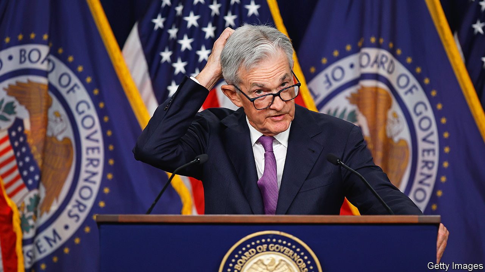

###### Republican doves

# America’s Federal Reserve could soon be flying blind 

##### A government shutdown would have far-reaching consequences 

 

> Sep 28th 2023 

One of the most anodyne phrases a central banker can utter is that they are “data-dependent”. It is a sophisticated way of saying that they do not know the future, and so will wait and see what the numbers look like. These days, though, declarations of data dependence by the Federal Reserve are more interesting: they sound like plaintive pleas rather than statements of the obvious. Many of the data points that allow the Fed, analysts and investors to understand the American economy are on the verge of disappearing, a casualty of the looming government shutdown.

Congress faces a deadline of midnight on September 30th to pass a bill to keep the federal government funded. Given the stubbornness of hardline Republicans, who wield near-veto power in the House of Representatives, the chances that America’s legislature will miss the deadline are high and rising. The most recent government shutdown, which started towards the end of 2018, lasted for 35 days, meaning it could easily be November before federal employees get back to work this year.

The straightforward economic impact of a shutdown is milder than often imagined. Unlike in the disastrous scenario of a debt-ceiling induced default, the government would continue to meet its mandatory obligations such as providing income support to the elderly. It is the so-called discretionary parts of federal spending—from crop insurance for farmers to money for highways—that would be halted. These account for about 27% of the government’s budget. A rule of thumb, based on past experience, is that each week of a government shutdown shaves about a tenth of a percentage point from the annualised rate of gdp growth in the quarter when it occurs. But when federal offices reopen, workers receive back-pay, and the hit to growth is mostly papered over.

The less widely appreciated concern is that the government will be unable to collect and publish a wide array of the economic data that are the lifeblood of financial markets. Retail sales, housing starts, personal income, gdp and, most crucially, inflation—all these reports will be suspended while the government is shut. The blackout will be more of a problem than during the 2018-19 saga, because on that occasion the Bureau of Labour Statistics (bls), responsible for inflation figures, among others, had already received funding and so could continue to operate. If a shutdown starts next week, the bls would go offline, joining the Census Bureau and the Bureau of Economic Analysis, two other stalwarts of official statistics.

The Fed’s policymakers would not be entirely bereft of information about the economy. For starters there are plenty of regular private-sector indicators of which they already make use: multiple reports on the job market, alternative indicators of inflation and surveys of both consumer and business sentiment. Financial information from banks and state-level figures, especially tax receipts, are useful. Plus the central bank has regional offices that will continue to collect data about their local economies. The problem, however, is that none of these fallbacks has the same combination of nationwide scope, methodological rigour and track record as, say, the bls’s consumer price index. “It would be very awkward for the Fed if it made a decision based on its own regional data, and then when the national data comes out, it’s actually quite different,” warns Joseph Wang, a former Fed trader.

This risk could well tip the Fed towards being more doveish in its next interest-rate decision at the start of November. Why raise rates again if there is little visibility about how the economy is performing? If the government reopens and it turns out that inflation was too hot, the Fed could always catch up with a rate increase at its December meeting. By contrast, if the Fed raises rates in November and it then emerges that the economy has in fact slowed sharply, the central bank would have to consider reversing its move—far more awkward to explain than a slightly belated rate hike. The Republican hardliners who are driving the government to a shutdown do not want to be thought of as inflation doves, but that is the strange consequence of their intransigence. ■


