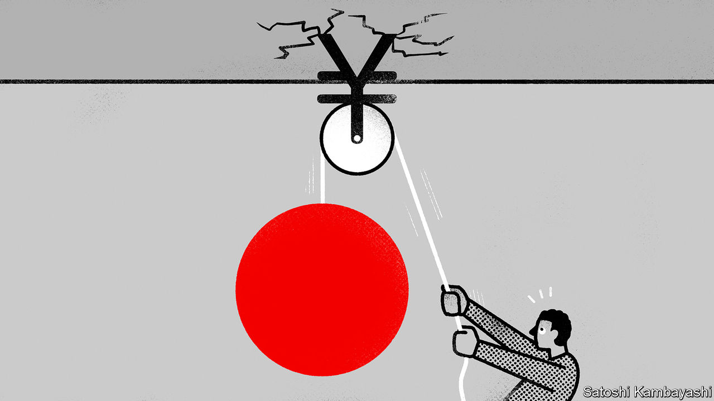

###### Buttonwood

# Investors’ enthusiasm for Japanese stocks has gone overboard 

##### Speculators have flocked to the country’s markets this year. They may soon regret it 

 

> Sep 28th 2023 

Foreign visitors have come flooding back to Japan since it reopened to travel in late 2022, making up for three years’ absence during the covid-19 pandemic. The weakness of the yen has produced some bargains for these recent arrivals. For the first time in a much longer period, investors are similarly excited about the bargains to be found in Japanese stockmarkets. Unfortunately, much like the travellers who zip through Tokyo in go-karts dressed as Mario and Luigi, many now risk going overboard in their newfound enthusiasm.

From January to August foreigners bought ¥6.1trn-worth ($40bn-worth) of Japanese stocks, which represents the largest nominal inflow during the same timeframe since 2013. According to a survey by Bank of America, more fund managers are now overweight the country’s shares (ie, investing more than they usually would) than at any time in almost five years. The return of investors to Japan’s markets has been driven by optimism about reforms to corporate governance, with companies increasingly subject to investor activism and therefore returning cash. High-profile winning bets on Japan’s trading companies by Warren Buffett, a famous investor, have provided a boost. So has the fact that Japanese stocks have returned 13% this year, in dollar terms, compared with a 10% rise globally. 

All this optimism will soon be put to the test. After all, it is not just prospects for corporate-governance reform that have fuelled the rise in Japanese stocks; it is also the astoundingly cheap yen, and that may not last. The currency trades at ¥149 to the dollar, its weakest in three decades—down by 23% since the end of 2021. Japanese exporters, which face domestic costs but make much of their revenue overseas, have benefited enormously from this state of affairs. 

The yen’s weakness has been caused by huge differences in interest rates, with capital flows moving to higher-yielding assets. Unlike almost every other central bank, the Bank of Japan (boj) has refused to raise rates: its short-term interest rate remains at -0.1%. Yet observers increasingly expect the boj to shift, abandoning its cap on ten-year government-bond yields and raising rates for the first time since 2007. Japan’s “core core” inflation, which strips out fresh food and energy prices, sits at 4.3%, far above the central bank’s target. Even a small rate rise would squeeze the government, which last year had net debts equivalent to 163% of Japan’s gdp, twice the rich-world average.

Some had thought that a virtuous cycle of mild inflation and stronger wage growth might finally be returning to Japan after decades of torpor, which would have made higher rates and a stronger yen less bothersome. But after months of waiting there is little evidence that pay really is rising. Employee earnings have dropped 2% in real terms in the past year and by 8% in the past decade. The ratio of job vacancies to applicants, which reached around 1.6 in 2018 and 2019, is now at 1.3, and falling rather than rising. Thus if the boj is dragged into tighter policy, it will not be by a budding recovery. Rather, it will be because of external pressure. With oil prices hovering above $90 per barrel, inflation in energy imports will filter through to other prices over time. 

Even if the boj does manage to stick to its guns, the gulf between American and Japanese interest rates looks unlikely to widen much, since the Federal Reserve has paused its rate rises. The transitory effects of the weaker yen will therefore begin to ebb for Japanese companies. A fall in the yen will boost earnings once, as foreign revenues are magnified in yen terms relative to the previous year. However, unless the yen continues falling, the support is a one-off. If the American economy weakens and investors come to expect interest-rate cuts, the yen will almost certainly surge against the dollar, weakening overseas earnings in the opposite way.

Reforms to Japanese corporate governance are not to be sniffed at, and some beaten-down companies still present opportunities. Yet these bright spots will not be enough to overwhelm the macroeconomic gloom that is now enveloping Japan. Global investors sometimes seem capable of holding only one narrative in mind when it comes to the country: Japan is either a stagnant mess, with little hope of rescue, or is on the verge of an epoch-defining revival. This dichotomy does not apply today. The overwhelmingly positive trend in Japan’s corporate governance must be set against the trickier situation it is facing in the currency markets.■


