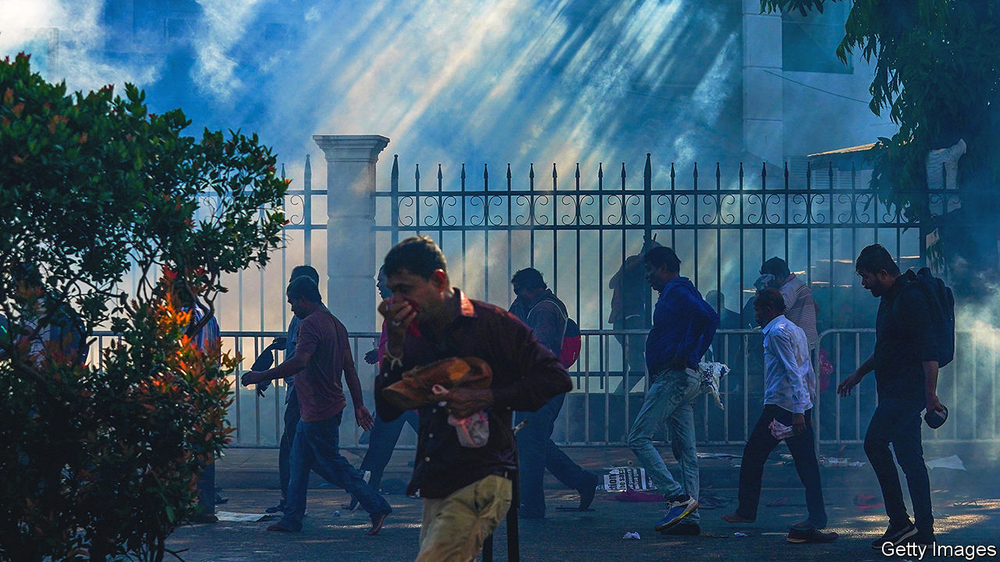
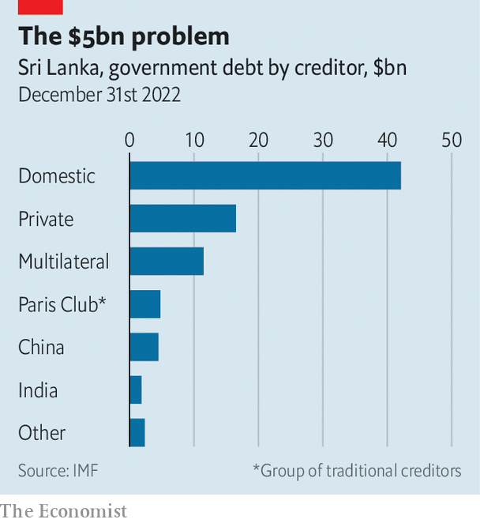

###### Better off without you

# Sri Lanka shows how broken debt negotiations have become 

##### The country’s creditors decide they have no choice but to freeze out China 

 

> Sep 28th 2023 

For sri lanka’s politicians September 27th was meant to be the light at the end of the tunnel. After more than a year of economic free fall—in which the former president fled protests, gdp shrank by 9% and billions of dollars of arrears piled up—the imf was in town, ready to release $330m from a bail-out agreed in March. There was even talk that the country’s creditors would reach a deal to cut back its debts. 

Yet the fund’s officials flew back from Colombo without releasing a dollar. The problem was two-fold: Sri Lanka’s tiny tax take and China, which is the country’s biggest creditor. The imf cannot lend more unless Sri Lanka restructures its debts, since the country owes so much elsewhere that officials cannot otherwise be sure they will get their money back. Therefore by refusing to take a haircut on its debts, China is holding up Sri Lanka’s restructuring—as it is in other indebted countries, too.

 


On the same day that the imf officials departed, Bloomberg, a news service, reported that other national creditors, led by India, were working on a deal, and that it would not include China. They may end up insisting that Sri Lanka suspends repayments to China or forces it onto a comparable deal. Either would be almost impossible to enforce. Creditors usually only agree to something because everyone agrees to the same terms. Even creditors at war with one another usually manage to hash out a deal. The decision to proceed without China reveals the extent of the breakdown in sovereign-debt negotiations.

It was hoped that a recent deal in Zambia, to which China signed up, would provide a template. But the solution was unique to the structure of Zambian debt, which allowed creditors to relabel some Chinese lending as private rather than public. And China only agreed to much of the compromise, which includes low interest rates and slower repayment, on the condition that it could back out if Zambia’s economy picked up. At a recent g20 summit, where the agenda ranged from cryptocurrencies to global tax, officials observed that debt restructuring was the issue on which the least progress had been made.

Worse, middle-income countries like Sri Lanka cannot even get into the process through which Zambia secured its deal. The Common Framework, a g20 mechanism for creditors, only applies to poor countries. Middle-income ones must negotiate with China alone. Chinese officials refuse even to sit on a committee with the rest of Sri Lanka’s national creditors. Many economies near default today, from Egypt to Pakistan, are also too rich to qualify. 

Sri Lanka’s situation also exposes a worrying new fault line. Some think that China was put off joining Sri Lanka’s creditor committee because India was a co-chair. After all, it was willing to participate in Zambia’s committee, which it jointly led with France. Such tensions will only become more of a problem, since India’s lending is growing. Bradley Parks of William &amp; Mary, an American university, suspects that India’s officials have decided to lend to countries already indebted to China to counter their rival’s influence. Future standoffs are therefore likely to be in places where both countries are big creditors. 

This week’s check-up was the first by the imf in a defaulting country in the Asia-Pacific region since the financial crisis there more than 20 years ago, when it doled out $35bn to Indonesia, South Korea and Thailand, and was so busy that South Koreans called events “The imf Crisis”. Then the fund was in the thick of things—now it can do little but sit and watch. ■


