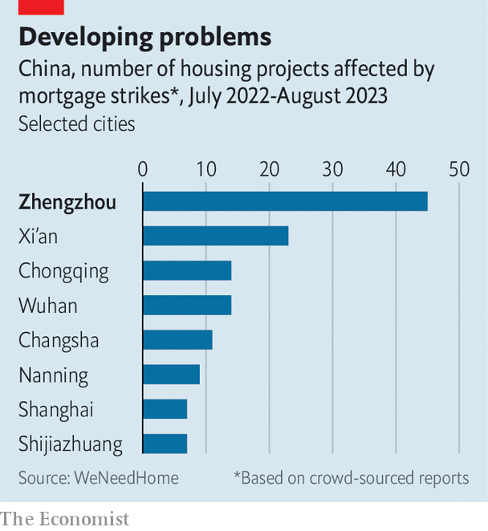

###### Laboratory visit

# The city that encapsulates China’s economic stagnation 

##### Zhengzhou’s experience suggests that local problems will be hard to fix 

 

> Sep 25th 2023 

On a Typical evening Zhengzhou’s manufacturing district should be teeming with workers heading back to their dormitories. For more than a decade the city of 13m in central China has been home to Foxconn employees who assemble iPhones in a local megafactory—meaning activity at hole-in-the-wall eateries and dank internet cafés provides an informal gauge of the health of the local economy. But now one of the main dormitory areas is vacant. Labourers are stripping out what remains of internet cafés and hauling off sofas that once furnished dorms. Many workers fled, never to return, in October last year, escaping a  that had confined them to their dorms, sometimes ten to a room, for weeks on end.

Zhengzhou has become one of China’s most problematic cities. gdp per person in Henan province, of which it is the capital, is more than a quarter below the national average. The city’s difficulties—including a lack of work, falling property prices and banking instability—are acute examples of those facing China at large. They also emerged earlier than those in much of the rest of the country. As such, Zhengzhou has become a laboratory for potential remedies, some of which have since been rolled out on a national level. 

China’s recent economic data, released on September 15th, indicate that the economy is at least starting to stabilise. The annual rate of growth in industrial production rose to 4.5% in August. Retail sales were up by 4.6%. Both beat analysts’ expectations. But the total floor area of new homes under construction fell by 7.1% in the first eight months of the year, continuing . And even if the situation has begun to stabilise, Zhengzhou’s experience shows how hard it will be for China to truly escape from its economic malaise—and how long any recovery will take.

The region’s troubles began to accelerate in 2020, with the default of Yongcheng Coal, a local energy firm. The next year floods swept Zhengzhou, killing almost 400 people and submerging a metro line. Local officials, including the party secretary, were sacked for hiding the true number of casualties. In 2022 bank depositors around the country discovered they could not withdraw their funds from several banks in the province, leading to weeks of protests outside the Zhengzhou branch of China’s central bank. The city also experienced tough treatment during covid-19. Locals shudder at the memory of a four-month lockdown they endured before the abandonment of “” policies.

 


As one woe after another has been visited upon the city, its property market has worsened. China has been in the throes of a real-estate crisis since 2021. Developers have come up short on the cash needed to finish flats. And because most buyers pay upfront, they have found themselves taking out mortgages without receiving homes. In July last year dissidents began tracking mortgage boycotts—and found Zhengzhou to be at the centre. By some counts, 600,000 local homebuyers have bought flats in troubled developments. cric, a research firm, estimates that one in every 13 households has been affected.

The situation has forced local policymakers to act. Henan’s plans to ease joblessness have included a 100-day, military-style campaign, which began in May and recently came to an end. It aimed for “zero-dynamic clearing” of youth unemployment, borrowing language from the zero-covid policy. Staff at universities were told to identify youngsters who were struggling to find jobs and to connect them with public institutions, state-owned enterprises and even employers in the countryside. Since the campaign has only just concluded, the results are not yet clear—but it seems unlikely to have discovered thousands of new employment opportunities. With a poor job market and 870,000 new university graduates this year alone, Henan’s public servants would have had to have been working overtime to have put even the slightest dent in the problem.

Other reforms are a little more thought-through. In March Zhengzhou became the first big city to drop restrictions on buying second homes, in an attempt to prop up demand. Last month it led the way again as the first city to launch reforms that instructed banks to lower mortgage rates, exempted new graduates from deed taxes and handed out subsidies of up to 30,000 yuan ($4,100) for home purchases for families with three children. It also lifted a rule that banned people from reselling their homes within three years of purchase.

By early September work appeared to have restarted on some of the city’s largest stalled property developments. One, named Qifucheng, had been paused since 2019. The development, with more than 6,000 residential units, has been called Zhengzhou’s largest , or abandoned building site. Last year the developer behind it was accused of putting a few workers on site in order to give the impression that work was taking place, perhaps to avoid being sued. Now trucks are moving in and out, and many workers are on the job. If similar projects resume, people looking for new flats might even shake off their distrust of the sector. This will take time, however. Property prices in Zhengzhou are still heading in the wrong direction—they fell by 0.5% month-on-month in August—which bodes ill for a rapid recovery in other second-tier cities.

Perhaps Zhengzhou‘s most daring reform has been to relax the constraints of the , a household-registration system. A year ago city officials announced that migrants with local jobs and residences would qualify for a registration necessary to buy homes or access education, abandoning a system that has created a two-tier society across China. In theory, ditching the could relieve many of the city’s problems. Talented young people looking to live in a big, central city might move to Zhengzhou. Some might even launch startups, attracting workers from around the country. All of this should help boost property prices. Yet since policymakers introduced the reform, other provinces have made similar moves, increasing competition for potential arrivals. In August, for instance, Jiangsu, a prosperous coastal region, said that it would relax requirements for many of its cities.

After a long delay, the central government has shown that it is taking the country’s stagnation seriously. Meanwhile, the central bank has loosened policy. But questions remain over whether China’s leaders will be able to solve local crises, which is necessary if the country is to raise its long-run growth. So far, the message has been that local leaders will need to solve many of their own problems. It is unfortunate, then, that Zhengzhou’s experience suggests doing so will be a struggle. ■


