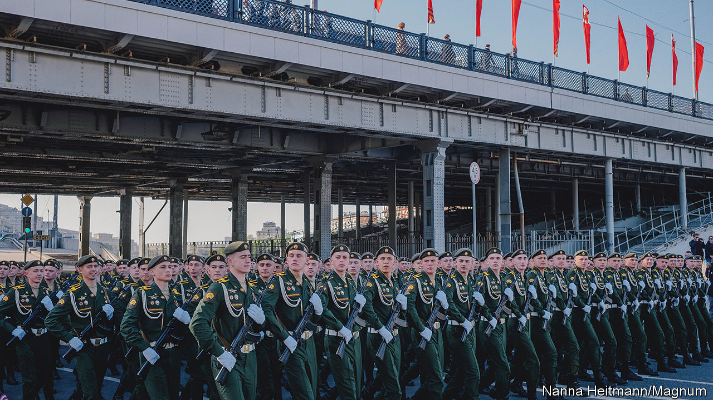
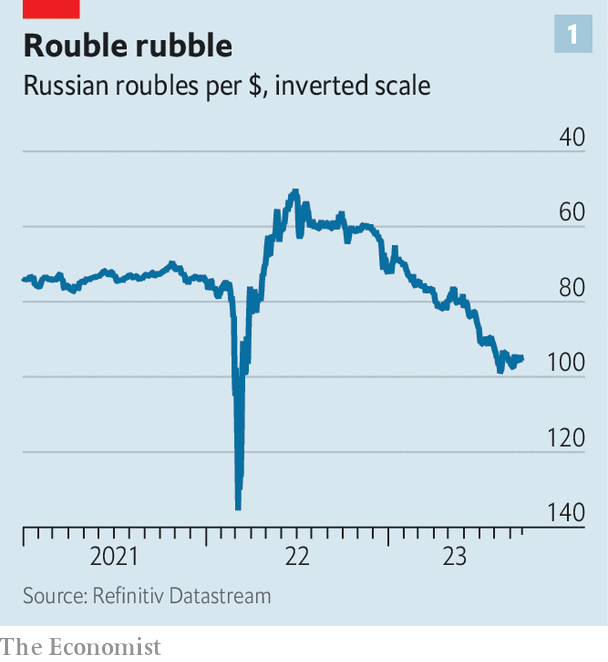
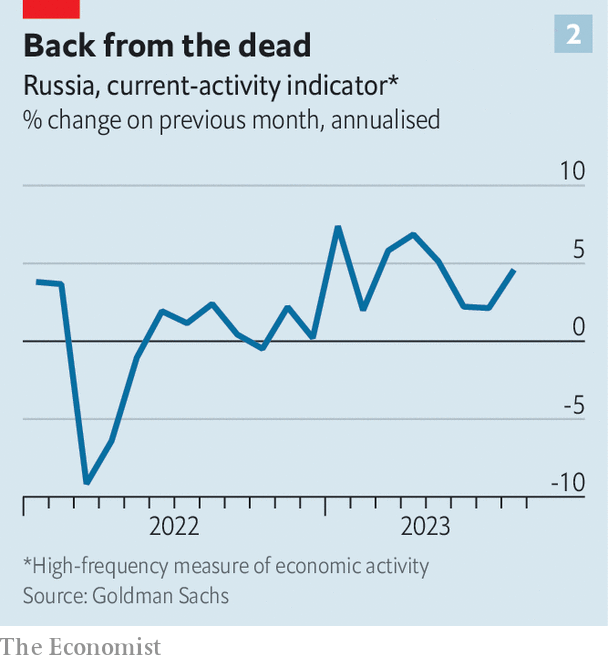
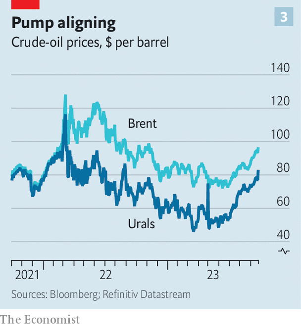

###### Conflict economics

# The costs of Russia’s war are about to hit home 

##### Vladimir Putin will be unable to protect citizens from the pain 

 

> Sep 28th 2023 


Over the past year few currencies have done worse than Russia’s rouble. Last September an American dollar bought just over 60 of them. These days it will buy almost 100 (see chart 1). The drop is both a symbolic blow to ordinary Russians, who equate a strong currency with a strong country, and the cause of tensions in the Russian state. It has blown apart the consensus that existed among Russian policymakers last year, when the central bank and finance ministry worked hand in glove. Now, as inflation rises and growth slows, the two institutions are turning against one another. At stake is the country’s ability to wage war effectively.

 


During the conflict’s early stages, Russian officials had a straightforward task: it was their job to stop the economy collapsing. Immediately after the invasion began, this involved preventing people from pulling money out of the financial system, by implementing capital controls and doubling the policy interest rate. The rouble hit 135 to the dollar, before recovering. The economy nosedived and then improved (see chart 2). Funded by juicy revenues from sales of oil and gas, the finance ministry then kept the show on the road by lavishing spending on defence and welfare. 

 


Strong oil-and-gas exports also caused the rouble to appreciate, lowering import prices and in turn inflation. This allowed the central bank to accommodate fiscal expansion, cutting interest rates to below where they had been on the eve of the invasion. Over the course of 2022 consumer prices rose by 14% and real gdp declined by 2%—a weak performance, but miles better than forecasters had predicted. Last week Vladimir Putin noted that “the recovery stage for the Russian economy is finished”.

The new stage of the economic war presents officials with tough choices. Mindful of a presidential election in March, the finance ministry wants to support the economy. Bloomberg, a news service, has reported that Russia is planning to increase defence spending from 3.9% to 6% of gdp. The finance ministry also wants to raise social-security spending. Mr Putin is keen to run the economy hot. He recently boasted about Russia’s record-low unemployment rate, calling it “one of the most important indicators of the effectiveness of our entire economic policy” (conscription and emigration no doubt helped). 

Yet the central bank is no longer keen to assist. The problem starts with the rouble. It is sliding in part because businessfolk are pulling money from the country. Low oil prices for much of this year have also cut the value of exports. Meanwhile, Russia has found new sources of everything from microchips to fizzy drinks. Resulting higher imports have raised demand for foreign currency, cutting the rouble’s value. 

A falling currency is boosting Russian inflation, as the cost of these imports rises. So is the fiscal stimulus itself, warned Elvira Nabiullina, the central bank’s governor, in a recent statement. Consumer prices rose by 5.5% in the year to September, up from 4.3% in July. There are signs of “second-round” effects, in which inflation today leads to more tomorrow. Growth in nominal wages is more than 50% its pre-pandemic rate, even as productivity growth remains weak. Higher wages are adding to companies’ costs, and they are likely to pass them on in the form of higher prices. Inflation expectations are rising.

This has forced Ms Nabiullina to act. In August the central bank shocked markets, raising rates by 3.5 percentage points and then by another percentage point a month later. The hope is that higher rates entice foreign investors to buy roubles. Raising the cost of borrowing should also dampen domestic demand for imports. 

But higher rates create problems for the finance ministry. Slower economic growth means more joblessness and smaller wage rises. Higher rates also raise borrowing costs, hitting mortgage-holders as well as the government itself. Last December the finance ministry decided it was a good idea to rely more heavily on variable-rate debt—just as borrowing costs began to rise. In August, conscious of higher rates, it then cancelled a planned auction of more debt.

Mr Putin would like to square the circle, defending the rouble without additional rate rises. He has therefore asked his policymakers to find creative solutions. Two main ideas are being explored: managing the currency and boosting energy exports. Neither looks likely to work. 

Take the currency first. The government is keen to mandate exporters to give up more hard cash and make it harder for money to leave the country. In August officials started preparing “guidelines” that would “recommend” firms return not just sale proceeds but also dividend payments and overseas loans. On September 20th Alexei Moiseev, the deputy finance minister, hinted that capital controls were being considered to stem outflows to every country, even those deemed “friendly”. 

Such measures are, at best, imperfect. Russia’s export industries form powerful lobbies. The experience of the past 18 months is that the firms which dominate energy, farming and mining are skilled at poking loopholes in currency controls, says Vladimir Milov, a deputy energy minister in the early days of Mr Putin’s reign. Waivers and exemptions abound. In late July Mr Putin issued a decree allowing exporters operating under intergovernmental agreements, which cover a big chunk of trade with China, Turkey and others, to keep proceeds offshore. 

Civil war

The Kremlin also wants to create artificial demand for the rouble by forcing others to pay for Russia’s exports in the currency. Central bankers seem to think this plan is pretty stupid. “Contrary to popular belief,” as Ms Nabiullina noted in a speech on September 15th, the currency composition of export payments has no “notable impact” on exchange rates. The only thing that changes is the timing of the conversion. Either an exporter paid in dollars uses them to buy roubles, or the customer buys the roubles themselves. What might help Russia more would be to pay for more of its imports in domestic currency so as to save foreign exchange—and then for foreign sellers to keep hold of those roubles. But there is little sign of that happening.

Russia might consider using its foreign reserves to intervene in currency markets. Yet more than half of its $576bn-worth of reserves, held in the West, are frozen. Using the rest is hard because most of Russia’s institutions are under sanctions that limit their ability to conduct transactions, says Sofya Donets, a former Russian central-bank official. And the country’s available reserves, which have shrunk by 20% since before the war, could only defend the rouble for a little while anyway. 

 


Short of raising rates, the only workable way to support the rouble is to boost energy exports. In theory, two factors are working in Russia’s favour. One is a rising oil price. Since July production cuts by Saudi Arabia and receding fears of a global recession have helped raise the price of Brent crude by nearly a third, to $97 a barrel. The other factor is a narrowing gap between the price of Urals, Russia’s flagship grade, and Brent, from $30 in January to $15 today (see chart 3). This gap is likely to continue to shrink. Since December members of the g7 have barred their shippers and insurers from helping to ferry the fuel to countries that still buy it unless it is sold under $60 a barrel. Russia’s response has been to build a “shadow” fleet of tankers, owned by middlemen in Asia and the Gulf, and to use state funds to insure shipments. 

However, Russia’s oil-export proceeds will probably not rise more. Higher prices may depress consumption in America; China’s recovery from zero-covid seems over. Reid l’Anson of Kpler, a data firm, estimates that America, Brazil and Guyana could together increase output by 670,000 barrels a day next year, making up for two-thirds of Saudi Arabia’s current cuts. Futures markets suggest that prices will fall during much of 2024. Although Russia could export more oil to make up for this, doing so would accelerate the slide. 

The other bad news for Russia is that it must now earn more from oil merely to keep its total export revenue flat, owing to declining gas sales after the closure of its main pipeline to Europe. In the fortnight to September 19th these were a paltry €73m ($77m), compared with €290m last year. There is talk in the eu of curbing imports of Russian liquefied natural gas. Europe’s nuclear-power generators are also cutting their dependence on Russian uranium.

All this means that, as Russia’s inflation troubles persist, the tussle between the government and the central bank will only intensify. The temptation to splurge ahead of the presidential vote next year will fan tensions, forcing the central bank either to crank up rates to debilitating levels or to give up the fight, leading to spiralling inflation. Alternatively, Mr Putin could cut military spending—but his plans for 2024 show he has little interest in doing that. The longer his war goes on, the more battles he will have to fight at home. ■


