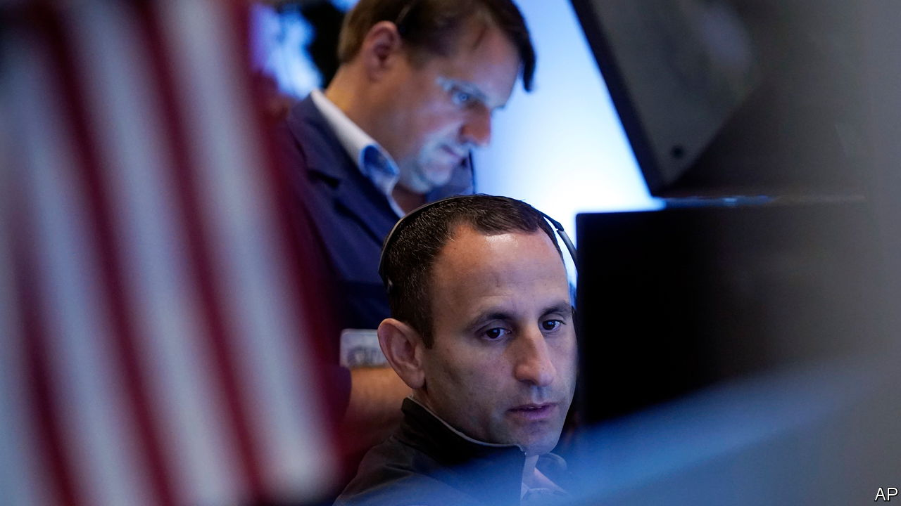
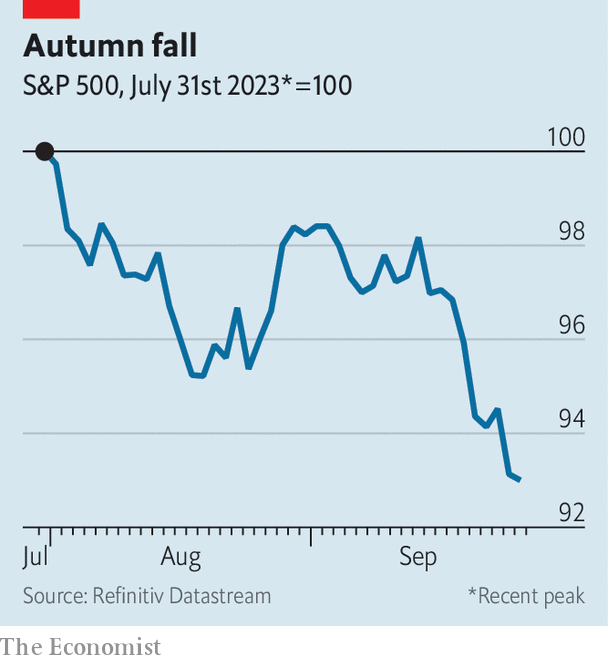

###### Cruel world

# Why fear is spreading in financial markets 

##### Investors have begun to confront the long-haul reality of high interest rates 

 

> Sep 27th 2023 

According to t. s. Eliot, April is the cruellest month. Shareholders would disagree. For them, it is September. The rest of the year stocks tend to rise more often than not. Since 1928, the ratio of monthly gains to losses in America’s s&amp;p 500 index, excluding September, has been about 60/40. But the autumn chill seems to do something to the market’s psyche. In September the index has dropped 55% of the time. True to form, after a jittery August it has spent recent weeks falling.

Such a calendar effect flies in the face of the idea that financial markets are efficient. After all, asset prices ought only to move in response to new information (future cash flows, for instance). Predictable fluctuations should be identified, exploited and arbitraged away by traders. Yet this September there is no mystery about what is going on: investors have learned, or rather accepted, something new. High interest rates are here for the long haul.

The downturn was prompted by a marathon session of monetary-policy announcements, which began with America’s Federal Reserve on September 20th and concluded two days and 11 central banks later. Almost all the big hitters repeated the “higher for longer” message. Beforehand Huw Pill of the Bank of England had likened rates to Table Mountain, Cape Town’s flat-topped peak, as opposed to the triangular Matterhorn. Christine Lagarde of the European Central Bank raised rates and spoke of a “long race”. The Fed’s governors, on average, guessed that their benchmark rate (currently 5.25-5.50%) would still be above 5% by the end of 2024.

 


For the bond market, this merely confirmed expectations that had been building all summer. The yield on two-year Treasuries, which is sensitive to near-term expectations of monetary policy, has risen from 3.8% in May to 5.1%. Longer-term rates have been climbing as well, and not just in America, where the ten-year Treasury yield has hit a 16-year high of 4.6%. Ten-year German bunds now yield 2.8%, more than at any point since 2011. British gilt yields are near the level they hit last autumn, which were then only reached amid fire sales and a market meltdown.

At the same time, fuelled by America’s robust economy and the expectation that its rates will reach a higher plateau than those of other countries, the dollar has strengthened. The dxy, a measure of its value compared to six other major currencies, has risen by 7% since a trough in July.

By comparison with the bond and foreign-exchange markets, the stockmarket has been slow to absorb the prospect of sustained high interest rates. True, borrowing costs are not its only driver. Investors have been euphoric over the potential of artificial intelligence (ai) and a resilient American economy. The prospect of rapidly growing earnings, in other words, might justify a buoyant stockmarket even in the face of tight monetary policy.

Yet it appears investors had also taken a pollyanna-ish view of interest rates, and not just because the most recent fall in prices was triggered by pronouncements from central bankers. Since shares are riskier than bonds, they must offer a higher expected return by way of compensation. Measuring this extra expected return is difficult, but a proxy is given by comparing the stockmarket’s earnings yield (expected earnings per share, divided by share price) with the yield on safer government bonds.

Do this with the s&amp;p 500 index and ten-year Treasuries, and the “yield gap” between the two has fallen to just one percentage point, its lowest since the dotcom bubble. One possibility is that investors are so confident in their shares’ underlying earnings that they barely demand any extra return to account for the risk that these earnings disappoint. But this would be an odd conclusion to draw from economic growth that, while robust, has presumably not escaped the business cycle entirely, as recent disappointing consumer-confidence and housing data demonstrate. It would be an even odder conclusion to draw in relation to profits from ai, a still-developing technology whose effect on firms’ bottom lines remains mostly untested.

The alternative is that, until now, investors have simply not believed that interest rates will stay high for as long as the bond market expects—and central bankers insist—they will. If that is the case, and they are now starting to waver, the next few months could be crueller still. ■


