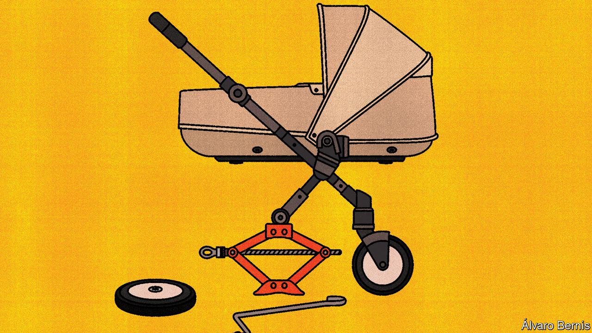

###### Free exchange

# Why the state should not promote marriage 

##### Even though children from two-parent households do better in life 

 

> Sep 28th 2023 

Here are some stark facts about family structure and children in America. Whereas the poverty rate among youngsters living with two married parents is 7.5%, among those raised by a single mother it is 35%. Children of married parents tend to behave better in school, stay in education longer and earn more as adults. Those raised by married parents appear to be at an advantage even after controlling for the age, education and race of their mothers. 

Yet marriage has been in long-term decline (and without a compensating rise in unmarried cohabitation). Today more than two-fifths of births are to unmarried mothers, up from less than a fifth in 1980. The fall is unequal across demographic groups: only 11% of births to college-educated mothers are outside wedlock. Marriage has gone from being a pretty universal institution to an exclusive one that propels life advantage through generations. 

In recent years economists have documented these trends and their relationship to inequality and social mobility. Melissa Kearney of the University of Maryland summarises the literature in a new book, “The Two-Parent Privilege”. Ms Kearney is aware that many liberals—and very few conservatives—will wince at her findings, and writes in an almost apologetic tone as a result. “Not talking about these facts is counterproductive,” she pleads. 

Why does being raised by two parents matter so much? One reason is the extra earnings an additional adult may bring to a household, which contribute to the enormous costs of child-rearing. Yet it is not all about money. Children raised by mothers who divorce and remarry tend to do worse than those raised by both their biological parents. The beneficial effects of two-parent child-raising appear to be particularly strong for boys, and even spill out beyond the boundary of the home. Researchers have found that the number of black fathers living in the local neighbourhood strongly influences the life chances of black boys.

The question is what to do about all this. Ms Kearney does not argue for a return to conservative social practices, such as shotgun marriages after unplanned pregnancies or encouraging parents to remain in unhappy unions. She cites research showing that legal changes making divorce easier (the introduction of “no fault” or “unilateral” divorce) result in worse outcomes for affected children. But, she says, such laws have a big advantage: they help adults escape bad situations and are probably desirable as a result. On top of this, some households benefit from the absence of a negative influence. Children whose parents are charged with a crime tend to do better if that parent is sent to prison. If single mothers are single because the men who fathered their children would have been bad second parents, then their offspring would have had little chance of better life outcomes in the first place.

Ms Kearney is more interested in whether the underlying causes of single parenthood can be fixed, so that more happy marriages are formed. She laments the long-term decline in the availability of good jobs for men without college education, which is thought to reduce the pool of “marriageable men” and—consequently—present fathers. She also highlights that social norms now exert less pressure, even on parents in a healthy relationship, to live together. To demonstrate the importance of these norms, she compares the effects of two economic booms that took place a generation apart. The Appalachian coal rush of the 1970s and 1980s boosted men’s wages; the result was more marriages and, for married couples, more births—but not more births out of wedlock. Decades later, amid different norms, the shale oil and gas booms had different effects. They boosted births among married and unmarried women alike, and had no effect on the propensity of couples to marry. Therefore Ms Kearney concludes that both money and mores are needed for additional two-parent homes to form.

For all the striking statistics in the book, the author does not offer an especially rousing call to arms. Ms Kearney’s four prescriptions are to promote a norm of two-parent homes, to improve the economic position of men without a college education, to scale up the pro-family programmes that work and to strengthen the social safety-net for all family types.

Yet policymakers are already obsessed with male-dominated middle-class manufacturing jobs. Recently this has meant more protectionism and other policies that do more harm than good. And it is doubtful that governments can do all that much to alter social norms, just as they hold little responsibility for the fact that they changed in earlier decades. Past research (of which Janet Yellen, America’s treasury secretary, was a co-author) has theorised that technological development—namely, the wider availability of contraception and abortion—was the fundamental cause of the rise of single parenthood in the late 20th century, because it altered the premarital behaviour of both men and women. Although some conservatives argue that the welfare system is instead to blame, since it made single motherhood a less daunting financial prospect, this is at odds with the evidence. As Ms Kearney notes, restricting welfare does not reduce births and single-motherhood is more common in America than in countries with generous handouts. Moreover, the record of trying to promote marriage with tax incentives and the like is one of failure. Without more concrete proposals, Ms Kearney is at risk of having identified a trend that correlates with poverty, but is no easier to solve. 

Happy families

Perhaps knowledge of what produces successful adults is most useful to individuals planning their own lives. The safest bet for anyone who wants to have children who thrive is probably to settle down. The vast majority of college graduates already seem to believe this, at least based on how they behave, if not how all of them talk. Anyone who doubts that the two-parent privilege exists should read Ms Kearney’s book. Unfortunately, that does not mean there is much in its pages for policymakers to exploit. ■


