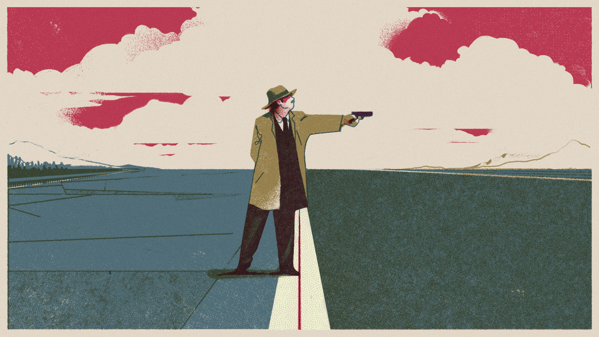

###### Assassin’s creed

# States are becoming more brazen about killing foes abroad 

##### Some countries are finding new justifications for political murders 

 

> Sep 26th 2023 

The murder of Hardeep Singh Nijjar, a Sikh separatist activist who was shot in Canada in June, has caused  between Canada and India. It has also brought into sharp relief an incendiary facet of the new world disorder: assassinations. Killings of dissidents and terrorists, and of political or military figures, are as old as politics itself, but their incidence may be rising. Ukraine targets occupiers and collaborators; Russia has tried to kill Ukraine’s president. On September 25th Ukraine claimed to have killed the head of Russia’s Black Sea Fleet, only for him seemingly to appear in a video a day later. 

Beyond the war in Europe a new cohort of rising powers, including India and Saudi Arabia, are projecting force abroad. They resent what they view as Western double standards on state-sponsored killings. New technologies make it easier than ever for governments to strike their enemies with precision, even from great distances. 

Yet even as assassinations are becoming easier, and perhaps more frequent, the world has not yet figured out how to respond to them. You only need to look at the West’s response to such killings. Russia’s assassination of Alexander Litvinenko, a former KGB agent, in Britain in 2006 caused an outcry and led to sanctions. After  in 2018 in Istanbul of Jamal Khashoggi, an exiled Saudi journalist living in America, Joe Biden said Saudi Arabia should be treated as a pariah. Yet last year he  Muhammad bin Salman, the Saudi crown prince and de facto ruler, and is  into making peace with Israel. Meanwhile India denies involvement in Mr Nijjar’s death and may avoid any serious consequences relating to it. The world’s most populous country is important to the West, both as an economic partner and a geopolitical counterweight to China. These inconsistencies reflect a longstanding moral and legal maze over state-backed killings.

The Bible may extol the Israelite Ehud for killing Eglon, the oppressive and “very fat” Moabite king. Yet it also commands obedience to authority, “For rulers are not a terror to good works, but to the evil.” Assassination, in the sense of killing a prominent person for a political motive with no legal process, carries the connotation of perfidy. Dante placed Julius Caesar’s killers in the deepest circle of hell, alongside Judas, their bodies gnawed on by Satan. Yet states kill prominent foes abroad—for different reasons and with varied methods. A paper in 2016 by Warner Schilling and Jonathan Schilling lists 14 possible objectives, from revenge to weakening an enemy or destroying a rival state. 

Reliable data on the patterns of assassinations and their causes are hard to come by, given the problems of identifying killings and culprits. Some 298 assassination attempts on national leaders were reported between 1875 and 2004, according to a paper by Benjamin Jones and Benjamin Olken published by the  in 2009. Since 1950, they find, a national leader has been assassinated in nearly two out of every three years.

War by other means

For Rory Cormac of the University of Nottingham in Britain, the shooting in Canada is evidence of a weakening of international norms against assassination: “With every high-profile killing, the taboo erodes a bit,” he says. He offers two big reasons: authoritarian regimes “are becoming more brazen” about challenging liberal norms; and democracies’ resort to targeted killings has “emboldened other states”. Other factors, such as ease of travel and drones that make possible long-distance surveillance and strikes, probably worsen the problem. Over the years America has killed thousands of suspected jihadists—and many civilians, too—with drones.

“Assassination has never changed the history of the world,” the British politician Benjamin Disraeli remarked, after Abraham Lincoln’s killing. Yet some murders can have a dramatic impact. A bullet fired by a Serbian nationalist, killing Austria’s Archduke Franz Ferdinand in June 1914, detonated the first world war. And assassination risks retaliation: both Mike Pompeo and John Bolton, respectively a former American secretary of state and national security adviser, have allegedly been the targets of an Iranian assassination plot. Britain’s domestic-intelligence service, MI5, says Iran has “ambitions to kidnap or even kill British or UK-based individuals perceived as enemies of the regime”.

Cloaks and daggers

When it comes to methods, Russia likes poison. Its agents murdered Litvinenko using radioactive polonium. They nearly killed another former spook in Britain, Sergei Skripal, and his daughter Yulia with Novichok, a nerve agent, in 2018. North Korea favours poison, too. It killed Kim Jong Nam, the half-brother of the country’s leader, Kim Jong Un, by smearing him with VX, another nerve agent, at Kuala Lumpur’s international airport in 2017. 

America prefers bombs and bullets. Its special forces raided a safe house in Pakistan and killed Osama bin Laden, al-Qaeda’s leader, in 2011. An American drone strike killed his successor, Ayman al-Zawahiri, in Kabul in 2022. Another one took out Qassem Suleimani, head of the Quds Force, Iran’s foreign-operations outfit, at Baghdad’s airport in 2020. 

This is all in spite of the fact that, in 1961, President John Kennedy (who was himself later assassinated) told an aide that he disapproved of the practice: “We can’t get into that kind of thing or we would all be targets.” Yet America was certainly into that kind of thing, back in the early years of the cold war. Revelations of its secret efforts to kill leaders such as Fidel Castro of Cuba (unsuccessfully) and Rafael Trujillo of the Dominican Republic (successfully) caused a backlash. In 1976 President Gerald Ford issued an executive order stating that no member of the American government “shall engage in, or conspire to engage in, assassination”.

Killing abroad still continues. These days, says Luca Trenta of Swansea University in Wales, autocracies use covert action to give them plausible—or often implausible—deniability. But democracies such as America seek to wrap a veil of plausible legality around “targeted killing”, particularly of suspected terrorists.

The UN Charter enjoins all its members to “refrain in their international relations from the threat or use of force against the territorial integrity or political independence of any state”. At the same time, however, it recognises “the inherent right of individual or collective self-defence if an armed attack occurs”.

International human-rights lawyers take a restrictive view. In peacetime, assassinations and targeted killings are unlawful. In wartime they may be permissible, if they conform to the laws of war. Ukraine targets senior Russian commanders just as the Allies in 1943 shot down a plane carrying a Japanese admiral, Yamamoto Isoroku, over the Solomon Islands.

What about international terrorism, which seems to lie between ordinary policing and war? Mary Ellen O’Connell of the University of Notre Dame in America argues that “there is no grey zone.” Under international law, she says, countries must deal with terrorism through the tools of law enforcement, including international co-operation and extradition; lethal action amounts to “extra-judicial killing”.

Nevertheless America, in particular, has sought greater legal freedom of action. One track has been to qualify sovereignty. Military action, it contends, is permissible where a state is “unwilling or unable” to prevent acts of terrorism. It has also at times designated territories abroad as “areas of active hostilities”, where armed forces can operate more freely.

 


Another route has been to expand the right to self-defence. One step is to declare that it includes responding to attacks by non-state actors as well as by states. The next is to aver a right to “anticipatory self-defence”, allowing a country to use force to forestall an “imminent” threat of attack. The most widely accepted definition is that the threat should be “instant, overwhelming and leaving no choice of means and no moment for deliberation”. But this, too, has been stretched. 

In 2001 President George W. Bush went further, and began adopting ideas of pre-emption and prevention to justify the use of force even before threats are “fully formed”. Barack Obama’s administration also redefined the meaning of “imminent”. Eric Holder, his attorney-general, said it had to consider not only the proximity of the threat, but also the “window of opportunity to act”. Much of this thinking is borrowed from Israel, whose supreme court ruled in 2006 that, in the case of terrorists, “rest between hostilities is nothing more than preparation for the next hostility”.

America’s example has encouraged a similar loosening of rules in Britain, Australia and France, says Dr Trenta. But for Professor O’Connell, it all amounts to the West granting itself rights that do not apply to others, “a rules-based order in violation of international law”. 

India could well argue—as government-friendly newspapers do—that Mr Nijjar’s killing falls within the West’s ideas of counter-terrorism. Sikh separatism has led to past bloodshed, not least the assassination in 1984 of the prime minister, Indira Gandhi, and the bombing the following year of an Air India jet flying from Montreal to London. Though it has much abated, Sikh violence could flare up again. India claims that Mr Nijjar was a terrorist and offered a reward for his capture; his supporters say that he was a peaceful activist. In India’s view, the West’s refusal to clamp down on Sikh separatists poses a menace. The government, though, prefers to say it has nothing to do with Mr Nijjar’s death. As for law enforcement, co-operation becomes harder the more India chips away at democratic liberties.

Killer instincts

Developing a long arm for covert operations is not easy. It requires resources and know-how to track a target, organise a hit and avoid arrest. India’s spooks may think they are emulating those of America and Israel as the necessarily harsh defenders of democracy. Some even talk of the “Israelification” of India’s foreign-intelligence service, the Research and Analysis Wing (RAW). But if it is seen to turn from mitigating clear security threats to bumping off political foes, RAW will become the shadowy outward face of repression at home, as Russia’s or Saudi Arabia’s spooks are seen. Assassinations can alert the world to the brutality of the regimes ordering them. ■

