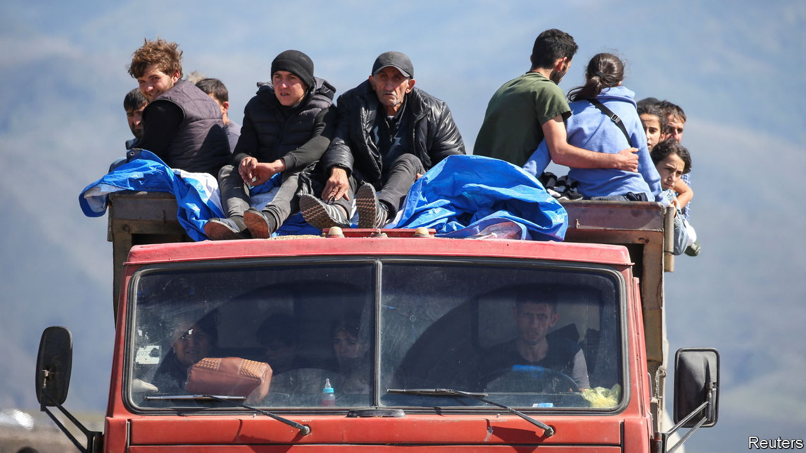
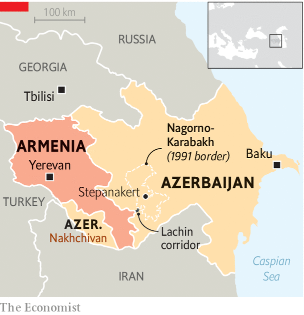

###### A short war with a long shadow

# A humanitarian disaster is under way in Nagorno-Karabakh 

##### And Russia may also be destabilising its old ally, Armenia 

 

> Sep 28th 2023 

The war unleashed on September 19th by Azerbaijan against , a separatist ethnic-Armenian enclave, lasted less than a day. But it has ended a hostile stand-off that had lasted more than 30 years, and prompted an exodus of tens of thousands of terrified people. It has also placed Azerbaijan’s backer, Turkey, in a stronger position in the Caucasus as Russia’s .

Overwhelmed by Azerbaijan’s modern army,  by a nine-month blockade, isolated from its Armenian motherland and betrayed by Russia, which took it upon itself to provide security in the region, Nagorno-Karabakh had no option but to capitulate. As  went to press, around 65,000 of the enclave’s ethnic Armenians (from a pre-war population of perhaps 120,000) had fled. Azerbaijan’s choice to attack the region rather than pursue a Western-backed deal guaranteeing the civil rights of its Armenian minority means that it is guilty of ethnic cleansing.

 


Not everyone has left, though many more will. For those who remain, it is vital that Azerbaijan is held to account for any violation of human rights in the region now under its control. The West needs to use whatever leverage it has. Azerbaijan’s elite likes to spend time and money in Europe and America, so the threat of sanctions should speedily be made. Time is of the essence. Too much has already been wasted.

The consequences of this one-day war, however, will stretch far beyond Nagorno-Karabakh. The episode marks a shift in the balance of power in the Caucasus. Armenia’s sovereignty looks more fragile than it has since the Soviet collapse in 1991. Russia, the regional hegemon since the early 19th century, has been exposed as an impotent and treacherous friend to Armenia, with which it has long had a military alliance. The West tried to work with Azerbaijan to avert the outbreak and now looks thwarted. And Turkey, which backed this month’s assault by its fellow Turkic state, is in the ascendant. 

One cause of all this is changes within Armenia. Its rulers were once close to Vladimir Putin’s Kremlin. But the ground shifted in 2018, when young protesters took to the streets of Yerevan, its capital, and swept away a Russia-backed regime run by corrupt politicians, many of them former warlords from Karabakh. Nikol Pashinyan, who led that velvet revolution and is now prime minister, pledged to stay close to Russia. But Mr Putin never forgave him for coming to power on the back of yet another popular uprising in the post-Soviet space. In 2020 Mr Putin’s implicit acquiescence and Turkey’s explicit backing for Azerbaijan allowed Ilham Aliyev, its leader, to launch a military attack against the enclave that left its status unresolved. 

But the immediate cause of the chaos is Russia’s weakness. As Mr Putin floundered in his war against Ukraine, Turkey and Azerbaijan saw an opportunity to press their advantage. Russia’s president did nothing when Azerbaijan made a military incursion into the sovereign territory of Armenia last year. Feeling betrayed, Armenia began to pivot to the West. It also conceded to most of Azerbaijan’s demands and accepted Azerbaijani sovereignty over Nagorno-Karabakh. 

Mr Putin’s rage against Armenia has grown as it has tilted to the West. In his eyes Armenia’s latest sin is its plan to sign up to the International Criminal Court, which has indicted Mr Putin for his crimes in Ukraine. He may already be stirring up unrest in Yerevan. An even bigger risk is that Azerbaijan will press on against Armenia itself and collude with Russia and Turkey to impose a corridor across the south of the country. This would link Turkey and Azerbaijan’s mainland, deprive Armenia of sovereignty and isolate it from its crucial border with Iran. 

Desperate times

In the short run Western governments should help Armenia cope with the big influx of refugees from Nagorno-Karabakh, and also help negotiate a fair—and hence enduring—peace deal between Armenia and Azerbaijan. In the long run, the West should back Armenia’s efforts to reduce its dependency on Russia and urge Turkey to normalise relations with Armenia and open the countries’ long-closed border. That would bring trade and ease Armenia’s isolation. With diplomatic skill, and good fortune, the chaos in the Caucasus may yet be contained. ■

