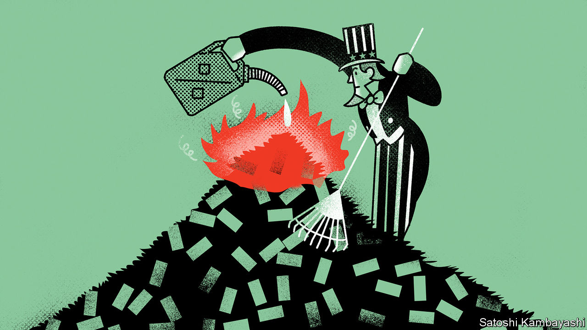
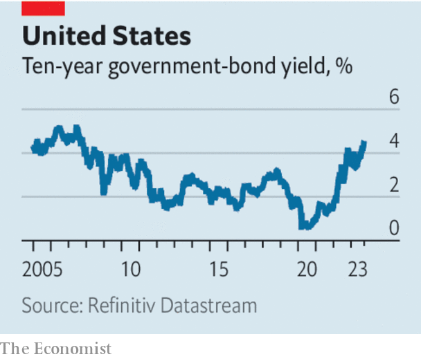

###### The budget bust-up

# Forget the shutdown. America’s real fiscal worry is rising bond yields 

##### Watch Wall Street, not Washington 

 

> Sep 28th 2023 

AMERICA’S CONGRESS is once again locked in a battle that could  the government—and once again the fight is a costly addition to the country’s economic problems. If Congress and the Biden administration do not strike a deal to fund the federal government, from October 1st it may need to furlough employees and freeze non-essential payments. House Republicans cannot even agree among themselves about what spending cuts to demand of the Senate and the White House, with hardliners seeking to  a bipartisan deal struck in the summer. 

Yet the reckless brinkmanship in Washington is not even the main threat to America. It concerns only the roughly 25% of America’s budget that is left when you set aside “mandatory” spending, such as public pensions and health care. The country’s budget problems are far broader—and they are getting worse by the month. To see why, you need to look not to Washington but to worrying movements in bond markets.

 


The annual cost to America’s government of borrowing for ten years has risen to 4.6%, the highest since 2007. Bond yields have been trending up since the spring, as investors have begun to anticipate that the  will keep interest rates “higher for longer” to keep inflation down—the opposite of the monetary-policy paradigm that prevailed before the pandemic. But whereas the last time yields were this high the federal government had debts of 35% of GDP, today the ratio is 98%. Rising interest rates are therefore nearly three times as painful for the budget.

As a result, the latest official projections show that this year the federal government will spend 2.5% of GDP on servicing its debts, a doubling in a decade. By 2030 the bill will be 3.2%, equalling an all-time high and more than the cost of defence. Even this estimate is too optimistic, because it was made before recent moves in bond markets, and so assumed that ten-year yields would stay below 4%. A past estimate by the Manhattan Institute, a think-tank, shows that rates at around today’s level would lead debt interest to consume nearly half of federal tax revenues by 2051 unless taxes rise or spending is cut.

The rising interest bill is already contributing to a gaping annual hole in the books. Astonishingly, over the past year the free-spending Biden administration has presided over a deficit of more than 7%—a level that is typically associated with war or recession. That binge explains why interest rates are increasingly expected to stay high. Government borrowing stimulates the economy, increasing the risk of inflation, leading the Federal Reserve to set higher rates. A rule of thumb from one literature review suggests that America’s deficit is supporting its interest rates by nearly three percentage points. Whether or not you believe that, the vast deficit helps explain both why America’s economy has proved surprisingly resilient to tighter monetary policy, and why its bond yields have risen more than those of the euro zone, where deficits are lower; Germany’s ten-year bond yield is only 2.9%. 

It would be foolish to expect interest rates to fall much while Uncle Sam continues to borrow indiscriminately. Unfortunately, reckless fiscal policy seems likely to continue. Some tightening is happening this year, as student-loan repayments resume. Yet that is only because a judgment by the Supreme Court forced the Biden administration’s hand. Do not be fooled, either, by Republicans clamouring to cut spending. Most of the long-term pressure on America’s budget comes from rising mandatory spending, which nobody is willing to confront. Owing in part to an ageing population, for example, the cost of Medicare, health care for the over-65s, will increase by 30% relative to GDP over the next ten years. 

The next big fiscal decision will be whether or not to renew Donald Trump’s income-tax cuts which were passed in 2017 and which are due to expire in 2025—another factor that flatters official forecasts for debt. Republicans will want to extend them; even Democrats will find it hard to preside over tax rises that include a rough halving of the standard deduction (the amount that can be earned before paying tax) and less generous tax credits for parents. If Mr Trump is re-elected president, he will probably seek fresh tax cuts, too.

For the time being, America’s rising bond yields reflect only rising expectations for interest rates, not the risk of prolonged inflation or default. But if politicians of all stripes continue to act as if deficits do not matter even as borrowing costs rise, they will eventually find themselves with an unpalatable choice between prolonged austerity and forcing the Fed to set monetary policy with one eye on the budget—unleashing further inflation and compromising the stability of the economy. Next to that, today’s shutdown skirmish would seem piddling. ■

