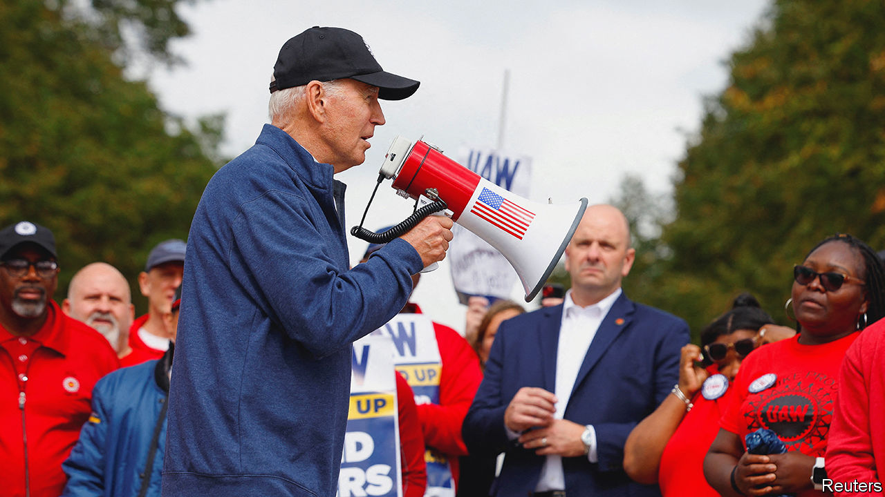

###### Striking contradictions

# Joe Biden may come to regret his claim to be pro-union 

##### The UAW strike highlights the deep strains in Bidenomics 

 

> Sep 27th 2023 

Both the Democratic and Republican parties are already fairly sure who their nominees will be in 2024, so the general election campaign will begin unusually early. Perhaps it started this week: President Joe Biden joined a  in Michigan, becoming the first sitting president to do so; the next day Donald Trump was in the same state, also courting car workers. As befits a campaign in which the two candidates have a combined age of 157, it has a retro feel. High inflation and striking union workers in Detroit recall races from the 1970s.

The United Auto Workers Union (UAW) wants a 36% pay increase over four years, better pensions, health care for those who have retired and sweeter terms for those hired since two of the “big three” carmakers received a federal bail-out in 2008 (one of them is Stellantis, whose biggest shareholder part-owns ’s parent company). That is a lot to ask, particularly given that the labour market is softer than a year ago. Average pay and benefits at the big three in Detroit currently range from $112,000 a year at Ford to $134,000 at GM. The unions counter that the firms are making record profits and ceo pay has soared. However, this is a cyclical business that seems to be at a high point: demand that built up when supply chains were disrupted is keeping prices unusually high.

None of this matters much to Mr Trump or Mr Biden, whose focus is on 2024. Mr Trump promises to protect manufacturing workers with tariffs. So does Mr Biden in a more targeted way, to accompany subsidies he has introduced to encourage electric vehicles (evs). Both hope to appeal to working-class families in the Midwest, home to two of next year’s six swing states.

This is popular. Democrats have allied with unions ever since Franklin Roosevelt enshrined collective-bargaining rights in law. More recently, Republicans have tried to become the party of the working class. Mr Trump beat Mr Biden easily among white working-class voters in 2020. A recent poll by YouGov for American Compass, a think-tank, found that 77% of Republican primary voters support tariffs to boost manufacturing at home.

That consensus needs skewering, and not only for the sake of America’s consumers. It was this same combination—striking unions and protection from foreign competition—that sent carmaking downhill in the 1970s. Detroit became bloated and uncompetitive. American brands became a shorthand for low quality. Now, with strikes raging and the federal government keeping Chinese- or European-made EVs out of the market with tariffs and subsidies, the conditions are in place for a repeat.

Mr Biden’s policy is an answer to a political problem: how to pursue the green transition, which a key group of voters does not care much about, and still get re-elected. He squares the circle by wrapping up  in a single package, supporting both with tariffs and subsidies. Alas, this policy is riven with contradictions. 

One of the UAW’s worries is that electric vehicles require fewer workers to build. The union sees its influence slipping away to non-union plants in the South and to non-union battery factories. For the carmakers, pivoting from gas-guzzlers to volt-voracious vehicles, as the federal and some state governments prod them to, will require a lot of capital. A generous settlement with the UAW would make it harder. Moreover, the green transition would be faster and cheaper if firms made full use of global supply chains, importing batteries and solar panels. But that is a non-starter in Washington because of overblown fears of China as a supplier. In short, Mr Biden’s policy undermines itself—though Mr Trump’s could be even worse. 

If the unions and carmakers reach a deal in a few weeks’ time, Mr Biden will come out of the clash looking stronger. But if it drags on, the Midwest’s economy suffers and Americans cannot get new parts for their cars, he may yet come to regret his claim to be the most pro-union president in American history. ■


