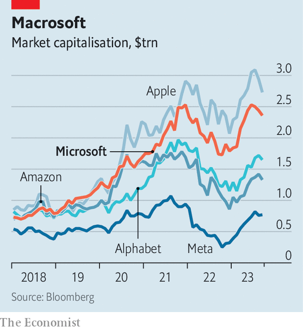

###### Reboot successful

# The lessons from Microsoft’s startling comeback 

##### A bold bet on AI could help it overtake Apple as the world’s most valuable firm 

 

> Sep 28th 2023 

“It is kinda like the Nineties are back,“ crowed Satya Nadella, the boss of Microsoft, at a product launch in New York on September 21st. He was referring to the glory days of the software giant, when its Windows operating system was ubiquitous, profits were soaring and revenues routinely grew by more than 30% a year. For a while Microsoft became the most valuable company in the world. But success bred complacency. By the early 2010s sales growth had slowed and profit margins had shrunk. 

 


In the 2020s Microsoft enjoyed a new heyday. Mr Nadella has put cloud computing at the centre of the firm, rather than Windows, which has helped trim costs and boost profits. The company’s operating margin has fattened from 29% in 2014 to 43%, the highest among America’s biggest 50 non-financial firms by revenue. Investors seem happy. Since the prospect of tighter monetary policy triggered a sell-off in tech stocks in November 2021, Microsoft’s share price has beaten all its big rivals bar Apple. 

Now Mr Nadella is charging ahead with another bold reorganisation, this time around artificial intelligence (AI). Thanks in large part to its investment in OpenAI, the startup behind , Microsoft has become the go-to firm for AI tools. A year ago most observers would have said that was Alphabet, Google’s parent company, or Meta, Facebook’s parent. And ai may propel Microsoft higher still, helping it  as the world’s biggest company from Apple. Its remarkable reinvention holds wider lessons for businesses. 

One is to be paranoid. When Steve Ballmer took over from Bill Gates in 2000, Windows was sacrosanct at the firm. As a result, Microsoft failed to exploit big shifts in technology, such as the emergence of the smartphone and cloud computing. It could have easily gone the way of Kodak or BlackBerry. But under Mr Nadella, who was painfully conscious of the company’s laggardly status, Microsoft became hyper-alert to promising new technologies. That prepared it to move quickly on ai. 

Another lesson is that firms do not need to do the inventing themselves. Microsoft has been adept at working out how to bundle and sell technologies created elsewhere. At the event in New York the firm launched “Copilots”, ChatGPT-like assistants, for various software offerings. At their core sit the capabilities of OpenAI’s tools combined with a cloud-computing business model pioneered by Amazon. 

Microsoft now wants to apply a similar formula to its gaming business. It plans to combine its cloud technology with the gaming assets and expertise of Activision Blizzard, its acquisition of which seems more likely now that Britain’s trustbusters have signalled that they are happy with the deal. 

Compare this approach with that of invention-obsessed , which has made a cumulative operating loss of $24bn in its moonshot “Other Bets” business since 2018. Amazon, too, has invested heavily in technologies that have sci-fi appeal, but have so far failed to win over customers. Three-dimensional screens for its smartphone were a flop, and take-up of its palm-scanning technology at its grocery stores is sluggish. Both it and Google have thrown money at delivery drones. 

A final lesson is that exposure to the stockmarket creates the discipline needed to rein in founders. Mark Zuckerberg, the boss of Meta, has already lost $40bn building his virtual-reality dreams and plans to spend even more. He can do this because dual share classes give him 61% of voting rights. Similarly the founders of Google, Sergey Brin and Larry Page, hold 51% of the voting rights at Alphabet, which may explain why the company has struggled to thrive beyond search. Apple and Microsoft, by contrast, are older, no longer dominated by their founders—and far more valuable. 

There are, inevitably, counter-examples. Sometimes a founder’s obsession turns into a money-spinner. And too much paranoia can be a distraction. Yet Microsoft is the rare example of a behemoth that has already carried out one successful reinvention and—if its bet on ai pays off—could yet pull ahead further still. Its remarkable comeback is worth studying. ■

