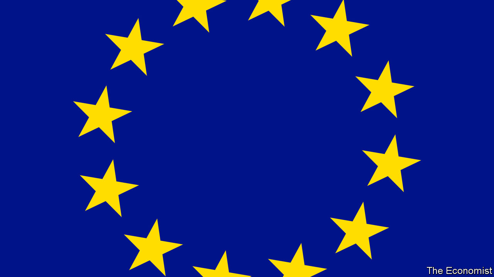

###### A bigger, better EU

# The war in Ukraine is a powerful reason to enlarge—and improve—the EU 

##### Nine new countries, including Ukraine, are vying to join 

 

> Sep 28th 2023 

The horror of two world wars prompted France, West Germany and others to link arms and create what is today the European Union. Seventy years on, war has returned to the continent. Out of the rubble in , something akin to the sentiment that moved the EU’s founding fathers is stirring again. The talk now is of admitting as many as nine new members, including Ukraine. Joining the world’s most successful club of peaceful, prosperous democracies would set that war-ravaged country—and fellow aspirant members in the Western Balkans, Georgia and Moldova—on a new and promising path.

 For the EU itself it would also be nothing short of historic, completing a  and marking the end of a process that started with victory over the Nazis. Bar one or two future applicants (perhaps one day including Britain), the shape of the EU would broadly be settled. But the way the EU works .

Expanding the EU from 27 to, say, 36 will be tricky. But after a long time when the idea of enlargement was dormant—Croatia, the most recent new entrant, joined a decade ago—it is back on the agenda. Leaders from across the continent, including aspiring new members, will meet in the Spanish city of Granada on October 5th. The next day, those already in the club will lay out what reforms will be needed to keep the show running with more (and more diverse) members. An arduous process will follow. The applicants and the EU machine will both have to change. A mooted date of 2030 for the completed enlargement is optimistic, but worth striving for.

Leaders considering the union’s future shape should remember that enlargement has been its most successful policy.  like the euro, the single market and the regulation of tech giants matter, but much of their value comes from the fact that their scope extends beyond France and Germany to Finland, Greece, Slovakia and Spain. Imagine how much less muscular the EU would have been in helping Ukraine had it not already embraced four countries that border the war zone. Further enlargement could increase Europe’s geopolitical heft, as France’s president, Emmanuel Macron, once a sceptic of expansion, now seems to acknowledge.

The EU can no longer afford to string the nine would-be members along by letting their applications drag on without a realistic hope of them joining. Leaving European neighbours in a grey zone opens the door to those who would destabilise the continent, starting with Russia’s Vladimir Putin. This unhealthy dynamic has fed the cynical and sometimes dysfunctional politics of the six countries of the Western Balkans and the other three applicants. None of them will be easy to integrate. Georgia, Moldova and Ukraine all have Russian troops occupying chunks of their territory (as did Germany until 1990). All the current countries bidding to join are deemed only “partly free” by Freedom House, an American think-tank. (Turkey, though technically still a candidate, is a long way from being ready, alas.)

As it embarks on this mission, the EU should make three firm commitments. The first is a message of hope to the applicants: as long as they undertake the reforms necessary to be worthy members, they will be let in. A similar promise was made to the Western Balkans in 2003, but was promptly forgotten. Applicants must still meet the same criteria that others have met to join the EU, in particular by upholding democracy. Conditions to join the euro should be stringent. But those who make a good-faith effort should be offered more help as their journey progresses. Some benefits of membership could be granted gradually as economic reforms take root, including access to the single market. At the same time it must remain clear that the final destination is full EU membership, not limbo on the outside.

The second commitment is that the EU’s own internal reforms must not delay the accession of those ready to join. Yes, the union has to rethink its inner workings: a bigger EU will not be a better one if it becomes gridlocked. Once it is enlarged to 36, it would be foolish to allow a single country’s government to veto collective action, as is the case now for foreign affairs and taxation. The common agricultural policy, which gobbles up a third of the bloc’s budget, will need drastic reform and slimming to stop too many subsidies flowing to Ukrainian oligarchs running farms the size of some EU countries. Letting in poorer members will shift development funds away from some current recipients. But the EU should not keep the door shut while it gets its own house in order. 

The final imperative is to learn from past enlargements. Most countries that reform in order to get into the EU stay on the right track, and grow both freer and more prosperous. But a handful have taken a bad turn: Hungary and Poland have defied EU norms they signed up to. If the club is to take a chance on newcomers with a shaky record of governance, it must have mechanisms to punish bad behaviour. A good place to start would be to make it easier for EU funds to be withheld from dodgy regimes. This has rightly begun to happen.

Growing, growing, grown

The prospect of welcoming a batch of newcomers is daunting. But Europe, after thinking hard, has leapt into the unknown before—and made it work. Greece, Portugal and Spain were all brought in around a decade after they had toppled nasty dictatorships, and now thrive as vigorous democracies. Between 2004 and 2007, the bloc took in a dozen new members, most of which had been under the Soviet yoke. That nearly doubled the number of EU countries, and upped the club’s population by 27%—nearly twice what is being proposed now. What then seemed impossible is remembered now as inevitable and vital. 

More than anything, if Europe is to count as a force in the world, it needs to show that it has the capacity to act. Delaying enlargement because it is too difficult to carry out would weaken the continent and thus the union at its heart, not least if Russian aggression today is followed by American isolationism tomorrow. Dreadful as the circumstances of war are, they have created the impetus for an EU that is both bigger and better. Europe must find a way to build it. ■


