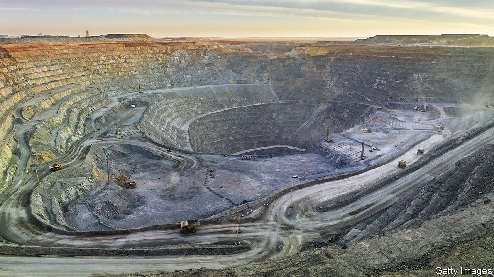

###### On America and China, household costs, mining, Indonesia, cannabis Airbnb, children’s books

# Letters to the editor 

##### A selection of correspondence 

 

> Sep 28th 2023 

America must persuade

Condoleezza Rice and Niall Ferguson are right about one thing: China is America’s greatest geopolitical competitor, by far (, September 7th). America’s policy elite is scrambling to contain China’s military, economic and diplomatic power. Joe Biden and Donald Trump may disagree on a lot of things, but both implemented a relatively hawkish strategy against China, which they have asked other countries to follow. 

The strategy has borne some fruit. America has struck a number of bilateral and multilateral arrangements with allies and partners, in particular along China’s periphery. America and India boast a military logistics agreement; the US, Australia and Britain are well on their way to implementing the AUKUS plan; the Philippines has consented to four additional access sites for the American military; and Mr Biden has devoted significant diplomatic capital to improving the relationship between South Korea and Japan. China, understandably, is wary about all of these developments.

Yet America needs to be humble and not overreach or alienate the very countries it hopes to strike deeper relationships with. Not every country wants to choose sides. Some have maritime and territorial disputes with China but, because of the whims of geography or trade ties, don’t see a mutually antagonistic relationship with Beijing as in their interest. Vietnam has been on the receiving end of Chinese aggression, yet Vietnamese leaders still have a strategic partnership with China. The Philippines is strengthening defence ties with Washington but has made it clear that it won’t be pushed into a war by a foreign power. India’s relations with China have soured considerably, but Delhi is still highly unlikely to outsource its China policy to Washington or get involved militarily in the event of a conflict over Taiwan. 

In other words, middle and emerging powers are doing what middle and emerging powers have done throughout history: preserving their geopolitical flexibility and maximising their choices. America is seeking to enlarge the roster of an anti-China coalition. What it will get instead is selective co-operation depending on the issue at hand. 

Daniel DePetris

Fellow 

Defence Priorities


 


Measuring household costs

I don’t think anyone would disagree that the cost-of-living crisis has impacted some less than others (, August 26th). However, Britain’s main measure of inflation, the consumer-price index, tells us very little about how different social groups have been affected, given it is a macroeconomic rather than household measure. That is why we welcome the decision by the Office of National Statistics to start quarterly publication of the household-costs indices, which will tell us about the impact of inflation on different households. With this potentially being the biggest issue for next year’s general election our policymakers must know the real state of “cozzie livs”.

Paul Allin

Honorary officer for national statistics

Royal Statistical Society


 


Training mining engineers

It does not help when the people in charge of the world’s economies do not understand the reality and complexity of the mining cycle when thinking about the issue of critical minerals (“”, September 16th). The protracted timeline from exploration to production in metal mining averages around 10-15 years, posing significant challenges in light of an ever-increasing need for mineral resources. But increasing mine production is not just a matter of pumping more minerals out of the ground. A faulty intersection of regulatory practices and political dynamics keeps erecting barriers to the timely development of crucial mineral resources, including recycling plants.

When it comes to human resources in mining, the silence of Western governments is even more disturbing. Students entering mining engineering programmes in 2023 will not reach the status of intermediate engineers until 2033. That is a decade from now. Can Western economies wait that long? As the industry confronts the impending retirement of a substantial portion of its workforce, the question of supply-chain resilience should extend beyond equipment and materials to include the replenishment of skilled mining professionals. If we want to avoid a green-metals crunch, actions to solve these problems must be taken now.

Dr Davide Elmo

Professor of rock engineering

NBK Institute of Mining Engineering

University of British Columbia


 


Indonesia’s dynastic politics

Banyan wrote about dynastic politics and the return of personalised rule as symptoms of democratic backsliding in Indonesia (). A lot of the ills he mentioned are remnants of Suharto’s three-decades long and highly personalised rule, rather than the fault of the current president, Joko Widodo, known as “Jokowi”. A suitable fix would be a strong, impersonal state, but that could take many decades of political development. In that context Indonesian democracy, now at 25, is doing well enough for itself.

In any case, there is reason to be optimistic. Prabowo Subianto may be a former general and son-in-law of Suharto. But the other two contenders for next year’s presidential election are outsiders, rising through the ranks of local government as Jokowi once did. Sure, patronage networks are back in vogue. But Indonesia’s growing middle classes are rowdy and critical, and they make their disapproval of patronage politics known on social media. Even if Jokowi decides to go down the road of dynastic politics, his successors will have to contend with an electoral democracy that is as vibrant as ever.

Elang Adhyaksa


 


Thailand’s stoners cannot rest easy to come

I found it amusing that your story on the fate of the nascent recreational cannabis industry in Thailand concluded that the new government was unlikely to reverse the old administration’s policies (“”, September 2nd). In fact, Srettha Thavisin, the new prime minister, has said recently that he would not support the recreational use of cannabis of any kind. The new government plans to revise the laws and tighten regulations. It has support. Most Thais, even the Westernised liberal ones, see recreational cannabis as a hastily implemented policy that is leading to an outbreak of addiction and unrest. The media broadcasts shocking stories of school children abusing cannabis and portray stoners as lazy parasites. 

Why must we criminalise the recreational use of cannabis again? The root of the problem is Thais’ lack of moderation. Criminalisation will push current users underground again. Potential users will not be able to learn openly about the risks and benefits. This will give rise to more cases of abuse—the opposite of what the government wants. Lastly, many small-time entrepreneurs have staked their savings into what could have been a promising tourist hook. Will the government be able to support them when they take their livelihood away? 

Above all, what is lacking in Thailand’s debate is any actual research and hard data on cannabis use and its effects. For now, with no clear policy from the government, the fate of Thailand’s stoners is quite hazy.

Shawanwit Poomsa-ad


 


Complaining about Airbnb

Regarding New York’s crackdown on Airbnb (“”, September 9th), it should be acknowledged that all of the negative impacts of short-term rentals are shifted to neighbouring homes and surrounding neighbourhoods. Airbnb and absentee “property managers” take no responsibility. Noise, parking, disrespect, uncertain security, parties, overcrowding, litter, and so on. Short-term rentals don’t belong in residential areas. We didn’t buy our houses to live next door to transient hotels. Furthermore, I can say with confidence from the heartland of the American housing crisis, that short-term rentals most certainly have a negative impact on housing inventory and affordability.

Steve Fort


 


It’s grim for fairy tales

“Children’s books not only sell well, but they also keep selling, year after year,” you say (“”, September 2nd). True for a very select few, perhaps, but otherwise at odds with the likelihood of profit in an industry with remarkably low barriers to entry. As one children’s author told me, “In a good year I can sell dozens of copies.”

Donal Curtin


