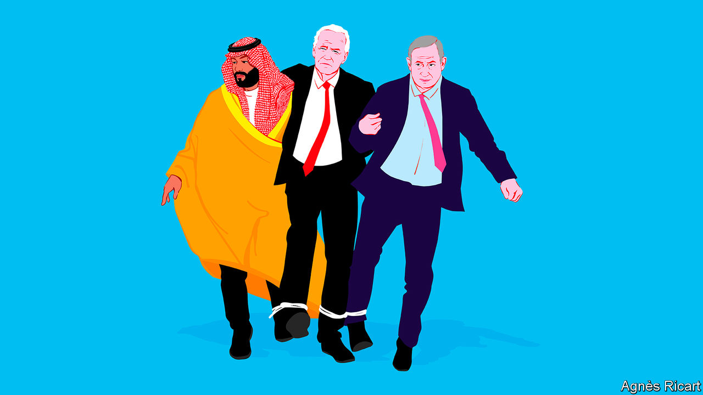

###### Trip hazards

# America, Israel and Saudi are “at the cusp of a deal” 

##### Joe Biden’s diplomacy could upend the Middle East, and give the Saudis nuclear technology 

 

> Sep 24th 2023 

Muhammad bin salman does little to hide his relish at the prospect of a  between America, Israel and Saudi Arabia. In a rare television interview on September 20th, Saudi Arabia’s crown prince and the country’s de facto ruler acknowledged with a smile that an  is on the cards. “Every day we get closer. It seems it’s for the first time real, serious.” A pact would, he said, be “the biggest historical deal since the cold war”. On September 22nd Binyamin Netanyahu, Israel’s prime minister, confirmed that the trio of countries were “at the cusp” of a deal. It would, he said, be a “quantum leap”. Four days later Israel’s tourism minister landed in Riyadh for a conference. He arrived to little fanfare, but as the first-ever public visit by an Israeli cabinet minister to the kingdom, it was a historic moment.

Formal diplomatic relations between Saudi Arabia, the richest and arguably most influential Arab state, and Israel, the Jewish state which the kingdom has long ostracised, have been a long time coming. Since becoming crown prince in 2017, mbs, as Prince Muhammad is known, has held at least one secret meeting with Mr Netanyahu. Both countries have a shared rival in Iran and quietly do business deals. But in 2020 the Abraham accords were signed between Israel and several Arab states, without Saudi Arabia. Few expected Israel-Saudi ties to be formalised during the lifetime of the prince’s father, King Salman, who is of a generation for whom any relationship with Israel was unthinkable.

Yet the incentives to do a deal have sharpened. For the Saudis, the motivation is a new strategic alliance with America. The two countries have a security relationship, but the kingdom wants a more formal defence pact, not least because Iran’s intensifying nuclear programme means it is on the threshold of having nuclear weapons, upending the region’s security balance. The talks include the possibility of a Saudi civilian nuclear-energy programme, with a uranium-enrichment facility run by Americans on Saudi soil, according to the , rather as Aramco, the Saudi oil giant, was originally American-run. While this effort would be civilian in nature, and America’s unspoken goal is to prevent a nuclear arms race in the Middle East, mbs says he reserves the right to pursue nuclear weapons if Iran crosses the threshold. “If they get one, we have to get one…but we don’t want to see that,” he said in his tv interview.

For President Joe Biden, a new American-backed diplomatic and defence framework in the Middle East, built around the two regional powers, would be a major foreign-policy achievement with which to enter an election year. During his election campaign several years ago he promised to treat Saudi Arabia as “the pariah that they are” following the murder of Jamal Khashoggi, a journalist. But today realpolitik rules. His administration sees a deal as a way for America to adapt to a new geopolitical era, in which it remains the ultimate guarantor of the Gulf states’ security even as their economies tilt towards Asia. This would thwart Iran, calm energy markets and prevent China from pulling the Middle East into its sphere of influence. 

The domestic obstacles remain significant. On the Saudi side, even a near-absolute monarchy must take some account of public opinion. Only 2% of young Saudi Arabians support normalisation of relations with Israel, according to the 2023 Arab Youth Survey, compared with 75% in the United Arab Emirates and 73% in Egypt (both countries have formal ties with the Jewish state). That explains the crown prince’s repeated references in his interview to Israel’s military occupation of the Palestinian territories. “For us, the Palestinian issue is very important. We need to solve that part,” he emphasised. Parallel talks between the Saudis and Palestinians are intensifying. Palestinian officials have been visiting the Saudi capital almost every week in the past few months, according to one source in the West Bank. And on September 26th the Saudis’ first envoy to the Palestinians travelled to the West Bank.

In his tv interview the prince did not, however, mention the Arab Peace Initiative, a plan endorsed in 2002 by Saudi Arabia and other Arab states. That envisaged relations with Israel only after an Israeli retreat from all the territories it captured in the 1967 six-day war, including East Jerusalem, and the establishment of a Palestinian state. Instead, the crown prince made vague promises of a deal that would give the Palestinians “their needs” and ensure “a good life” for them. All sides paint a picture of a new Middle East where economic opportunity transcends old hatreds.

mbs’s vagueness on Palestinian rights is a recognition of Mr Netanyahu’s domestic travails. Every Israeli leader has yearned to end their country’s regional isolation, which has lasted since its foundation in 1948. For Mr Netanyahu, who is facing widespread protests against the policies of his far-right government as well as corruption charges (which he denies), peace with the Saudis is also a golden opportunity to polish his tarnished legacy. The chaotic first nine months of his latest premiership may explain why the politician who has been so vocal for so many years on the dire dangers of Iran’s burgeoning nuclear programme seems willing to countenance Saudi uranium enrichment. 

A deal could create shock waves in Israeli politics. Mr Netanyahu’s hardline coalition includes parties which represent the religious Jewish settlers in the occupied West Bank, who oppose any concessions to the Palestinians. The settlers are well represented within his own Likud party as well. All warn they will oppose any compromise or deal in which Israel has to relinquish control over any territory.

Mahmoud Abbas, the Palestinian president, seems to have realised that the Saudis will no longer wait for a Palestinian state before establishing ties with Israel. But he would like Israel at least to cease building new settlements and guarantee greater Palestinian autonomy in the West Bank. Even that would bring down Mr Netanyahu’s current coalition. “The only formula the coalition will stand for is the Palestinians getting Saudi money for their needs, but no more rights,” says a senior right-wing Israeli politician. 

If mbs backs even part of the Palestinian demands, Mr Netanyahu will probably lose the support of some of his coalition, and with it his majority in the Knesset. His only option would be to use the prospect of a historic deal to gain the support of the centrist parties, which have hitherto refused to join his government and would demand serious policy changes to do so now. Mr Netanyahu might welcome the opportunity to rejig his coalition, replacing the far-right with centrists. But while the centrist parties led by Benny Gantz and Yair Lapid are in favour of a Saudi deal (though Mr Lapid has expressed serious reservations at the prospect of Saudi nuclear enrichment), both have bitter experience of serving in his previous governments and remain justifiably reluctant to relive that. 

Even Mr Biden may find the deal hard to sell at home. The prospect of a Saudi nuclear programme will worry Americans wary of regional proliferation. Both progressives in his own Democratic Party, who abhor the Saudis’ human-rights record, and the Republicans, who will fight anything his administration proposes, may obstruct it. His hope is that Mr Netanyahu, who remains popular among Republicans, can sway his opponents. The potential for an American-Saudi-Israeli agreement may be vast, but the political window for securing it is small. “If we don’t achieve it in the next few months,” said Mr Netanhayu, “we might delay it by quite a few years.” ■

