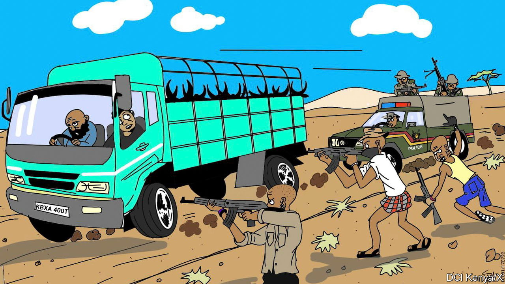

###### Crime fiction

# Kenya’s cops are spinning wild tales 

##### When people don’t trust you, try cartoons and creative writing 

 

> Sep 28th 2023 

“One of them fired at the detective, missing his ear by a whisker. But in a quick rejoinder, the detective...chambered a round and gave the thug a taste of his own medicine, fixing the thug’s appointment with his creator instantly.” One could be forgiven for thinking these words are from a fast-paced (if trashy) action thriller. In fact they are an account of a fatal shooting released on social media by Kenya’s Directorate of Criminal Investigations (DCI), part of the national police.

The DCI’s communications strategy confounds expectations in other ways, too. Last year three Kenyan police officers were convicted of torturing and brutally murdering a human-rights lawyer, his client (who had filed a complaint against the police after they had wrongfully shot him) and their taxi driver. At the height of this trial, one might have expected the DCI’s keyboard warriors to be talking up how careful its officers are with their guns. 

Instead they posted a breathless account—with comic-book illustrations—of how four officers had opened fire on armed cattle thieves with a general-purpose machinegun (GPMG), a weapon normally used in war, not community policing. “What followed was an avalanche of fire as the gunner unleashed the machine’s ferocious firepower clearing all the bushes used by the thugs for cover,” the DCI posted on X (previously Twitter). “As the GPMG flattened the area, its scary sound reverberated across the hills and valleys.”

There is some reason to this rhyme, as the police have a less than sparkling image. Nearly 70% of Kenyans say that “most” or “all” cops are corrupt, according to Afrobarometer, a pollster. Nor, it seems, are its sleuths very good at solving crimes. There are roughly 3,000 murders a year in Kenya, but only around a third of them make it to court. There are fewer than 500 successful prosecutions for murder a year. 

Alas, not even bombast lasts for ever. The dispatches have become clipped and dull of late. This may be because the DCI has fallen foul of the new government. Last year William Ruto, the president, disbanded its elite special unit, accusing it of “killing Kenyans arbitrarily”. That is a charge that even the most creative of writers would struggle to spin in its favour. ■

