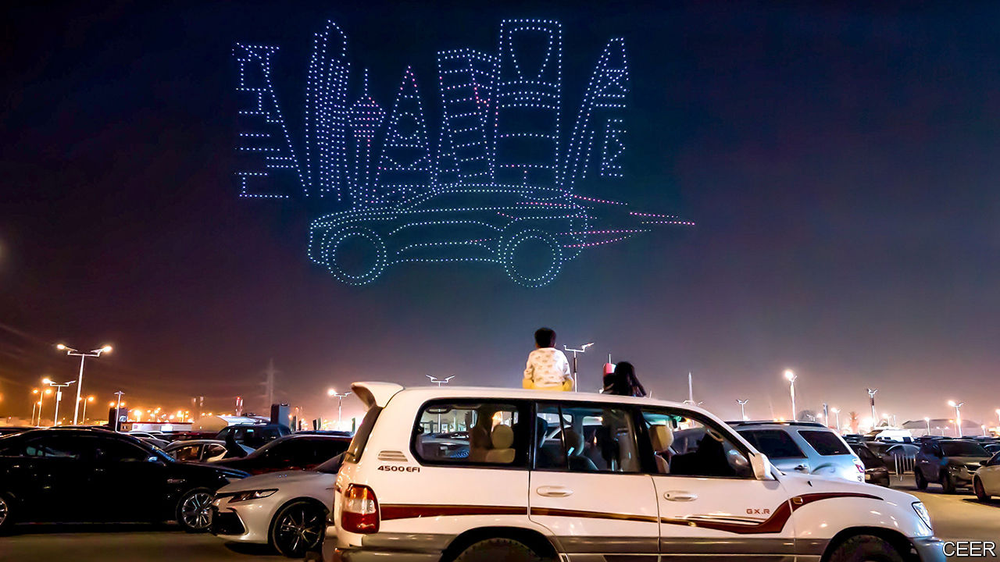

###### Powering up

# Saudi Arabia wants to become a force in electric-vehicle manufacturing 

##### Its ambitions may yet meet a number of obstacles 

 

> Sep 28th 2023 

When saudi arabia’s autocratic crown prince, Muhammad bin Salman (known as mbs), last year launched Ceer, the kingdom’s first electric-vehicle (ev) brand, his ambition was clear. His country was not just building a new automotive company, he gushed, it was “igniting a new industry”. Saudi Arabia is powering up its efforts to become a force in manufacturing EVs. If this project is a success, it could mark a significant step towards diversifying its economy away from oil. But big potholes remain.

Saudi officials have long talked of becoming a manufacturing hub for both petrol-powered and electric cars as part of the kingdom’s wider industrial strategy and its plans to tackle climate change. It says it wants to make 500,000 evs a year by 2030, roughly equivalent to annual demand for cars in Saudi Arabia today.

Now the Saudis are pushing money towards these ambitions. Of $32bn targeted by the ministry of industry and mineral resources for nine projects in mining, $6bn will be invested in a steel-plate mill and a plant for battery metals for EVs. They have made it faster and easier for companies to get licences and permits, which are often a hassle elsewhere in the world. 

Saudi Arabia is making some progress. Hyundai, a big South Korean carmaker, has agreed to build a factory to assemble its vehicles in the country. Tesla, the world’s largest full ev producer, is said to be in talks about setting up a manufacturing facility in the kingdom, though the company’s boss, Elon Musk, has denied the rumours. The Saudis have signed a $5.6bn deal with Human Horizons, a Chinese firm that makes luxury evs, to collaborate on development, manufacturing and sales. 

Ceer, a joint venture between the Saudi sovereign-wealth fund and Foxconn, one of the world’s biggest electronics manufacturers, is working with bmw, a German carmaker, to produce electric cars in Saudi Arabia. And Lucid, a loss-making American new entrant majority-owned by the fund, opened a factory near Jeddah on September 27th. Its annual production will be 5,000 cars; the firm claims production capacity will eventually rise to 155,000. 

Saudi may have to find other ways to boost its appeal. Carmakers everywhere face rising costs, tariffs and geopolitical worries. To attract ev manufacturing at scale, the kingdom may have to offer cheap renewable energy. It will also have to draw in suppliers to the big manufacturers. Hyundai Kefico, a component maker, recently signed a deal with Ceer.

Saudi Arabia has rivals in trying to develop an ev industry. Hungary has used its labour-cost advantage to attract battery-cell makers. Indonesia reckons that its nickel reserves mean it can do something similar, though its success is far from assured. Closer to the kingdom, Turkey and Morocco already have well-established auto industries that make internal-combustion-engine cars, so investors may be drawn to those countries instead.

Meanwhile, Saudi Arabia’s blistering temperatures and limited supplies of water mean that building and running factories there will be complicated. It does not yet have much of an industrial base. The kingdom has plenty of cash and a determined ruler but money gets you only so far. China owes its success to the fact that it moved early—and strategically—on evs before the rest of the world’s carmakers (Tesla excepted). That has given it an advantage that Saudi Arabia cannot hope to replicate. And the kingdom’s domestic car market is small.

The automotive industry is hard to enter even if the advent of electric cars has lowered the barriers. The claims being made are extraordinary. Ceer alone, the company suggests, could generate $8bn of gross value-added by 2034 (equivalent to 0.7% of gdp in 2022). It is easy to be sceptical of Saudi’s ev aspirations, especially since other hyperbolic targets are being set in the kingdom across many industries. Nonetheless its ev efforts are a serious attempt on the part of the world’s biggest oil exporter to diversify its economy and create new industries in anticipation of the bigger changes coming down the road. ■


