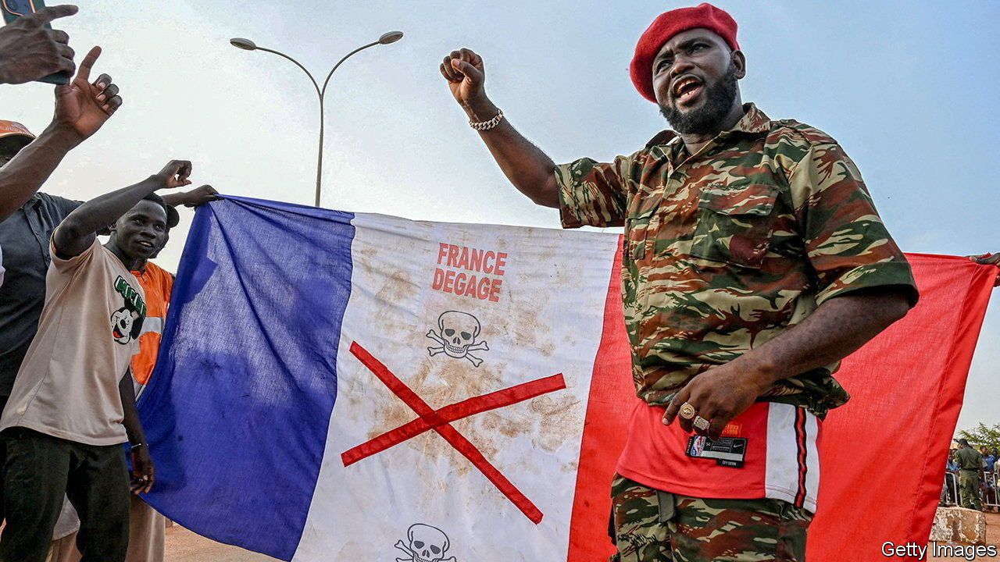

###### France and Africa

# Why Emmanuel Macron is pulling French troops out of Niger 

##### France’s decision to quit leaves its Africa policy in disarray 

 

> Sep 25th 2023 

When on July 26th soldiers from Niger’s presidential guard  the leader they were supposed to be protecting, France insisted that it would not take orders from the new junta. When the coup leaders told France’s ambassador and its 1,500 soldiers stationed in the country to get out, the  dug in its heels, citing a point of democratic principle. Emmanuel Macron, the French president, declared that Mohamed Bazoum, Niger’s captive president, had been democratically elected and so France would recognise only his authority.

But in an abrupt reversal on September 24th, Mr Macron announced that not only was France’s ambassador, Sylvain Itté, being recalled to Paris but all troops in Niger would leave by the end of the year. France, declared its president, would thus put an end to bilateral military co-operation with Niger.

The official explanation for this about-turn is that the new authorities “no longer want to fight against terrorism”, said Mr Macron. Between 2013 and 2022 France led an anti-jihadist operation in the countries of the Sahel—Burkina Faso, Chad, Mali, Mauritania and Niger—initiated at their request. Backed by other European countries, including Britain, Estonia and Sweden, the operation at its peak counted over 5,000 French soldiers. Last year France decided to wind down Operation Barkhane and quit Mali after military leaders there staged a second military coup, and hired mercenaries from Russia’s Wagner group. French forces withdrew to what then seemed to be the relative stability of neighbouring Niger, where France maintains a military base, complete with fighter jets and Reaper drones.

As it happens, Mr Macron has a point about counter-terrorism. Niger’s junta justified its putsch in July as a response to rising insecurity. In reality political violence has surged since the coup leaders took over. According to the Armed Conflict Location and Event Data Project, a research group based in America, political violence increased by 42% in the first month of rule under the junta in Niger compared with the previous month. In the first six months of 2023, when Mr Bazoum held office, by contrast, it fell by 39% compared with the previous six months.

Yet the French decision to quit Niger is about much more than this. It is partly a pragmatic recognition that the junta was not going to budge, and that regional countries, despite their threats, were unlikely to try to dislodge it from power. The decision also marks a reluctant and painful realisation in Paris that its influence on the continent has taken a severe knock.

In the eyes of a generation of younger Nigeriens, and partly thanks to the efficiency of Russian disinformation campaigns, France is now regarded as the problem, not the solution. In 2013 François Hollande, Mr Macron’s predecessor, was feted in Bamako, Mali’s capital, after he dispatched French troops to beat back a jihadist incursion. Today crowds wave hastily stitched Russian flags, and call for France to get out.

The uncomfortable truth is that, however much the French point to their tactical successes in the Sahel, the broader picture since 2013 is one of spreading political violence. This has rapidly spilled over into West Africa’s coastal states. Unlike other former colonial powers, France keeps a strong military presence on the continent, which consists of four other permanent bases, in Djibouti, Gabon, Ivory Coast and Senegal. This makes it a ready target to blame, and to accuse of neo-colonial occupation. The decision to leave Niger, declared the junta after Mr Macron’s declaration, was a “historic moment” for the country’s sovereignty.

The weight of France’s history casts a long shadow of suspicion over its broader activities on the continent. In a landmark speech in Burkina Faso in 2017, Mr Macron laid out his plans for a Franco-African reset. France would turn the page on “françafrique”, the web of cosy links between Paris and French-speaking African leaders that kept them in office and business deals flowing north. To make the point, he returned works of art from French museums, and asked forgiveness for France’s role in the genocide in Rwanda. Yet this new approach, combined with its colonial past, means that France is held to standards not applied to other outside powers, including Russia, China and Turkey. America too attracts little dissent. It runs a drone base out of Agadez in Niger, and has quietly decided to stay despite the change of regime, to little outcry.

France had no good options in Niger. Had its troops and diplomats stayed in spite of the junta’s demands, this could have precipitated a nasty confrontation. By leaving, as François Heisbourg of the Foundation for Strategic Research in Paris, puts it, “France’s bluff has been called, which we could pay a heavy price for down the line.” For France, a serious rethink of its Africa policy and the sustainability of its military presence on the continent is now in order. For the people of Niger, the likely consequence of this sorry episode is that political violence will only get worse. ■

