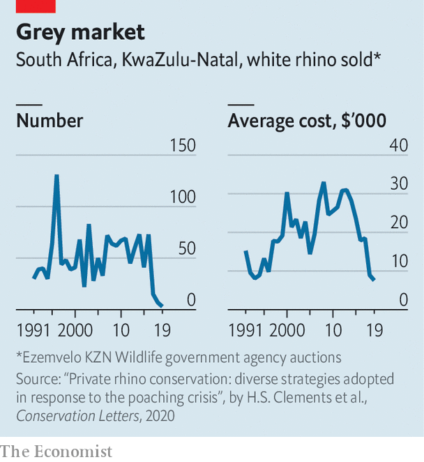

###### The horn laws

# Why there is a bear market in rhinos 

##### It is too expensive to protect them from poachers 

 

> Sep 26th 2023 

How many people does it take to move a rhinoceros? Your correspondent suspects that the answer is “as many as you can find”. On a recent morning in the Northern Cape, South Africa’s largest province by area, a veterinarian fired a tranquilliser dart out of a helicopter into a female rhino’s rump. It then took 19 rangers, an electric prod and a lot of corralling to get the pachyderm into a crate. Once inside the animal was trucked to its new owner, another private game reserve.

 


The buying and selling of live rhinos is not an easy business. Nor, these days, is it a lucrative one. The average price in dollars for a southern white rhinoceros in 2019 was almost 70% less than a decade earlier, according to Hayley Clements of Stellenbosch University (see chart). Today a male rhino costs about 150,000 rand ($7,900). Earlier this year John Hume, the owner of 2,000 southern whites—some 15% of the global wild population—received no bids when he put them up for sale. African Parks, a conservation NGO funded by international donors, stepped in to buy the rhinos at a fraction of his asking price.

The bear market in rhinos is ultimately about economics. Call it the horn laws. The southern white, the commonest type, is a South African success story. It was hunted to near-oblivion. By 1929 there were just 150 left. “Operation Rhino”, launched in 1960 by Ian Player, a conservationist, revived numbers by distributing rhinos from a national park to private reserves. 

Further boosts came after the introduction of auctions for rhinos in the 1980s and stronger ownership rights over the animals in the 1990s. Both improved the financial incentives for conserving them. “Creating property rights and market institutions was a game-changer,” argues Michael ‘t Sas-Rolfes of Oxford University. Today more than half of southern whites in South Africa graze on private land. 

Reserve-owners make money from tourism and hunting. The latter offends many, yet charging dentists from the Cotswolds or Connecticut to pretend to be Ernest Hemingway keeps many reserves afloat. And since the scores of rhinos hunted every year are old bulls who would otherwise compete for resources, regulated hunts can in fact help increase numbers. 

Over the past 15 years, however, rhinos have turned from assets into liabilities. The main reason is the cost of protecting them from poaching. After reaching 18,796 in 2010, the number of southern white rhinos in South Africa—home to around 80% of the global total—fell to 12,968 in 2021. Most were killed in state-run parks.

Less than 10% of annual losses from poaching happen on private land. This is because private owners spend at least four times as much on security as national parks do. They cannot pass on all the costs: safari-goers can opt for the beach instead. “The economics of rhino ownership is a disaster. It’s a bottomless pit,” says Pelham Jones, the head of the Private Rhino Owners Association, a lobby group. 

There are non-financial costs, too. “There is a lot of heartache,” says Peter Oberem, a veterinarian and reserve-owner. In 2008 he found a dead matriarch whose face had been hacked with an axe; her one-month-old was forlornly trying to suckle. He and his wife raised the calf. “He’s a big bastard now,” says Mr Oberem, proudly. But the stress and costs are too much for some. The number of reserves with rhinos has fallen from 330 to 280 over the past 15 years, according to the association. 

There are many creative efforts afoot to boost rhino populations. African Parks organises donor-funded trans-shipments to other African countries. Last year the World Bank issued the first “rhino bonds”, which raised money for two South African state-run parks with black rhinos. Another idea is “biodiversity credits”, which would pay those preserving flora and fauna. 

Rhino-owners argue that the simplest solution would be to legalise the international trade in rhino horn. A rhino can grow 1-1.5kg of horn a year. Those that have theirs chopped off sport spiky snouts again within just a few years. This means owners could sustainably provide more horn to the market than currently reaches it even in peak-poaching years. 

Yet last year the signatories to CITES, an international treaty, upheld a ban in place since 1977. Its proponents insist that legalisation would create more demand than can be met through legal supply and that it is better, therefore, to dampen demand through an outright ban. In fact the surge in poaching since 1977 suggests prohibition has had little effect on demand. 

Above all, owners resent being told what to do by outsiders. “I consider myself a greenie—but then I meet these greenies who don’t know what they are talking about,” says Mr Oberem. He and others speak of a “colonial” approach from some NGOs and rulemakers from rich countries. (Perhaps if most owners of southern whites were not southern whites themselves, they would make for more formidable foes of the self-styled progressives in global conservation.) 

Ultimately conservation is expensive. Sometimes the costs can be met through philanthropy or from taxpayers funding national parks. Yet such is the current logic of the horn laws: the animals are worth more dead than alive. ■

