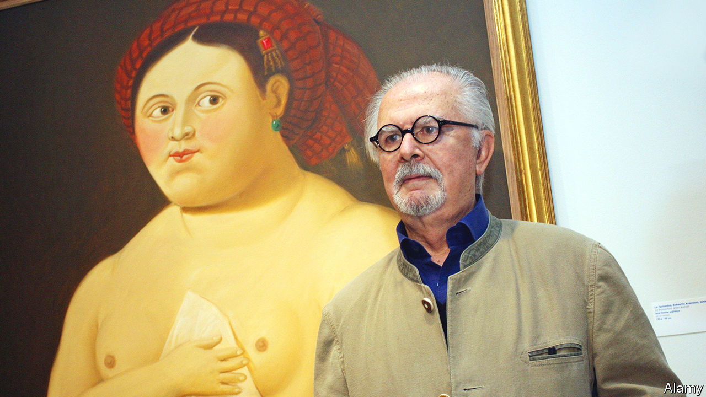

###### Life in its fullness

# Fernando Botero became famous for his over-size people and animals 

##### But the Colombian painter and sculptor, who died on September 15th, had a different agenda 

 

> Sep 28th 2023 

It all began with a mandolin, in Mexico, in the late 1950s. A casual mandolin, lying on a table. When Fernando Botero started to draw it, suddenly, on an impulse, he made the sound-hole tiny. The effect was dramatic. The mandolin seemed to swell with its own importance. He painted it several times, sometimes with its plumpness bolstered by a fat book and a snug, solid trumpet. Had the musicians who owned these objects wandered onto one of his canvases, they too would have loomed peculiarly large in their loose-fitting suits and hats. A new style, , had been born. 

Most critics scorned it. At a time of confident abstract expressionism, who wanted these whimsical figurative paintings? In an era when the female figure was meant to be twig-thin, who could bear to look at fat, lumpy women in frowsy frocks? Later on Mr Botero also made huge bronze statues, of staring cats and frisky nudes lolling like lilos. The reaction was often silence. A long gap lay between his first appearance in New York’s Museum of Modern Art, in 1961, and his first major gallery show there, in 1972, while the art world tried to puzzle out what he was doing.

He never had the slightest doubt. First of all, he was not painting fat people. Nor did he feel any lust or longing for large women. Nor was he mocking his subjects, or only sometimes, as in his portraits of puffed-up Latin American dictators and generals, with huge jodhpured thighs and minute genitals, foolishly saluting. When he posed beside most of his pictures, however superficially comic they might seem, his bearded face stayed solemn. 

What he was painting were “volumes”: the real substance of human beings. Volumes gave his figures sensuality and dignity. Most of them were characters from his poverty-stricken youth in the then-isolated small town of Medellín: peasants, circus performers, barflies, picadors, dancers, all painted purely from memory. From memory, too, he painted bourgeois couples promenading, relaxing or sitting stiffly with their children. His canvases made them impressive. Tiny accessories enhanced the effect: a fan, a cradled puppy, a whisper-thin cigarette. His subjects became monumental then. Similarly, a simple bowl of oranges became, in his handling, a celebration of the fullness of life. 

The public, at least, seemed to enjoy it all. Over the years his work became a commercial sensation. He became so rich, with his paintings selling for a million dollars and more, that he gave away parts of his own art collection to museums all over Colombia. His sculptures of nudes and huge animals turned up in parks and plazas across the world. To his joy he, a provincial artist, was producing work that touched people universally. 

How he was doing so he did not know. Perhaps it came from the pleasure he felt himself. From his first teenage watercolours, which he sold outside the  to support his widowed mother, he favoured volume rather than line. Once so inclined, he never wavered for the rest of his days. Confronted with a needle, he had to make it bulge. Asked to draw a horse, he inevitably gave it thick legs and hooves that were solidly square. His style declared his conviction of what art was. He could not change. 

He went to matador training rather than art school; no lessons in volume there, except being tossed once by a huge bull. On his first sojourn in Europe in the 1950s he was astonished by the works of Giotto, Uccello and Piero della Francesca, and by their way of achieving the fullness of robes, cloaks and limbs on a flat surface. He spent many hours too in the Prado in Madrid, sitting there with his easel and brushes to try to learn the secrets of Goya and Velázquez. He had gone abroad (paying for the trip with prize-money earned from a painting), hoping to find Picasso and to be like him. He came back eager to paint like the Italian masters of the . To these he gradually added Titian, Ingres, Rubens and, from his time in Mexico City, the muralist Diego Rivera. 

One response to these overwhelming masters was to redo their works in his own style. So the Mona Lisa, while preserving her smile, put on pounds, and another version of her, at the age of 12 with a glittery slide, was his first shocking incursion into the Museum of Modern Art. Manet’s “Le Déjeuner sur l’herbe” was transposed to a vivid Colombian landscape, and Marie Antoinette simpered stoutly in a feathered hat down a Medellín street. He was not imitating, but remaking beauty (since art was essentially beauty) from his own Colombian roots. Those gave truth to all he did.

Well into his 80s he dedicated ten hours a day to the task. He would “let the thing out” on an uncut roll of canvas, looking for relationships, tightening here and there. Being an artist, he thought, was like being a priest. You were born one, and the job required everything you could give. Since that was so, he had to address pain too, and tackle dark and serious themes. 

He therefore painted what was happening to his country. From the 1990s he recorded guerrilla warfare and drug-gang violence: a car exploding in the street, a group of drinkers torn apart in a bar, the drug lord Pablo Escobar fighting off bullets and then dead on a rooftop, like a beached whale. His style did not alter, but now expressed the innocent impassivity of common people caught in horror. In 1995 one of his sculptures, “Bird”, was blown up, together with 23 people; he made another, “The Dove of Peace”, inscribed with the victims’ names. He also produced his own Stations of the Cross, with Christ’s white flabbiness now emphasising his helplessness among his tormentors. 

His most affecting works, however, were around 100 paintings and drawings of the tortures inflicted by American soldiers on Iraqi prisoners in 2003 at Abu Ghraib. He began drawing the moment he read the news story, in pencil on paper. In the finished paintings the Iraqis were naked, bloodied, hooded and contorted. Most American museums that were offered them refused to take them. But they were not anti-American, he insisted. They were anti-brutality. Many viewers agreed. His unvarying, unchangeable style gave the prisoners only humanity and terrible vulnerability; their plumpness did not register at all. ■

