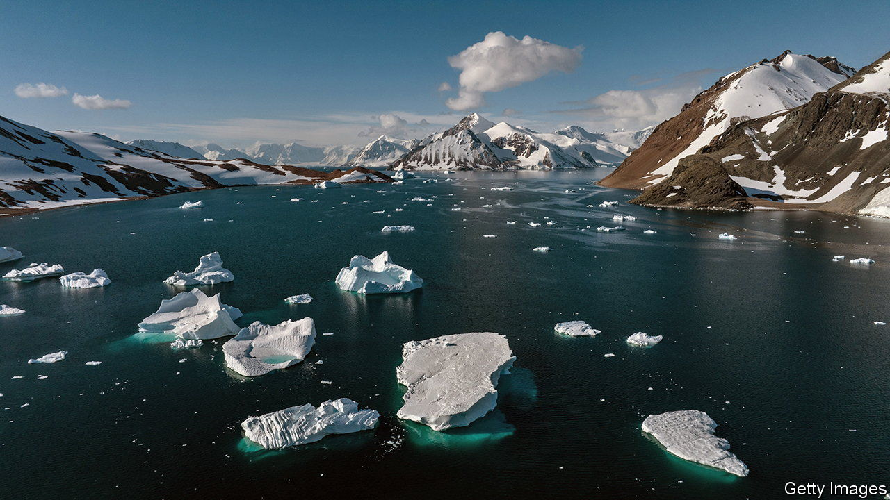

###### It’s grim down south

# Antarctic sea ice is at a record low 

##### The continent seems to be following in the Arctic’s footsteps 

 

> Sep 26th 2023 

WINTER IS COMING to an end in Antarctica, while summer is wrapping up at the other end of the globe. During this time, sea ice in the south reaches its highest yearly extent, whereas in the north it drops to its annual minimum. 

Antarctica’s sea ice  than expected in the early parts of the southern winter. As a result, despite a spurt in early September, when the sea ice grew more than twice as rapidly as is usual, the ice now falls far short of the average maximum observed at this time of year. On September 7th it covered just short of 17m sq km, according to data tracking its daily extent from America’s National Snow and Ice Data Centre (NSIDC). That is 1m sq km below its previous smallest annual maximum in 1986—an area equivalent to two Spains. Meanwhile, in the Arctic, where ice has been melting during the northern hemisphere’s summer, sea ice is at its sixth-lowest level since records began in October 1978.


The Arctic sea ice is clearly in long-term decline; since 1978 the area covered has shrunk by about 78,000 sq km—the size of the Czech Republic—per year. Admittedly, the last time a record low was set was in 2012, and in a rapidly warming part of a rapidly warming world a whole decade in which things got no more extreme feels almost like a reprieve. But the trend continues, and there is some evidence that the ice’s future decline has, if anything, been underestimated. A recent study published in  suggested that the first ice-free summer month in the Arctic could come in the 2040s, even if the world reduces greenhouse-gas emissions quite steeply. Previous modelling studies which put ice-free summers further away, the authors say, do not capture the trends as revealed by the actual data. 

The same long-term trend has not been in evidence around Antarctica. Its apron of sea ice had been stable until 2014; at times it even increased. This difference between the two poles puzzled scientists. “Climate models have all shown that Antarctic ice should be shrinking just like in the Arctic in response to anthropogenic warming,” says Professor Julienne Stroeve of the NSIDC. “Perhaps now the last few years show us that the Antarctic is starting to respond to greenhouse-gas-emissions-induced warming,” she suggests.

This year’s maximum extent is so remarkably low that scientists have been scrambling for more specific explanations. Strong seasonal winds and waves lead to a greater variation in sea ice extent during this time of year, as natural forces can push ice towards the shore or out to sea. An unusual pattern of waves and gusts could be to blame for slow growth in ice during this Antarctic winter. A shift in the El Niño Southern Oscillation, a regular atmospheric fluctuation, may have broken some of the sea ice up. Sea-surface temperatures have been abnormally high. 


But it is hard to imagine that this year’s low maximum in Antarctic sea ice, coming as it does after three record low minimums, can be explained entirely by natural variability. One recent paper suggests that, having previously been controlled in large part by the winds, the sea ice is now coming under the thrall of steadily warming waters below the surface. One piece of evidence for this is that the Southern Annular Mode, an oscillation in the winds which circle the continent that has long affected the formation of sea ice, seems to have lost its influence. 

Such a step change could have far-reaching consequences. The effects of warming are already felt by emperor penguins, the continent’s permanent inhabitants. Low sea ice last summer caused several colonies to lose their offspring. Some studies show that the birds could be on the brink of extinction by 2100 if current rates of warming persist.

Keeping the sea ice intact also ensures the survival of species elsewhere. It protects the continent’s coastal ice shelves, which in turn keep glaciers and ice sheets in place. Scientists estimate the threshold at which melting ice sheets in both Greenland and Antarctica would accelerate the rise in sea levels is between 1.5°C and 2°C of warming compared with pre-industrial levels. The planet is already 1.0-1.3°C warmer; there is no longer any realistic chance that it will stay below the 1.5°C target set in the Paris agreement. Humanity is skating on thin ice.■

