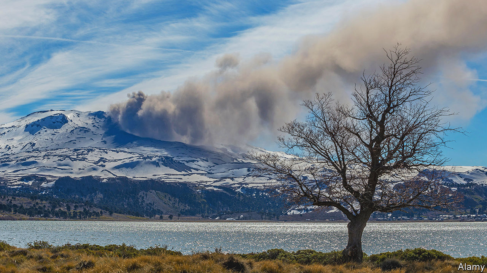

###### Ice and fire

# Glaciers on volcanoes could serve as early-warning systems 

##### They could also skew measurements of climate change 

 

> Sep 27th 2023 

Mapping glaciers was once a difficult and arduous job. So was monitoring volcanoes for the grumblings and rumblings that might herald an eruption. In recent decades, the old methods of hiking boots and mountaineering gear have been joined by satellites and remote sensing, making things both easier and safer. 

But looking from afar has its drawbacks too. If a volcano is high enough to sport glaciers on its flanks (and many are), then the thick layer of ice can make it harder, or impossible, to get accurate temperature readings from the rock beneath. 

And that is a particular problem, for glacier-topped volcanoes are some of the most dangerous of all. If they do erupt, the heat can melt the glaciers, forming torrents of fast-moving mud called lahars that can flatten anything in their path. In 1985 the Nevado del Ruiz volcano in western Colombia erupted. The glaciers on its summit and flanks formed several gigantic lahars, one of which buried the nearby town of Armero, killing more than 20,000 of its inhabitants. It remains the worst natural disaster in the country’s history.

In a paper published last month in , Matteo Spagnolo and Brice Rea, a pair of volcanologists at the University of Aberdeen, suggest a possible solution to the problem. The internal heat of volcanoes, they conclude, has a notable impact on the glaciers that sit on top of them. Monitoring those glaciers, rather than the volcano itself, may serve as an early-warning system for anyone living nearby. 

The researchers and their colleagues studied 600 glaciers in the Andes (including those on Nevado del Ruiz) of which 74, being less than a kilometre from the mouth of an active volcano, were classed as “volcanic”. One of the main features the scientists were looking for was the “equilibrium line”. This is the point on a glacier that separates the “accumulation zone”, where snow adds to the glacier’s mass, from the “ablation zone”, where melting subtracts from it. One of the things that affects the equilibrium line is the weather. Plenty of snowfall, or a cool summer, and the line will move downhill. A dry winter or a scorching summer will move it higher. 

In theory, though, any source of heat—including volcanic heat from beneath the ground—ought to affect the height of the equilibrium line. When the researchers examined the data, that is exactly what they found. Glaciers on volcanoes had equilibrium lines notably higher than those on ordinary mountains. In some cases, as on Copahue, a volcano on the border between Chile and Argentina, which last had a major eruption in 2016, the difference could be several hundred metres. Glaciers on quiescent volcanoes, such as Parinacota, a 6,400-metre mountain that sits between Bolivia and Chile, had equilibrium lines similar to glaciers on mountains that had never been volcanic at all. 

With so many glaciers in their sample, the researchers were able to rule out other explanations, such as differences in the local microclimate. And on the 13 volcanoes for which the best data were available, they were able to map the correlation in detail. Those data showed a strong link between changes in the amount of volcanic heat seeping to the surface and the movements of the equilibrium line. 

This means, say the researchers, that, although volcanic glaciers obscure what is going on underneath, they could themselves serve as telltales. Sudden changes in the equilibrium line, particularly if they are out of kilter with those of other glaciers nearby, could be evidence that something is brewing beneath the surface, and that further attention is warranted. Although they are getting better, volcanologists still cannot predict exactly when eruptions will occur. But a rise in heat suggests more magma is accumulating below, and makes a valuable early-warning sign. 

The findings have implications beyond volcanology and warning nearby inhabitants of a looming disaster. Measurements of glaciers around the world provide one way for climate researchers to track the long-term effects of climate change. A warmer planet should mean that glaciers are receding everywhere, and by and large they are. But Dr Spagnolo and Dr Rea’s results suggest that not all glaciers make equally reliable thermometers. Those on the sides of volcanoes can advance and recede for reasons entirely unrelated to global warming. Climate scientists, they argue, should consider excluding such glaciers from their databases. ■


