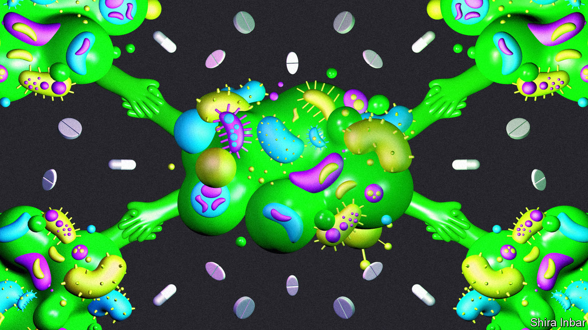

###### Storming the fortress

# Sticking together makes bacteria nearly invincible 

##### New treatments are trying to drive them apart 

 

> Sep 27th 2023 

Bacterial life is astonishingly varied. These single-celled organisms come as spheres, rods, spirals and corkscrews. A few are a centimetre long; most are tens of thousands of times smaller. They have been found on Mount Everest, in Antarctica, and deep within Earth’s crust. And yet virtually every bacterial species ever found shares one trait: its members do not like living alone.

Matthew Fields, a microbiologist at Montana State University, reckons that most of the bacteria living on the planet exist in colonies. Known as biofilms, these slimy aggregates are held together by strands of DNA, proteins and other molecules recycled from the cells of dead neighbours. Such sociability is ancient. Some of the oldest known evidence of life on Earth are fossilised biofilms known as stromatolites. A group of stromatolites in Western Australia are thought to be 3.5bn years old.

Cohabitation brings big benefits. When biofilms grow large enough, they become hard for hostile parties to penetrate. Some estimates suggest these fortresses can make bacteria up to 1,000 times harder for antibiotics to dislodge. But what is a boon for the bacteria is the bane of many of the humans who must live alongside them. Figures from 2022 suggest that biofilms play a role in 60% of all human bacterial infections. They congregate on joint implants and clog up catheters. They colonise bed rails, light switches and incubators in hospitals. They infect open wounds, and produce the plaque between your teeth. 

In 2017 Britain’s National Biofilm Innovation Centre put the global economic burden of biofilms at over $3.9trn. That represents more than just health costs. Biofilms can  and gunk up infrastructure.

Despite the scale of the problem, it has drawn little attention. One reason is that biofilms are comparatively poorly understood. Several different species of bacteria can unite in a single biofilm, which makes it harder to create accurate models in a lab. All the same, progress is being made. A better understanding of biofilms is indicating ways to get rid of them. 

No two biofilms are exactly alike. But they begin when a bacterium finds its way to a surface, often attracted by food. It secretes sticky compounds to attach itself and begins to divide. Within a couple of days—or a few hours, for the fastest-reproducing strains—a small colony of descendants has formed. 

Inside the bacteriopolis

The new bacteria, and any interested passers-by, can attach themselves to the colony in several ways. These include polymers secreted by the bacteria. Molecules of DNA usually carry the organism’s genetic information, but bacteria can repurpose them as biochemical glue. In a paper published in  in April, Tiago Costa, a bacteriologist at Imperial College London, reported that conjugative pili, hair-like filaments that bacteria use to exchange genetic information, can likewise be repurposed to bind them together. 

The bacteria can also build barricades from other chemicals they find in their environment. Biofilms in living bodies, for instance, can sometimes exploit their host’s immune system. When white blood cells spot a bacterial infection, they sometimes release strings of extracellular DNA to cordon it off. But that often backfires, helping bind the biofilm together. 

Biofilm-building is governed by quorum sensing, a process by which bacteria exchange chemical messages to work out how many of their fellows are nearby, and adjust their behaviour in response. The end result is something like an ad-hoc multicellular organism, made up of billions of individual bacteria and sporting channels to carry nutrients and remove waste. In a paper published on September 1st in , researchers at the University of Copenhagen found that, sometimes, a biofilm does not even require a solid surface to form. Its members can instead glom onto other bacteria floating about in a liquid medium—the equivalent, says Dr Costa, of a nomadic tribe, rather than a fixed settlement.

This cohesion makes the biofilm much harder to dislodge than individual bacteria would be. A biofilm protects most of its members from antibiotics and immune cells, which struggle to penetrate beyond its outer layers. The bacteria in a biofilm’s innermost depths can enter a hibernation-like state in which their metabolism slows down greatly. That allows these so-called “persisters” to live longer, and to resist more strongly any antibiotic that relies on disrupting bacterial cell chemistry to work. Bits of biofilms can even break off when attacked, seeding new infections elsewhere in the body. 

All this makes for a challenge. “It’s like trench warfare,” says Dr Costa. “We are not fighting against one bacterium, we are fighting against an army.” Much of the weaponry is rudimentary: cleaning open wounds, prescribing antibiotics, or, in the case of infected implants, removing them, sterilising them and putting them back. 

But the arsenal is growing. One promising weapon is . These are viruses which infect bacteria in the same way that many bacteria infect other organisms. Like antibiotics, phages leave the host’s cells alone. Unlike antibiotics, they make more of themselves in the process of killing their prey. That means that even a small initial dose can grow into an opposing army big enough to storm the bacterial barricades. And it is thought to be harder for bacteria to evolve resistance to phages in the way they have to many drugs, since the phages can themselves evolve to counter the new defences. 

Phages have been shown to be effective in a handful of laboratory studies, but a lack of data has prevented the arrival of commercial medicines. That is changing. Glasgow-based Fixed Phage is one company of many trying to develop phages to target biofilms. It is working on a product for use in dogs’ teeth, to prevent decay and remove bad breath. It hopes soon to move beyond canine canines, and test phages against diabetic foot infections in humans.

Brendan Gilmore, a microbiologist at Queen’s University Belfast, is investigating cold plasma, a substance in which electrons have been stripped from their parent atoms by a powerful electric field rather than scorching temperatures. Although a biofilm can survive exposure to the plasma, Dr Gilmore and his team think the stress could boost the metabolisms of “persisters” enough to restore their vulnerability to antibiotics.

A biotech company in Pittsburgh called Peptilogics, meanwhile, is exploring ways of zapping bacteria even while they are hibernating. It is experimenting with a small protein known as PLG0206 that is attracted to the negatively charged environment inside a biofilm. Once there, it can disrupt the membranes of bacterial cells, regardless of their level of activity. A phase 1 clinical trial on 14 patients with prosthetic joint infections began in October 2022. Interim data look promising.

Rather than finding ways into the fortress, some are hoping to tear it down. In 2008 Steven Goodman, then at the University of Southern California, and his collaborator Lauren Bakaletz at Ohio State University, found what seemed to be two universal components of biofilms—standard-issue screws that could be loosened with the right tool. The screws in question are two proteins in a family known as DNABII (pronounced DNA-B-2). They bind to places where strands of DNA scaffolding cross. Remove them, and biofilm should collapse.

Over the past 15 years, they have tested their theory on over two dozen bacterial species, including the ones responsible for tuberculosis and leprosy. No biofilms survived the disappearance of DNABII. The two researchers now chair the scientific board of Clarametyx, a biotech company based in Ohio, which aims to spin their discovery into clinical products. 

Clarametyx is developing CMTX-101, a drug programmed to remove one of the two DNABII proteins from a biofilm. The drug is an antibody, adapted for human use from similar antibodies produced by mice when they were exposed to the target proteins. Clarametyx hopes intravenous injections of CMTX-101 might one day be used along with antibiotics. The first human trials, on pneumonia patients, began in November 2022. Results are expected in early 2024. The firm hopes to begin trials on patients with cystic fibrosis soon. 

Another biotech company pursuing the same target is California-based Trellis Biosciences. Instead of developing a DNABII-targeting antibody in the lab, they went looking for one that already existed in humans. After three years of tests they identified an antibody they call TRL1068, which, like Clarametyx’s molecule, can extract DNABII proteins from biofilms. When tested on mice infected with a biofilm of MRSA, a bacterium resistant to many antibiotics, they enabled a 1,000-fold increase in antibiotic efficacy. “We are making traditional antibiotics work again,” says Stefan Ryser, the company’s president.

Demolition job

In May the firm announced the results of phase 1 trials in eight patients with chronic prosthetic-joint infections. None of the patients had a repeat infection after six months, and two showed no signs of biofilms on their implants at all. Trellis now plans bigger trials. 

It is too early to say which, if any, of these approaches might lead to useful drugs. But as bacteria continue to evolve resistance to antibiotics, the problems posed by biofilms will only grow. “I think there’s room for multiple players in this space,” says Dave Richards, the boss of Clarametyx. The more companies that pile in, the higher the chance one of them could turn up something revolutionary. ■


