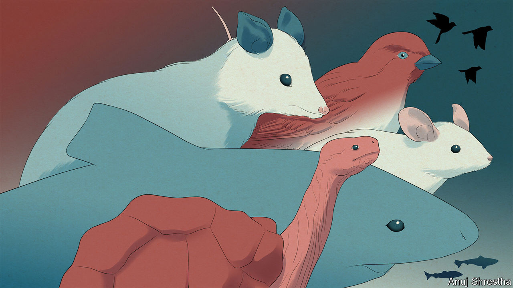

###### Of bowheads and borzois

# Alternatives to the laboratory mouse 

##### Researchers are looking at whales, sparrows and large dogs 

 

> Sep 25th 2023 

It is entirely possible that at this point you, the reader, are thinking that a greatly enhanced lifespan would be there for the taking had you only had the good luck or foresight to have been born a laboratory mouse. So many things, after all, seem to extend their life’s lease. If so, you should learn from the scepticism of Steven Austad of the University of Alabama, Birmingham. 

Laboratory mice are very little help, he thinks, in understanding ageing in animals that have not gone through decades of inbreeding and which live in environments that offer more danger than that inflicted in experiments. Lab mice, he feels, are not just a poor guide to the wider world of animal ageing; they are barely even mice any more. They are, in a phrase coined by one of his colleagues, just “mouse-like objects”. 

This scepticism may, in part, come from the fact that Dr Austad took an unusually long and circuitous route to the lab. His first degree was in English literature; as well as making an abortive attempt to write the great American novel he has enjoyed employment as a taxi driver, a newspaper reporter and an animal trainer. The last job provoked an interest in zoology that led to academia. 

In early work on American opossums he observed that those living on an island off the coast of Georgia, where there were no predators, seemed to age less rapidly than those on the mainland. This caused him to be sceptical about how much could be learned from inbred animals leading cushy lives (lab mice tend to live many times longer than their wild relatives). Instead, he seeks to study longevity in wild animals. 

With a maximum recorded lifespan of just over 120 years, human beings are at the upper end of the animal longevity scale. But there are a few that outdo them. At an estimated 200 years, bowhead whales are thought to be the longest-living mammals. Greenland sharks can manage double that. Giant tortoises are well-known multicentenarians. Among invertebrates, red sea urchins are reckoned to be able to clock up 100 years, a type of tube worm called , 300 years, and ocean quahog clams, 500 years. 

In-depth studies of bowhead whales and Greenland sharks obviously pose difficulties. Long-lived invertebrates may not have as much to say about people as one might wish. And working with true methuselahs, backboned or not, might mean working on their timescales, which would hardly be helpful. 

As a compromise between longevity and fecundity Dr Austad proposes the house sparrow. In general, animal lifespans increase with size. But whereas wild mice live three or four months wild sparrows, similar in weight, can live almost 20 years. Understanding the physiological differences that grant these birds such long lives might, he reckons, lead to useful ideas for increasing the lifespans and healthspans of people, a species in which he is interested despite its basically domesticated nature. 

Another off-kilter approach is to look at ageing not through the lens of animals that lead long lives in the wild, but of animals which lead shorter lives in domesticity. Big breeds of dog live less long than small ones; breeding them for size bred them for short lives, too. The mechanism by which that happened may be more tractable to study than most of those involved in ageing; selective breeding has changed relatively little of the dogs’ genome. And turning understanding thus gathered into a treatment would unleash a flood of dollars and love from people who own Great Danes, Newfoundlands and the like.

That is what Celine Halioua, the founder of Loyal, a San Francisco startup, wants to do. She knows which pathway she wants to target and the company is getting a drug (details of which are not public) into trials. Animal trials are more easily done than human ones, and veterinary approval is far faster than medical approval. Dr Halioua’s hope is that by developing a life-lengthening supplement for big dogs she can provide Loyal with a reliable revenue stream quite quickly. With that she can fund her long-term goal, the extension of human life. And it should help with her other heroic ambition—to found a drug company people actually like, even love. What better first step than extra years with a best friend?■

