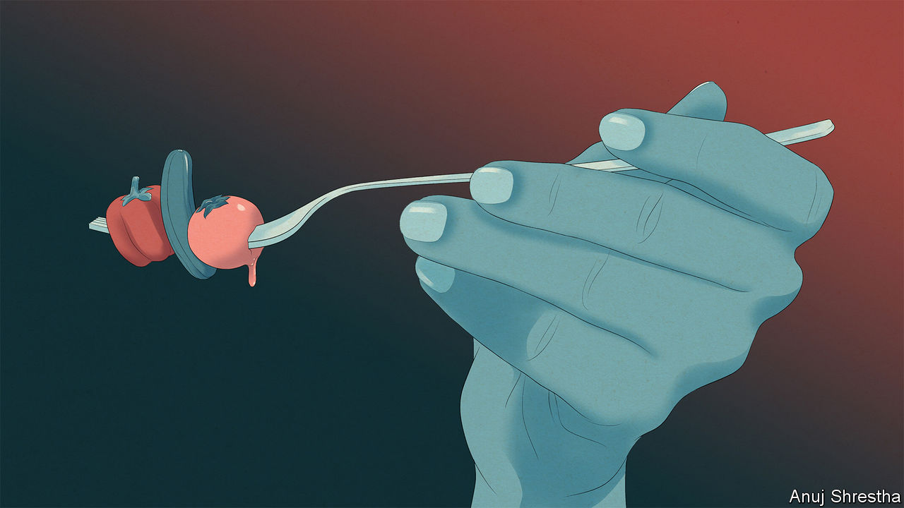

###### Don’t be greedy

# Eating fewer calories can ward off ageing 

##### And various existing medicines may offer similar benefits 

 

> Sep 25th 2023 

In 1991 eight volunteers sealed themselves into a huge greenhouse in the desert near Tucson, Arizona. They were part of an experiment seeking to discover whether a carefully curated selection of plants and animals could develop into a self-sustaining ecosystem: a “Biosphere 2” independent of “Biosphere 1”, aka the outside world. 

In terms of proving grand ecological truths the Biosphere 2 experiments were something of a bust. As an illustration of what can happen when somewhat fringe-y science meets extreme wealth they were fascinating. There were fierce fallings-out on both sides of the glass. In 1994 Ed Bass, an oil dynast who had paid for the facility, threw out the management team and handed the reins to Steve Bannon, later a key adviser to Donald Trump. At the same time, though, there was what some took to be a breakthrough in the science of human ageing. 

One of the eight biospherians was Roy Walford, a professor of pathology at the University of California, Los Angeles (ucla). Research by Walford and others had shown that restricting what animals ate could significantly lengthen their lives. The lifespans of nematode worms, fruit flies, rodents and dogs could be extended as much as 50% by laboratory protocols which gave them a diet with all the nutrients they needed in terms of minerals, vitamins and the like but fewer calories than were seen as normal. 

Biosphere 2 allowed him to test the theory on humans in no position to sneak off for snacks. With a daily intake of 1,750-2,100 calories (7,320-8,790 kilojoules) the biospherians, trim to begin with, all slimmed down. But after eight months their weight stabilised. Gaunt as they were, their energy levels remained high. Blood tests showed physiological responses which matched those of calorie-restricted rodents with extended lifespans.

Some people have taken this as a reason to incorporate calorie restriction into their lives, as Walford did. But such diets, which go well beyond the sort of weight-restricting efforts to which any sensible person might aspire, are hard to maintain. That has provoked an interest in finding ways to get the benefits of calorie restriction without having to engage in it. 

The garden of forking paths 

Calories are a measure of the amount of energy that cells can get from breaking food into its component chemical parts. The precise nature of that breaking down, and what happens with all the parts, is under the control of a range of signalling pathways which have the job of matching what the cell is doing with how much energy the organism needs and has available. Dysfunction in these nutrient-signalling pathways is one of the 12 hallmarks of ageing listed by Dr López-Otín and his colleagues.

If there is a general truth behind the success of calorie restriction, it is that when energy is on the scarce side, the nutrient signalling pathways in cells pay greater attention to what is going on and keep the cell in better shape. What is necessary if the same pathways are to be recruited without the calorie reduction is an understanding of what other cues can have the same effect.

The research would be both easier to do and easier to understand if these pathways all had distinct, clearly understood functions. Alas, this is not the case. Pathways frequently regulate more than one function, functions are frequently regulated by more than one pathway and the farthest-flung parts of pathways are often obscure. To make things yet less comprehensible, the proteins involved in the pathways have incredibly opaque names.

Take the MTORC1 pathway. The complex of proteins which gives it its name first came to attention because an immune suppressant called rapamycin has a strong effect on it: hence “mechanistic target of rapamycin complex 1”. That gives no real clue, however, to the fact that the signalling pathway in which MTORC1 sits is a complex set of controls and feedbacks designed to regulate metabolism in response both to the availability of nutrients (for example, glucose, which provides energy, and amino acids, from which proteins are made) and impediments to their use (for example, low oxygen levels). 

The ambit of this regulatory power is broad; it influences the rate at which cells break down damaged internal structures (“autophagy”), the balance of their protein content (“proteostasis”) and the reproduction of their mitochondria, components responsible for turning the calories it receives into a form of energy its proteins can use. Autophagy, proteostasis and mitochondrial reproduction are three more of the 12 hallmarks of ageing. 

Rap of ages

What is more, rapamycin, the effects of which give MTORC1 its name, turns out to lengthen the lives of lab animals even though it curbs their immune responses. This has led some longevity enthusiasts to seek off-label prescriptions for it. But its side-effects, including anaemia and an insensitivity to insulin, make rapamycin ill-suited for widespread use. There is thus a search for “rapalogs” which provide the benefits of a tuned-up MTORC1 pathway without so many costs. 

Another pathway which calorie-restriction studies have marked out as promising is named after a protein called AMPK (don’t ask). This regulates the production of ATP, a small energy-carrying molecule produced in mitochondria. When ATP levels fall, the AMPK pathway increases a cell’s sensitivity to insulin.

Metformin, a drug used to treat type-2 diabetes, does so by activating the AMPK pathway. Like rapamycin, it extends the lifespans of healthy mice. It does the same for diabetic humans. A study published in 2014 showed that diabetes patients treated with metformin enjoyed a decreased mortality rate, not just compared with patients who were not treated with it, but also with healthy controls who were not given the drug.

Not surprisingly, metformin is also used off-label, probably more widely than rapamycin. The American Federation for Ageing Research, a not-for-profit organisation, hopes soon to start a six-year, 3,000-person clinical trial to measure its effects in people from 65- to 79-years-old. The Targeting Ageing with Metformin (TAME) trial will see if metformin helps prevent cardiovascular disease, cancer and cognitive decline; it will also test the hypothesis that it reduces all-cause mortality.

A further set of medicines developed to treat diabetes but now used more widely are the GLP-1 receptor agonists. The best known, semaglutide (sold as Wegovy), has been specifically licensed in various places for use in people without diabetes who nevertheless need to lose weight. Whether they might live longer than someone of the same final weight who does not take one of the drugs is an open question. There are no published studies that show the drugs to have an effect on the lifespans of laboratory animals. 

One thing that does do the job for lab animals is taurine, an amino acid widely used as a dietary supplement. According to a recent paper by Parminder Singh of the Buck Institute for Research on Ageing in Novato, California, and colleagues, in mice taurine increases lifespan by 10%; some of this seems to be due to nutrient signalling. But there are effects on four or five other hallmarks of ageing, too. Taurine levels drop with age in humans but, in those who live to be over 100, levels stay significantly higher. 

Nutrient sensitivity may also be enhanced by a molecule called NAD+. Some enzymes—proteins which catalyse chemical reactions—require the presence of a small extra molecule to do their thing. NAD+ is such a “co-enzyme”. More than 300 enzymes need it to be present if they are to do their bit for the cell. And if you give mice more of it, they live longer. 

Considering that NAD+ is so generous with its favours it is difficult to know exactly which of the enzymes it helps are responsible for delivering this effect. But one connection which looks particularly interesting is that with a set of proteins called sirtuins. 

La vie en vin rouge

Sirtuins came to prominence two decades ago when David Sinclair, who is now co-director of the Centre for Biology of Ageing Research at Harvard University, showed that stimulating their production prolongs life in a variety of laboratory animals. One form of stimulation is calorie restriction. But Dr Sinclair discovered a chemical alternative: resveratrol, a molecule found, among other places, in the skins of red grapes. 

Dr Sinclair is by no means publicity-shy; his discovery saw a great deal of brouhaha. He founded a company, Sirtris, to produce resveratrol derivatives suited to the human body. The work did not amount to much. Sirtris, having been bought by GlaxoSmithKline, ceased to exist as a separate entity in 2013. 

That might seem a cautionary tale. But it can also be seen as grounds for hope. Sirtuins got a lot of attention because there had been no similarly credible claims about longevity for some time. Their story set out a blueprint for looking into such things: a mechanism looked interesting, a molecule seemed promising, investigations were carried out, conclusions were drawn. Many more mechanisms and drugs are now being scrutinised in the same way. Some scepticism is warranted. But there is no reason to believe that none of them will get results just because the few looked at so far have not. ■

