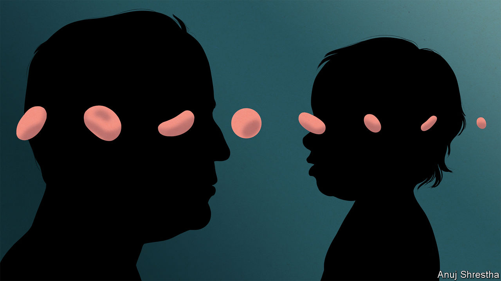

###### You can’t have everything

# Older genomes have more dodgy genes 

##### Can evolution’s trade-offs be avoided? 

 

> Sep 25th 2023 

Nutrient-sensing systems can be tuned up; senescent cells targeted for destruction; stem cells supplied afresh; epigenomes spruced up. For many of the hallmarks of ageing hope is in the air. But some are more refractory. Perhaps the toughest of all is genomic instability: the persistent accumulation of mutations. By middle age, to take an example published in 2018 by Philip Jones’s group at the Wellcome Sanger Institute near Cambridge, England, the cells lining a human oesophagus will each have acquired mutations in an average of 20 genes.

Cells have surveillance and repair mechanisms to correct damage to their DNA. Mutations persist regardless, though, because evolution makes these mechanisms good enough, rather than perfect. The investment required to repair 100% of the mutations would cost the cell more than the damage it sustains to its DNA by letting some mutations slide. This explains the finding that when cells are placed in an environment where one sort of damage to dna becomes more common, they give up on repairing other sorts; such repairs are no longer worth it. 

The biggest risk comes from mutations which unleash the cell’s innate capacity to reproduce without pause or purpose, thereby causing cancer. The body has various ways to react to such mutations; there is a whole set of tumour repressor proteins, of which the most well known are p53 and p16, and there are various ways for the immune system to swoop on the cells in which those safeguards are over-ridden. As a backstop, it also has the Hayflick limit, which gives cells only so many chances to reproduce. 

Here again, life’s trade-offs are at play. If anti-cancer measures were to be relaxed, ageing might be less of a problem. Less p53 activity would make senescent cells less damaging; the p53 and p16 they leak into the environment cripples any nearby stem cells. Making it easier for cells to resume growth if necessary might allow the slow erosion of non-cancer-causing mutations to be offset, with the dead weight of somewhat clapped-out cells lessened and vigour returned. But the price of creating tissues better suited to growth and rejuvenation would be more cancers. 

War of attrition

Some think that price can be circumvented. Rejuvenation Technologies, of Mountain View, California (which like the similarly named and previously mentioned Rejuvenate Bio of La Jolla, California, counts Harvard’s Dr Church among its backers), is planning to help cells extend their telomeres and avoid the Hayflick limit. They think telomere attrition (which Dr López-Otín and his colleagues see as important enough to qualify for a hallmark of its own) can be countered if cells make more of a vital sub-component of telomerase. To encourage them to do so they will use mRNA technology like that used in some sars-cov-2 vaccines. 

Injected into tissues that need rejuvenation the mRNA would provide cells with a temporary ability to make this substance. Various studies have shown that pepping up telomerase increases both the lifespan and the healthspan of mice, with positive effects on insulin levels, neurological function and strength. The initial targets for Rejuvenation Technologies will be two forms of fibrosis, then cirrhosis of the liver.

In mice the approach also had an unlooked-for bonus: it perked up the mitochondria on which cells rely for the production of ATP, the molecule from which proteins get their energy. Why this might be is not clear; though mitochondria have small genomes of their own, they have no telomeres. But it is welcome, because mitochondria are something that ageing specialists have been interested in for decades. 

Their initial interest was, it transpired, misplaced. It was based on the idea that the way in which mitochondria use oxygen to get energy out of metabolites exposed them to fearsomely reactive forms of oxygen at levels that damaged their genes. This damage due to “oxidative stress” was held to be a key aspect of ageing.

This turned out to be, at best, only partially true. Damage to mitochondrial genes does matter, but it seems to come about as a result of replication errors rather than reactive forms of oxygen. Those oxygen radicals do, though, have the potential to encourage inflammation—and because mitochondria, like many of us, get a bit more leaky as they age, over time that potential becomes reality. The cell’s systems for getting rid of clapped-out mitochondria also become less efficient over time, making matters yet worse.

Another link between mitochondria and ageing comes in the form of humanin, a short string of amino acids of the sort biologists call a peptide. It appears that as well as containing genes describing some full-size proteins, mitochondrial genomes also contain a lot of short DNA sequences that could describe peptides, and some of these peptides have now been isolated and studied. 

Humanin normally becomes less prevalent as people age. But studies of centenarians show that their humanin levels stay high. Correlation, not causation; but interesting enough to justify some experiments. Those have found that nematode worms genetically engineered to have high humanin levels live longer. In April a review of humanin’s protective effects by researchers at the University of Sassari, in Italy, suggested that there could be a role for it in treating Alzheimer’s and Parkinson’s diseases, diabetes, obesity and inflammation. Another potential belle has come to the ball. ■

