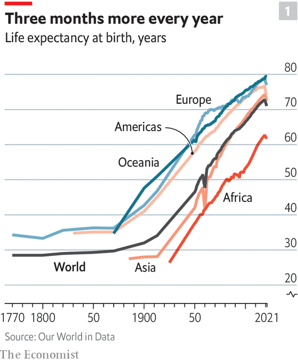
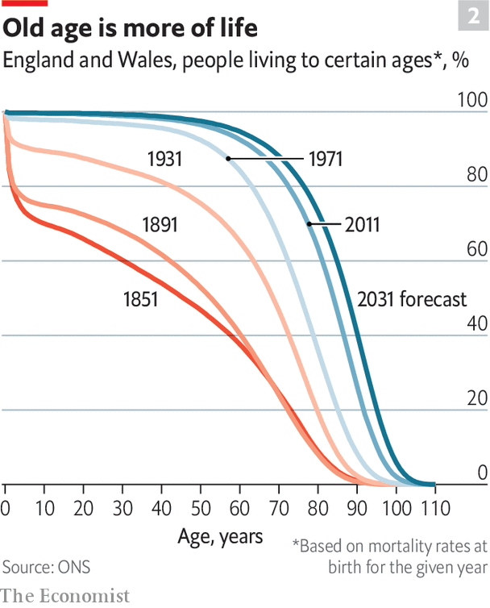
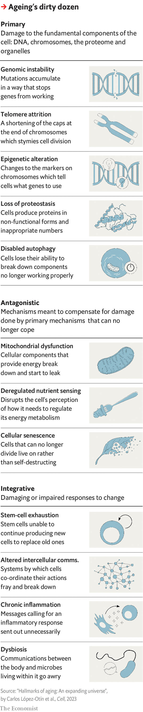

###### In search of forever

# Slowing human ageing is now the subject of serious research 

##### And some of it is making progress, writes Geoffrey Carr 

 

> Sep 25th 2023 


“All my possessions for a moment of time.” Those, supposedly, were the last words of Elizabeth I, who as queen of England had enough possessions to be one of the richest women of her era. Given her patronage of alchemists—who searched, among other things, for an elixir of life—she may have meant it literally. But to no avail. She had her last moment of time in March 1603, a few months short of the three score years and ten asserted by the Bible to be “the days of our years”. 

 


Things have improved since the reign of Good Queen Bess. People in the rich world can now reasonably assume that the days of their years will last well beyond 70. Those in poorer countries are catching up (see chart 1). In every year since 1950 average life expectancy around the world has risen by 18 weeks. 

 


There are, however, two catches. One is that the increases seem to have a limit. The number of centenarians has been growing and will grow more. The Pew Research Centre predicts there will be 3.7m worldwide by 2050, three times as many per head of population as in 2015. But only one in 1,000 of them lives beyond 110, and no one in history is reliably attested to have got past 120. The average is going up; the maximum, much less so (see chart 2). The other catch is that “healthspan”, the number of healthy, vital years, does not automatically keep pace with lifespan. 

Some of Elizabeth’s modern equivalents in wealth, if not majesty, are as desperate as she was for more moments than are currently on offer. In the hope of longer, healthier lives they are offering substantial down payments to today’s alchemists, the wizards of medicine and biotechnology trying to understand, decelerate and, ideally, reverse bodily ageing and its attendant ills. 

Peter Thiel, a co-founder of PayPal, Larry Page and Sergey Brin, co-founders of Google, and Jeff Bezos, founder of Amazon, have all invested in, and often been instrumental in the creation of, firms trying to prolong lifespan and healthspan. In March Sam Altman, the head of OpenAI, revealed that two years ago he had invested $180m in Retro Biosciences, a Silicon Valley firm founded with the goal of adding ten years to healthy human lifespans.

Beneath the forest canopy of firms backed by tech royalty an undergrowth of more conventionally financed startups is working on drugs that might slow or stall some aspects of ageing. Even closer to the ground, the idea is catching on of prolonging lifespan and healthspan using pills and potions that are already available, in addition to (and sometimes instead of) the conventional approach of diet, exercise and early-to-bed. A culture of do-it-yourself lifespan extension is emerging, at least in affluent places endowed with the sort of technical expertise and technological hubris identified with Silicon Valley. 


Many in mainstream science and medicine look at all this slightly askance. That is understandable. It is an area which attracts chancers and charlatans as well as those with more decent motives, and its history is littered with “breakthroughs” that have led more or less nowhere. America’s Food and Drug Administration does not recognise “old age” as a disease state, and thus as a suitable target for therapy. Nevertheless, evidence has been accumulating that such research might have something to offer. 

Some established drugs really do seem to extend life, at least in mice. That offers both the possibility that they might do so in people and some insight into the processes involved. The ever-greater ease with which genes can be edited helps such investigations, as does access to large amounts of gene-sequence data. The ability to produce personalised stem cells, which stay forever young, has opened up new therapeutic options. And new diagnostic tools are now offering scientists means to calculate the “biological ages” of bodies and organs and compare them with actual calendar ages. In principle this allows longevity studies to achieve convincing results in less than a lifetime.

The machine stops

Ageing seems quite simple. Bodies are machines, and machines wear out. But unlike most machines, bodies both make themselves and repair themselves. So why do they not do so perfectly?

One answer is that the machines’ designer, evolution, is interested in reproduction, not longevity. Life is a matter of genes and environment, and the environment, in the form of accidents, predators and diseases, is what kills most creatures. Genes with benefits that show up only over a longer lifespan than the environment allows are not likely to do particularly well unless they provide other benefits. Genes that offer a successful and fertile youth are onto a winner. 

Indeed, evolution may be actively plotting against old age. If a gene helps an animal breed when young but endangers it when it is old, the odds are that it will spread. There is some evidence that one variant of a particular gene involved in Alzheimer’s disease provides reproductive advantages to young people.

More generally, looked at from the evolutionary point of view of the genes involved, an individual is simply a way to make further copies of those genes, rather than an end in itself. Keeping the body’s repair mechanisms in tip-top condition is worthwhile only if it gets more genes into the next generation. If other uses of those resources do the job better, then repair will lose out. In this “disposable soma” approach, the individual is a means to an end abandoned when it is no longer fit for purpose. 

 


This sort of perspective explains why there are many conditions, such as Alzheimer’s and Parkinson’s diseases, retinal degeneration, type-2 diabetes and various cancers which are rare in early life but quite common in old age. But it also suggests that this need not be the case. The fact that evolution has no interest in keeping the repair systems going does not mean it cannot be done, just that some cunning may be required.

Most genes have variants, known as alleles, which all work, but may have somewhat different effects. Genetic manipulation of laboratory organisms and studies of the genes of human centenarians have identified alleles of particular genes that, in the former, have been proved experimentally to increase lifespan and, in the latter, are associated with longer lives. Such work helps illuminate the processes behind bodily ageing. 

It may, for example, lead to an understanding of why, as a study published in 2014 by researchers at King’s College London showed, centenarians are less likely to die of cancer or heart disease than people in their 80s are. This suggests that people who live a really long time may do so because they have some comparatively rare form of protection against things that kill younger old people. That may be very good news. 

Something does still kill them, though. The King’s College study found centenarians disproportionately vulnerable to general frailty and “the old man’s friend”, pneumonia.

Another reason for hope in the face of evolution’s callousness is that the physiological details of ageing are becoming clearer. In particular, those researching the question have been able to divide the problem into bite-sized chunks that can, to some extent, be tackled individually. Some of these smaller (if often still huge) problems are attractive targets for intervention in their own right; chronic inflammation, for example, or the build-up of aberrant proteins seen in Alzheimer’s disease. George Church of Harvard University, a biotech guru unafraid of the unorthodox, thinks the approach could offer more than that: identify and deal with each of the components separately and you may find you have solved the problem in its entirety.

Several groups have compiled lists of such chunks. One of the most widely consulted was devised by Carlos López-Otín of the University of Oviedo, in Spain, and his colleagues. They propose 12 hallmarks of ageing (see chart) chosen on the basis that they are all things which typically get worse with age, which accelerate ageing if stimulated and which seem to slow it down if treated. Deal with this dirty dozen (Dr Church would make it a baker’s dozen by adding cancer to the roll) and you might prolong life indefinitely and healthily. That, at least, is how the optimists look at it.

Oncology is already a well-developed field of research. This report will not address it directly. Nor will it remark on diet, exercise and a good night’s sleep, other than to extol their value. They remain as necessary as ever.

Instead, it will look at the progress being made with respect to each of the 12 hallmarks. The resulting picture is not as tidy as one might wish. Biology is a complex, networked affair and many of ageing’s hallmarks overlap. Sometimes that means an intervention may do good in more than one area. At other times there may be trade-offs. But even dealing with part of the list will bring people better lives. Deal with all of it and, well, who knows? ■

