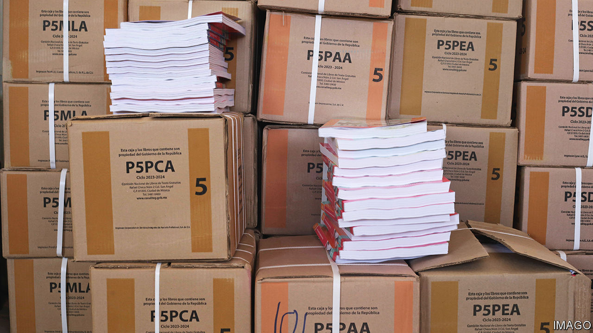
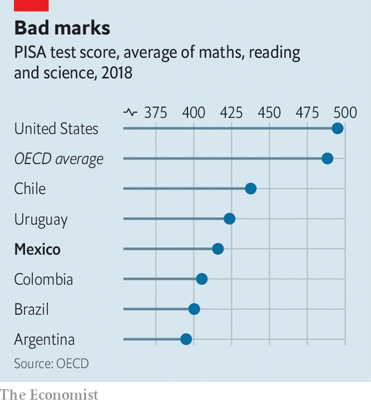

###### A textbook row

# Andrés Manuel López Obrador puts his stamp on Mexico’s schools 

##### Some parents and politicians are putting up a fight 

 

> Sep 28th 2023 

Textbooks often cause controversy. Parents object to what they teach children about sex. History can be ideologically charged. Maps sometimes provoke anger in neighbouring countries. But rarely have textbooks caused such an uproar as in Mexico, when the government issued new books for the start of the school year on August 28th. The governors of several states refused to distribute them. Parents have burned them.

Mexico is among the few countries in which the national government produces the approved textbooks for all schools, public and private. Cuba, North Korea and Nicaragua, all dictatorships, are among the others. Mexico began its policy in 1959, saying that obliging schools to use the same books, and providing them free, would help reduce inequality in a stratified society. Most six- to 15-year-olds study in the public system: some 21.5m compared with just 2.7m in private schools. 

When the state writes the textbooks, the government can impose its ideology on schools. That has been especially true since 1980, when the education ministry took over direct responsibility for writing the books from a semi-independent body (which now prints them).

 


It is perhaps no surprise that Mexico’s populist president, Andrés Manuel López Obrador, is taking full advantage of the opportunity. He sees himself as a transformational leader, and textbooks are a cheap way to bring about big changes. This year, the fifth of his six-year term, he has introduced a shake-up of the curriculum, textbooks included, that he calls the “New Mexican School”. Mexico needs education reform. It performs poorly on PISA, an international test of the reading, maths and science skills of 15- and 16-year-olds (see chart). But experts doubt that the New Mexican School is what the country needs. 

The new library mirrors the president’s obsessions while incorporating modern ideas about diversity. Children will learn more about pre-Hispanic civilisations, a change that has been widely welcomed. Pronouns are now gender-neutral. 

More contentiously, students will now be schooled in Mr López Obrador’s ideology. The books denounce individualism, capitalism and “neoliberalism”, which allegedly “has eliminated worker gains”, says one. They extol the president’s pet building projects, including a museum and an airport in Mexico City. One of the officials who directed the textbooks’ composition is a Venezuelan who used to work for Hugo Chávez, that country’s late left-wing dictator. A guide for teachers urges them to ask themselves whether they are “oppressed or an oppressor”. 

The new textbooks are full of mistakes. One suggests that herbal tea can treat covid-19. Another puts a Mexican state in the wrong place on a map; another gets the birthdate of Benito Juárez, a president of the 19th century, wrong.

The new curriculum is also a pedagogical mess, says Marco Fernández of México Evalúa, a think-tank. Subjects will no longer be taught separately. Instead, children are to learn through interdisciplinary projects. More interactive learning is a good thing, says Eugenia Roldán of Cinvestav, a research body on education, but not everything can be taught that way. The new curriculum drastically reduces the teaching of maths and Spanish. 

Another brick in the wall

Teachers have received little training for the new content. That is not surprising, since Mr López Obrador has slashed the budget for teacher training, from 1,644 pesos ($88) per teacher per year in 2016 to just 85 pesos today. “I had to do a lot by myself and still have many questions,” says Vianney Narváez, a history teacher.

Mr López Obrador has weakened education in other ways. On taking office in 2018 he reversed a reform by the previous government that curbed the power of the teachers’ union and introduced performance reviews. He disbanded a body that evaluated the quality and performance of public education (there are no plans to assess his new curriculum). His government does give out more scholarships than the previous one did; but they help children attend badly performing schools. Some parents send their children to fee-paying schools as soon as they have enough money. Schooling is “really so basic”, says Julia Arlette Huerta, who wants to move her eight-year-old to a private school.

A debate that is still to be held is “whether the government should be writing the textbooks at all”, says Ms Roldán. Private schools have long ignored the official textbooks, which means that prosperous and poor children have not been learning the same things. The new curriculum and books are likely to increase the inequality that uniform textbooks sought to lessen. For a government whose motto is “first the poor”, that would be a failure. ■

