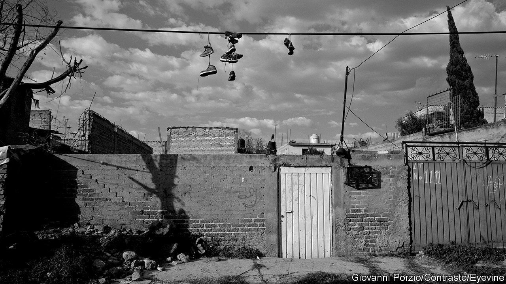
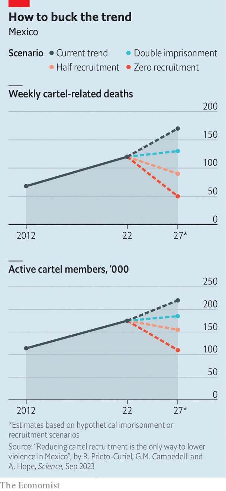

###### Criminal enterprise

# Mexico’s gangs could be the country’s fifth-biggest employer 

##### A recent paper suggests a novel way to curb their power 

 

> Sep 28th 2023 

What would it take to tackle Mexico’s criminal organisations? That is a question that successive governments have tried and failed to answer. A crackdown on gangs from 2006 caused them to splinter. Violence increased. President Andrés Manuel López Obrador’s policy to deal with the root causes of crime is known as “Hugs not bullets”. A new paper published in by Rafael Prieto-Curiel, who previously worked in a government department forecasting crime in the capital, suggests a novel answer: stop them recruiting.

 


Mr Prieto-Curiel started by using data on murders, arrests and other variables affecting gangs’ manpower to estimate total gang membership at 175,000. He then estimated how that number might change under different conditions. His work suggests that stopping gangs from hiring fresh recruits is the most effective way to shrink them and reduce violence. If gangs were to take on only half of the 350 to 370 new people they currently need each week, by 2027 membership would be 155,000. If they faced a complete interdiction of new recruits, their numbers would fall to 110,000 by 2027. 

Focusing on recruitment would be a shift from long-standing Mexican policy, backed by the United States, that focuses on arresting . To make it, Mexico would need a better understanding of how gangs go about hiring. Some people are forced into the job, either by being kidnapped or by applying for fake job advertisements, often that of security guard. Other young men (it is almost always men) willingly sign up, perhaps because of a lack of other opportunities or, Mr Prieto-Curiel reckons, the glamorising of cartels in TV shows. 

If counted as a single organisation, Mexico’s gangs are the fifth-biggest private-sector employer in the country, after the likes of FEMSA, a sprawling company best known for its “Oxxo” convenience stores, and Walmart, an American supermarket chain. Between them the two big cartels, Sinaloa and Jalisco New Generation, employ over a quarter of the total number of gangsters. By contrast Mexico’s National Guard, a militarised federal police force, has just over 100,000 members. ■

