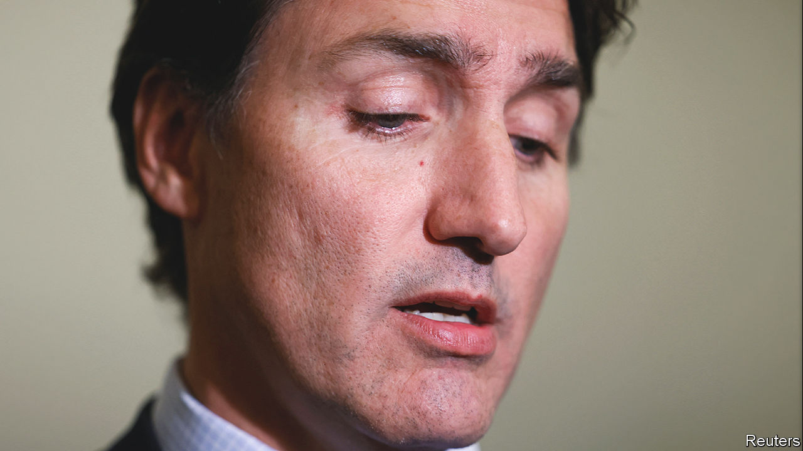

###### Canada’s embattled prime minister

# The spat with India only adds to Justin Trudeau’s woes 

##### Support for his government was faltering even before the squabble 

 

> Sep 27th 2023 

On September 18th Justin Trudeau, the prime minister of Canada, lobbed a  into his combustive relationship with Narendra Modi, the Indian prime minister. Mr Trudeau accused “agents of the government of India” of killing Hardeep Singh Nijjar, a Canadian citizen and Sikh separatist leader, earlier this year. Mr Modi has responded by calling the allegation “absurd”, ordering the Canadian government to cut the number of its diplomats in New Delhi and suspending new visas for visiting Canadians. 

Mr Trudeau’s call for India to co-operate with an investigation into the killing has been  by President Joe Biden and has received calibrated backing from the British government. But support for Mr Trudeau at home is less enthusiastic. Some on the right have suggested that the prime minister released half-baked intelligence to distract from his domestic political troubles. That seems unlikely. “There’s no upside to his doing it,” says Richard Fadden, who was Mr Trudeau’s first national security adviser and intelligence chief.

However, the spat with India does come at a difficult time for the prime minister, who insists he will seek a fourth consecutive term some time in the next 24 months. This is a feat achieved only twice before in Canada. Although Mr Trudeau has won three successive mandates since 2015, it has been with diminishing support each time, leaving him in a minority position in parliament in 2021. An unlikely pact with the socialist New Democratic Party gave Mr Trudeau a working majority and the possibility of governing until 2025. 

Many doubt he will last that long. After eight years in power, Mr Trudeau’s approval ratings are at a historic low of 27%. During 2021 his ratings were at or near 40%. His energised Conservative rival, Pierre Poilievre, has gained ground peddling the theme that “Canada is broken”. Mr Poilievre is polling at 37%. 

The sense from some of the countries in the G20 is that Canada is a country in decline. In many ways that is surprising. During Mr Trudeau’s stint in power Canada’s GDP has grown by 13%, only slightly less than the United States during the same period, and more than much of Europe. But several key concerns, such as over the cost of living and housing, remain problematic. 

Some of Mr Trudeau’s policies have benefited Canadians. A child benefit introduced in 2016 helped cut child-poverty rates by half. Between 2015 and 2020 overall poverty rates fell by 45%. Mr Trudeau managed to wrestle Donald Trump to a draw after the then American president vowed to overturn NAFTA, a free-trade agreement signed between Canada, the United States and Mexico in 1992. It was replaced by a similar deal, USMCA, in 2018.

Several factors are to blame for Mr Trudeau’s waning fortunes. Many middle-class Canadians—those he vowed to champion when he first ran for election—feel squeezed. Annual inflation is still among the lowest in G20 countries, and has fallen from its peak of 8% in June 2022. But it recently went up again, to 4%, double what it was when Mr Trudeau came to power. Canada ranks among the toughest countries in the world in which to buy a home. Since Mr Trudeau was elected the home-price-to-income ratio has increased by 45% compared with an average of 25% across the OECD, a club of mostly rich countries.

“Canada may be the worst country in the OECD when it comes to the disconnect between home prices and incomes,” says Mike Moffat, an economist who has briefed Mr Trudeau’s cabinet on the housing crisis. Canada has the lowest housing supply per person of any G7 country. Mr Moffat thinks a “wartime effort” is needed to build almost 5.8m homes over the next decade, more than twice as many built in any previous decade. 

Migration is also hurting the prime minister. This year Canada’s population surpassed 40m people for the first time. Nearly all of the rise was caused by migration: Canada welcomed 432,000 newcomers in 2022, the largest number ever. Mr Trudeau wants to boost this number more. The government has a target of an additional 465,000 immigrants this year, increasing to half a million in 2025. Although most Canadians remain pro-migrant, they are less sure of Mr Trudeau’s plans, particularly in light of the housing crunch. Some 61% of those asked in a recent poll think the migrant target is too high.

Meanwhile Canada’s universal health-care system is creaking. A survey by Ipsos taken at the end of 2021 suggested that two-thirds of those polled were satisfied with their free government-funded medical care. When the same question was asked earlier this year that share was 48%. Backlogs for operations such as hip or knee replacements mean that patients are waiting for years before they are treated. Millions do not have access to family doctors. Earlier this year, the Liberals made a song-and-dance about pouring C$46bn ($34bn) into health care over the next decade, the equivalent of 0.2% of GDP a year. But the Ipsos poll suggests that 38% of Canadians believe health-care investments made in the last decade have made no impact. 

Climate change is a big issue for voters. Mr Trudeau takes it seriously. Since 2018 the country has had a carbon tax, currently C$65 per tonne. That tax is scheduled to rise to C$170 in 2030. However, forest fires have been raging since May, and are still continuing to burn coast to coast.

Mr Trudeau’s foreign-policy troubles are not confined to India. NATO allies resent the country’s puny defence spending, of just 1.29% of GDP this year. Canada’s relationship with China has worsened ever since two Canadians were arrested in China in 2018 and held in jail for almost three years on specious charges of spying. In March he sought outside advice on whether to hold an inquiry into Chinese interference in Canadian elections. 

Similarly, the relationship between Saudi Arabia and Canada is only just beginning to thaw after Chrystia Freeland, the deputy prime minister, criticised Saudi Arabia’s human-rights record in 2018. That prompted the expulsion of the Canadian ambassador, the sale of all Saudi assets in Canada and an end to imports of Canadian wheat. The credibility of the intelligence over Mr Nijjar is largely thanks to Canada’s allies, which have backed Mr Trudeau’s allegation, says Mr Fadden. He needs their support in order to win the diplomatic tussle. “I don’t think Canada is going to move India on its own,” he adds. 

Although Mr Trudeau has sought to insulate Canada from the culture wars that are raging in the United States, it has not proven immune. His response to a protest by lorry-drivers in Ottawa last year, which started against covid-vaccine mandates and evolved into a larger protest against him, irked many on the right.

“The Liberals won on hope,” says Greg Lyle, of Innovative Research, a pollster, of Mr Trudeau’s win in 2015. That is now in short supply. The economy is on track for two consecutive quarters of negative growth (technically a recession). Mr Lyle thinks it would be a mistake to dismiss the prime minister entirely, with by-election results in June demonstrating the resilience of the Liberals. But the light from the man once considered a beacon for progressives burns far less brightly. ■

