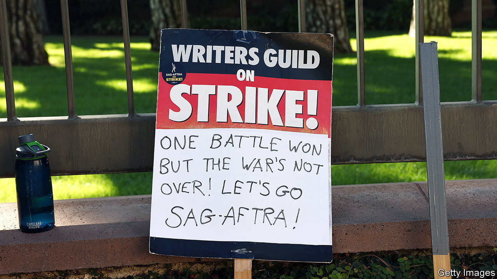
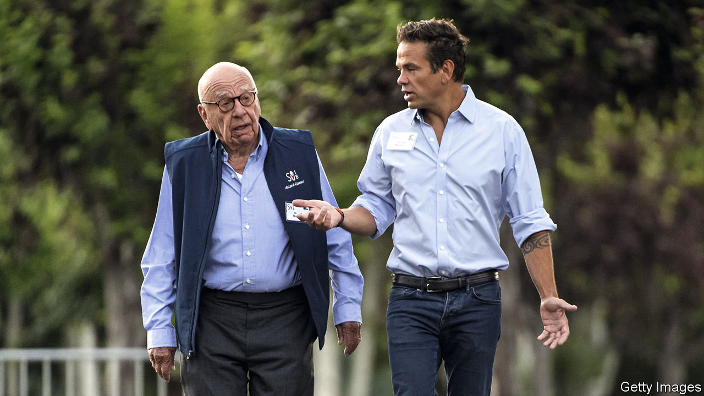

###### The world this week

# Business 

#####  

 

> Sep 28th 2023 

 striking film and television screenwriters returned to work after their union, the Writers Guild of America, reached a tentative agreement with entertainment companies. They had been on strike since May 2nd. The deal with the studios includes bonuses for writers based on viewing figures on streaming services, and guarantees that artificial intelligence can’t write or rewrite literary material or be used as a source. It is hoped that the pact will entice actors to end their strike. The industrial action has already delayed the release of many movies next year, including a Lord of the Rings prequel. 

A legal-package delivery

America’s Federal Trade Commission lodged a lawsuit against , accusing the online retailer of using “unfair strategies to illegally maintain its monopoly power”. The FTC claims Amazon does this by burying sellers on its site that offer cheaper goods elsewhere and by replacing relevant search results with paid ads, among other things. Amazon said the lawsuit was “misguided” and a “fundamental misunderstanding of retail”. 

Meanwhile, Amazon boosted the other, more profitable, side of its business, when it struck a deal to invest up to $4bn in , an AI startup. Amazon also announced that it will start introducing ads to its  content from next year. As with other streaming services, users will be able to sign up for a costlier ad-free subscription. 

 said it would list its logistics arm, Cainiao, in an IPO in Hong Kong, the first spin-off in a restructuring plan that will split the Chinese tech giant into six entities. Alibaba will still own more than 50% of Cainiao after its flotation. 

 takeover of  came a step closer, after Britain’s competition regulator dropped its opposition to the deal. Microsoft had submitted a revised offer for the video-game maker that attended to the regulator’s concerns. 

 missed another debt payment on a bond, casting more doubt about the future of the embattled Chinese property developer. Hui Ka Yan, Evergrande’s chairman, has reportedly been put under surveillance by the police, a move that stops just short of an arrest or detention. Trading in Evergrande’s shares was suspended in Hong Kong. 

The International Energy Agency said that “bolder action” was required if the world was to reach  by 2050. The agency said that global renewable-energy capacity needed to triple by 2030 and sales of electric cars and heat pumps would have to rise sharply.

 finance minister, Mehmet Simsek, asked markets to be patient with the government’s efforts to rebalance the economy after years of unorthodox economic polices. The central bank recently raised its key interest rate from 25% to 30%, the fourth consecutive increase, as it tries to tackle the resurgence of sky-high inflation. 

 volumes were 3.2% lower in July than a year earlier, according to a closely watched index from the Netherlands Bureau for Economic Policy Analysis. That is the sharpest decline since August 2020, amid the pandemic, and driven to a large extent by the slowdown in China and the knock-on effects to trade in Asia. 

A big act to follow

 


Lachlan Murdoch started to put his stamp on , nominating Tony Abbott, a former Australian prime minister and climate-change sceptic, to the board. This came soon after Rupert Murdoch announced that he was stepping down as chairman of both Fox and News Corporation, giving his son complete control over the businesses. Mr Murdoch built his television and newspaper empire over 70 years, and is widely considered to be the last media mogul. However, as “chairman emeritus” of Fox and News Corp he could still wield considerable clout.

 said it was suspending construction of a factory in Michigan that would make batteries for electric vehicles, citing concerns about whether it would be competitive. The plant has become politically controversial because it would license technology from a Chinese company, CATL, the world’s largest battery-maker for EVs. Meanwhile, the United Auto Workers said Ford had improved its pay offer in their dispute, and did not include any of the carmaker’s other factories when it extended its strike, hitting General Motors and Stellantis instead. 

Target is to close nine stores in Portland, New York, San Francisco and Seattle because of criminal theft and threats to its staff. In an annual study the National Retail Foundation said that crime, violence and theft were at “unprecedented levels” in the industry. American  lost $112bn from theft last year. More than 78% said that organised retail crime was more of a priority this year than in 2022. 

