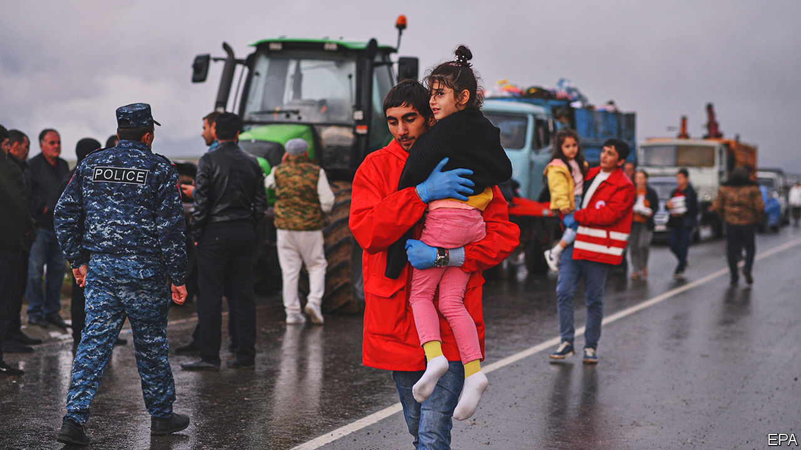
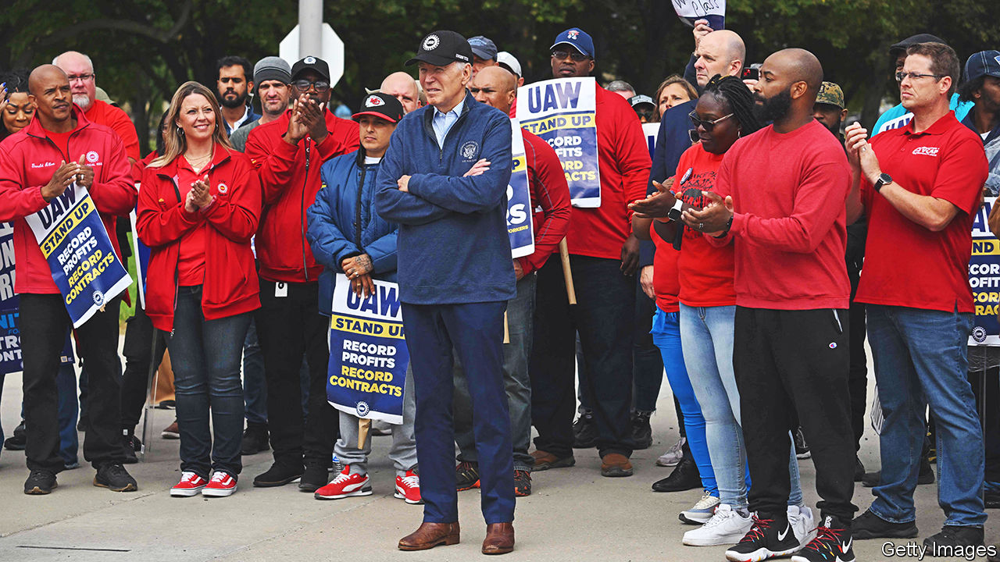

###### The world this week

# Politics 

#####  

 

> Sep 28th 2023 

Tens of thousands of ethnic Armenians fled, a disputed Armenian-majority enclave in Azerbaijan that the Azeri army has taken control of. Azerbaijan’s president, Ilham Aliyev, promised to protect ethnic Armenians, but said that Karabakh’s decades-long status as an independent entity was over. At least 68 people were killed by an explosion at a fuel depot. The episode underlines the waning of Russian influence in the Caucasus. Armenia, long an ally of Russia, is pivoting towards the West. America said the Azeri show of force was unacceptable and told Azerbaijan to observe a ceasefire and allow aid into the area. 

 president, Recep Tayyip Erdogan, met Mr Aliyev to discuss the crisis and to hail the Azeri victory. Separately, Mr Erdogan reiterated his pledge to ratify  membership of NATO if America sells F-16 fighter jets to Turkey.  president, Viktor Orban, the other hold out on confirming Sweden’s membership, said he was in no hurry to ratify. 

Balkan bust-up

Tensions remained high in, after 30 gunmen barricaded themselves in a monastery during a shoot-out with police. Three of the gunmen and a policeman were killed. Ethnic-Serb politicians said the militants were rebelling against the Kosovan government’s refusal to create Serb municipalities in northern Kosovo, where ethnic Serbs dominate. Kosovo said the men were “Serbian state-supported troops” and that some had fled to Serbia. 

 special forces claimed to have killed dozens of Russian naval officers in a missile attack on Russian headquarters in Sevastopol, Crimea’s biggest port. It seems that Admiral Viktor Sokolov, the commander of Russia’s Black Sea Fleet, was not one of them. He popped up on videos released by Russia’s defence ministry apparently to show he is still alive. Meanwhile the first American-made M1 Abrams tanks arrived in Ukraine to help with its counter-offensive against the Russians.

A UN commission of inquiry on Ukraine said that Russia had  people to death in areas it had occupied, and that Russian soldiers had raped or committed sexual violence against women ranging in age from 19 to 83. Russia denies targeting civilians. 

 conservative leader, Alberto Núñez Feijóo, narrowly failed to get enough votes in the lower house of parliament to become prime minister. His People’s Party won the most seats in an election in July, but he could not persuade smaller parties to give him an absolute majority. Spanish law allows him a second attempt on September 29th.

The British government upset greens again, when a regulator gave approval for a Norwegian company to develop the Rosebank oil-and-gas field in the. The energy security minister said that Britain would still need fossil fuels as part of a mix on the path to net zero over the coming decades. 

 is to withdraw its ambassador and troops from , ending a months-long stand-off since a coup in July. France, which had 1,500 soldiers fighting jihadists in Niger, has refused to recognise the legitimacy of the junta that overthrew Mohamed Bazoum, the elected president. 

Elsewhere in the coup-belt across the Sahel,  military government indefinitely postponed elections scheduled for February, breaching a promise to return to civilian rule for the first time since 2020.

Haim Katz,  tourism minister, became the country’s first cabinet minister to publicly visit . Meanwhile a high-level Saudi delegation travelled to the occupied West Bank for the first time since Israel captured the territory in 1967. Saudi Arabia’s inaugural official envoy to the  also visited the area. The meetings come after recent comments from the leaders of both Israel and Saudi Arabia on the likelihood of normalising relations between the two countries.

The chairman of  National Election Authority announced that the country would hold a presidential election from the 10th to the 12th of December, earlier than had been expected. Abdel-Fattah al-Sisi, the incumbent, has not yet formally announced he will stand but he is expected to do so. So far few opponents have said they will challenge him.

At least 100 people were killed in a fire at a wedding in . Some reports suggest the inferno in Qaraqosh, Iraq’s biggest Christian town, was started by fireworks.

Joe Biden hosted a summit of  at the White House, and announced that America would establish diplomatic relations with Niue and the Cook Islands. America is showering South Pacific states with promises of aid and support to counter the rise of Chinese influence. 

A long-running dispute over the Scarborough Shoal in the  flared up again when the Philippines removed a 300-metre floating barrier that China had only recently installed. The Philippines claimed that the barrier was impinging on Filipino fishing rights. China, which captured the atoll from the Philippines in 2012, warned the country “not to provoke and cause trouble”.

A prominent human-rights lawyer and activist was imprisoned for four years in  for calling for a national debate about the monarchy. Arnon Nampa, who made the comments at a protest in 2020, fell foul of the country’s draconian  laws, which ban any criticism of the royal family. A call by the Move Forward party, which came first in an election in May, to reform the law was one reason why it was blocked from taking power by the conservative-military establishment that dominates Thailand’s Senate.

 expelled Travis King, an American soldier who crossed over from South Korea on a guided tour of the demilitarised zone between the two countries in July. He was handed over to American custody in China.

In  a court declined to issue an arrest warrant for , the leader of the opposition Democratic Party, who stands accused of corruption. The court issued its ruling on the basis that he was unlikely to flee the country or destroy evidence. Mr Lee, who came a close second in the presidential election of 2022, says the charges are politically motivated and denies any wrongdoing. 

, a Democratic senator from New Jersey, pleaded not guilty in a court appearance to charges of accepting bribes, some of it in bars of gold, from businessmen acting as go-betweens with officials in Egypt. It is the second time Mr Menendez has been indicted for bribery. A separate case ended with a hung jury in 2017.

The flying pickets

 


 visited a picket line of striking car workers in Michigan, the first time an American president has joined a union picket. The United Auto Workers are demanding a 36% pay increase over four years, which Mr Biden endorsed. , fresh from being found liable for fraud by a judge in New York, also took a trip to Michigan to court the state’s blue-collar voters, though he went to a non-union factory near Detroit. 

The speaker of  Parliament, Anthony Rota, resigned, after he introduced a 98-year-old Ukrainian-Canadian to a parliamentary session as a war “hero” for fighting for Ukrainian independence. After the session, which was attended by Volodymyr Zelensky, Ukraine’s president, it emerged that the man had fought in a unit under SS Nazi command against the Russians. 

