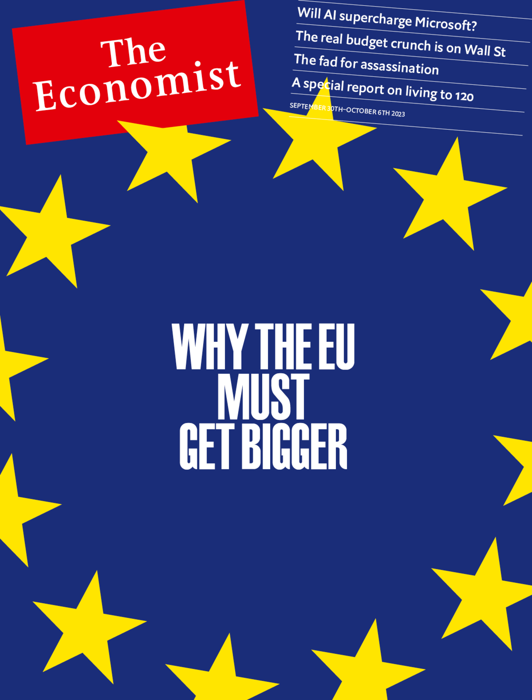

###### The Economist

# This week’s covers 

##### How we saw the world 

> Sep 28th 2023 

Some weeks, including this one, we publish more than one cover. In most of the world we consider the growing attempts to stop ageing. After years of false starts, the idea of a genuine elixir of longevity is taking wing. Behind it is a coterie of fascinated and ambitious scientists and enthusiastic and self-interested billionaires. Increasingly, they are being joined by ordinary folk who have come to think that the right behaviour and drugs could add years, maybe decades, to their lives.

 


 

 


In mainland Europe we explain how the war in Ukraine is giving fresh momentum to calls to enlarge the European Union. Nine countries, including Ukraine, are now vying to join the bloc. For the EU their admission would be nothing short of historic, completing a grand continental union and marking the end of a process that started with Allied victory over the Nazis. But the way the union works would have to change. 

 


 


