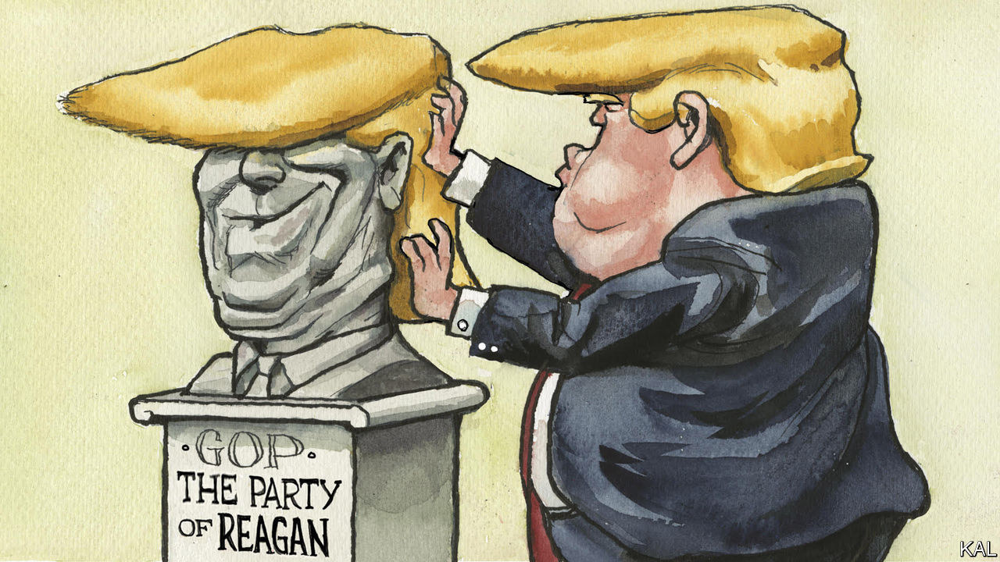

###### Lexington

# A Trump Party in the Reagan Library 

##### The second Republican debate, like the former president’s speech, showed how much has changed 

 

> Sep 28th 2023 

“Every time I hear you, I feel a little dumber.” It might have been Jerry Seinfeld, after one of his mouth-agape pauses, responding to George Constanza’s latest theory of life. Better yet, accompanied by a lonesome guitar and rhymed, perhaps, with “plumber” or “warm beer”, the line might have made for a fine country-and-western lyric.

They were in fact the words of Nikki Haley, a former ambassador to the United Nations and governor of South Carolina, speaking during the second Republican debate, on September 27th. And though she was once again squashing Vivek Ramaswamy, a former biotech entrepreneur, after gritting her teeth through another of his peppy paeans to himself, she might well have been speaking for the viewers at home as they thought back on their whole dismal evening in front of the tube. 

The debate was held at the Ronald Reagan Presidential Library in Simi Valley, California, and so, inevitably, one of the moderators opened it by invoking Reagan’s cherished description of America as a “shining city on a hill”. Equally inevitably, given the state of the Republican field and possibly of the city itself, from there things went downhill. Time may have softened Reagan’s edges and blurred his flaws, bathing him in a rosy glow as it lengthened his shadow across the land. Yet even at his most peevish and least coherent, it is impossible to imagine him degrading himself to participate in the bickerfest that the seven serious Republican candidates not named Donald Trump chose to conduct, insulting and talking over each other in the hilltop shrine dedicated to Reagan’s loftiest conception of his party and country.

Mr Trump once again won the debate by skipping it. With some efforts at adjustments, the other candidates played what have already become their familiar roles: vice-president Mike Pence assumed his sombre, sorry-for-your-loss undertaker’s mien, while Chris Christie, the former governor of New Jersey, presented himself as a brawler on the prowl for Mr Trump.

Staring into the camera, Mr Christie taunted the former president as being afraid to defend his record. “You keep doing that—no one up here is going to call you Donald Trump,” he said, smugly pausing for what was obviously prepared as a devastating put-down. “We’re going to call you Donald Duck.” Reagan might not have admired the humour—who could?—but he would have appreciated the G-rating. 

While Mr Ramaswamy did his Uriah Heep (“You see a young man who’s in a bit of a hurry, maybe a little ambitious, bit of a know-it-all?” he rattled off with his ingratiating grin), Ms Haley did her brisk-nanny number, disciplining almost every other candidate onstage—this time not excepting Ron DeSantis, the governor of Florida, whom she accused of banning fracking. Mr DeSantis, true to robotic form, reacted by ejecting a speech-chunk about his policy for “energy dominance”, under which “we’re going to choose Midland over Moscow” and “the Marcellus over the Molas”, and by which, evidently, he hoped to choose alliteration over responding to Ms Haley. Mr DeSantis had a better outing than in the first debate, and his campaign still has plenty of money, but he did not tower over the other candidates. 

All the candidates acted like Reagan disciples in vying to sound toughest on China. But Mr DeSantis temporised on support for Ukraine against Russia, promising that, like Mr Trump, he would somehow “end this war” as president. And though Reagan signed a law granting amnesty to nearly 3m people who had entered America illegally, these Republicans competed to sound most like Mr Trump, pledging to finish his wall or send soldiers in pursuit of Mexican drug cartels. 

Although Mr Trump chose to ignore his rivals for the nomination and act like a general-election candidate, he offered his own backhanded homage to Reagan on the evening of the debate. He spoke at a non-union parts-maker in Macomb County, Michigan, made famous during the Reagan years as the prototypical home of the white working-class Democrats who became key to his national coalition. Such voters have been critical to Mr Trump as well. Though Barack Obama won Macomb County in 2008 and 2012, four years later Mr Trump became the first Republican to win Michigan since 1988, partly by carrying the county. 

MAGA, before it was uncool

Like Mr Trump, Reagan was no friend to organised labour, but he won workers over by summoning their patriotism: “Make America great again” was his line first. He also promised prosperity and appealed to their grievances, including with racially coded messages about welfare cheats and crime. When he ran for president in 1980, Reagan, like Mr Trump later, was reviled by Democrats and his own party’s establishment as a lightweight, a teller of tall tales and a warmonger without foreign-policy experience. 

But though Reagan could be a fierce partisan, he was never as sulphurous, crude or hyperbolic as Mr Trump. He also, not coincidentally, commanded majority support, something Mr Trump has never accomplished and probably never will. In his speech, Mr Trump repeatedly urged the crowd to get the leadership of the United Auto Workers to endorse him, an unlikely proposition. He said negotiations under way between the UAW and the Big Three auto companies would not matter, because Mr Biden’s subsidies for electric vehicles would destroy the industry in two years. “Crooked Joe Biden” and the “radical left Marxists” and “fascists” around him, he warned, were “selling you out to China.” 

“For we must consider that we shall be as a city upon a hill,” runs the source of Reagan’s quotation, from the sermon John Winthrop delivered in 1630 as he prepared to sail with other settlers to found Boston. The line was less a boast than a goad, even a warning. “The eyes of all people are upon us,” Winthrop continued. Kind of an embarrassing thought, these days. ■


